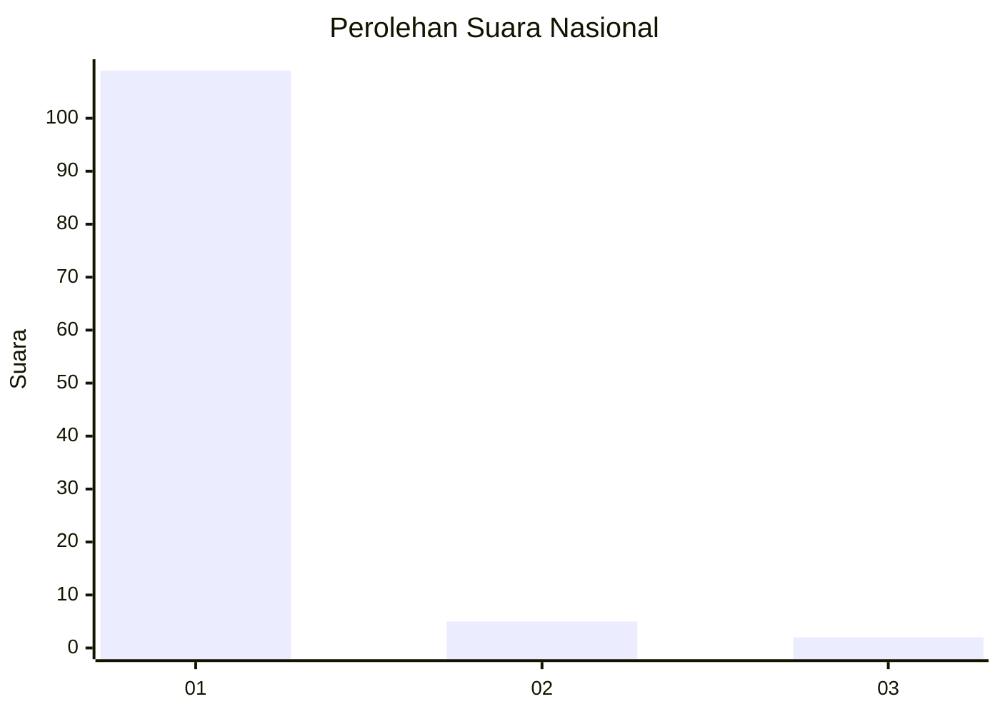
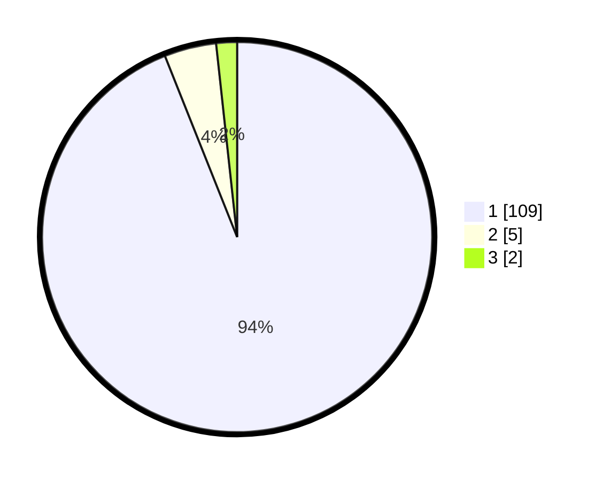

# Hasil

## Grafik

## Tabel

| No. | Nama Paslon    | Suara | Suara (raw) | Persentase |
|:--- |:-------------- | -----:| -----------:| ----------:|
| 1   | ANIES MUHAIMIN | 109   | [109][p-1]  | 93,97      |
| 2   | PRABOWO GIBRAN | 5     | [5][p-2]    | 4,31       |
| 3   | GANJAR MAHFUD  | 2     | [2][p-3]    | 1,72       |

[p-1]: https://github.com/gigit-pemilu/pemilu-2024/blob/main/pilpres/hitung-suara/sub/11-aceh/sub/03-aceh-timur/sub/01-darul-aman/sub/2031-teupin-drum/sub/001-tps/sub/paslon-1.txt
[p-2]: https://github.com/gigit-pemilu/pemilu-2024/blob/main/pilpres/hitung-suara/sub/11-aceh/sub/03-aceh-timur/sub/01-darul-aman/sub/2031-teupin-drum/sub/001-tps/sub/paslon-2.txt
[p-3]: https://github.com/gigit-pemilu/pemilu-2024/blob/main/pilpres/hitung-suara/sub/11-aceh/sub/03-aceh-timur/sub/01-darul-aman/sub/2031-teupin-drum/sub/001-tps/sub/paslon-3.txt

## Foto C Plano

https://sirekap-obj-formc.kpu.go.id/5d88/pemilu/ppwp/11/03/01/20/31/1103012031001-20240215-062507--c257d238-4ab8-45cf-b2e0-88864a938247.jpg

https://sirekap-obj-formc.kpu.go.id/5d88/pemilu/ppwp/11/03/01/20/31/1103012031001-20240214-200300--25a47f2f-2841-4e7b-90da-f7891dedd376.jpg

https://sirekap-obj-formc.kpu.go.id/5d88/pemilu/ppwp/11/03/01/20/31/1103012031001-20240219-113305--e2b7e12b-e575-4002-a212-46984bfbc9b2.jpg

## Metadata

| Key        | Value               |
| ---------- | ------------------- |
| Time Stamp | 2024-02-19 12:00:00 |

