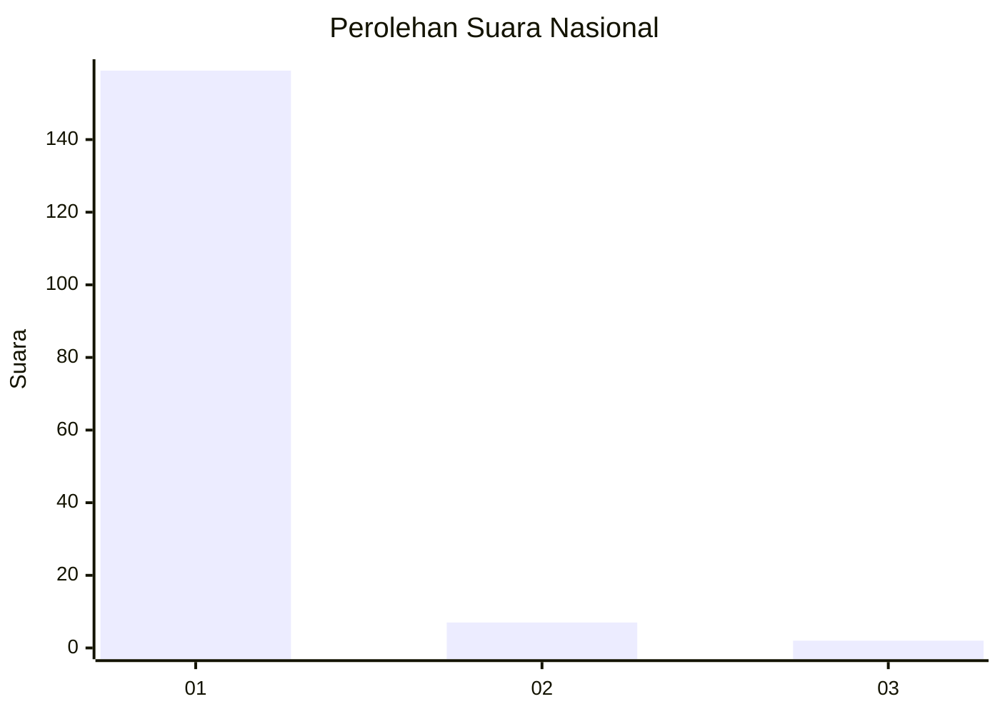
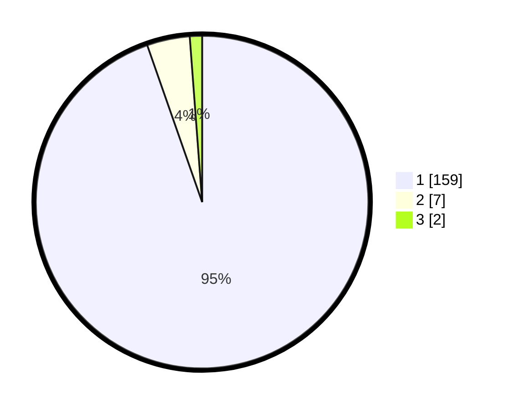

# Hasil

## Grafik

## Tabel

| No. | Nama Paslon    | Suara | Suara (raw) | Persentase |
|:--- |:-------------- | -----:| -----------:| ----------:|
| 1   | ANIES MUHAIMIN | 159   | [159][p-1]  | 94,64      |
| 2   | PRABOWO GIBRAN | 7     | [7][p-2]    | 4,17       |
| 3   | GANJAR MAHFUD  | 2     | [2][p-3]    | 1,19       |

[p-1]: https://github.com/gigit-pemilu/pemilu-2024/blob/main/pilpres/hitung-suara/sub/11-aceh/sub/03-aceh-timur/sub/01-darul-aman/sub/2034-seuneubok-aceh/sub/002-tps/sub/paslon-1.txt
[p-2]: https://github.com/gigit-pemilu/pemilu-2024/blob/main/pilpres/hitung-suara/sub/11-aceh/sub/03-aceh-timur/sub/01-darul-aman/sub/2034-seuneubok-aceh/sub/002-tps/sub/paslon-2.txt
[p-3]: https://github.com/gigit-pemilu/pemilu-2024/blob/main/pilpres/hitung-suara/sub/11-aceh/sub/03-aceh-timur/sub/01-darul-aman/sub/2034-seuneubok-aceh/sub/002-tps/sub/paslon-3.txt

## Foto C Plano

https://sirekap-obj-formc.kpu.go.id/7685/pemilu/ppwp/11/03/01/20/34/1103012034002-20240214-213010--0c0b3d6d-7307-45d6-b677-20f68e85b315.jpg

https://sirekap-obj-formc.kpu.go.id/7685/pemilu/ppwp/11/03/01/20/34/1103012034002-20240214-200343--85e74774-6f58-41a6-a184-67ac63f10b84.jpg

https://sirekap-obj-formc.kpu.go.id/7685/pemilu/ppwp/11/03/01/20/34/1103012034002-20240214-200602--4f9bab05-a557-45d7-b82c-e45f00b5fd84.jpg

## Metadata

| Key        | Value               |
| ---------- | ------------------- |
| Time Stamp | 2024-02-15 04:00:24 |

