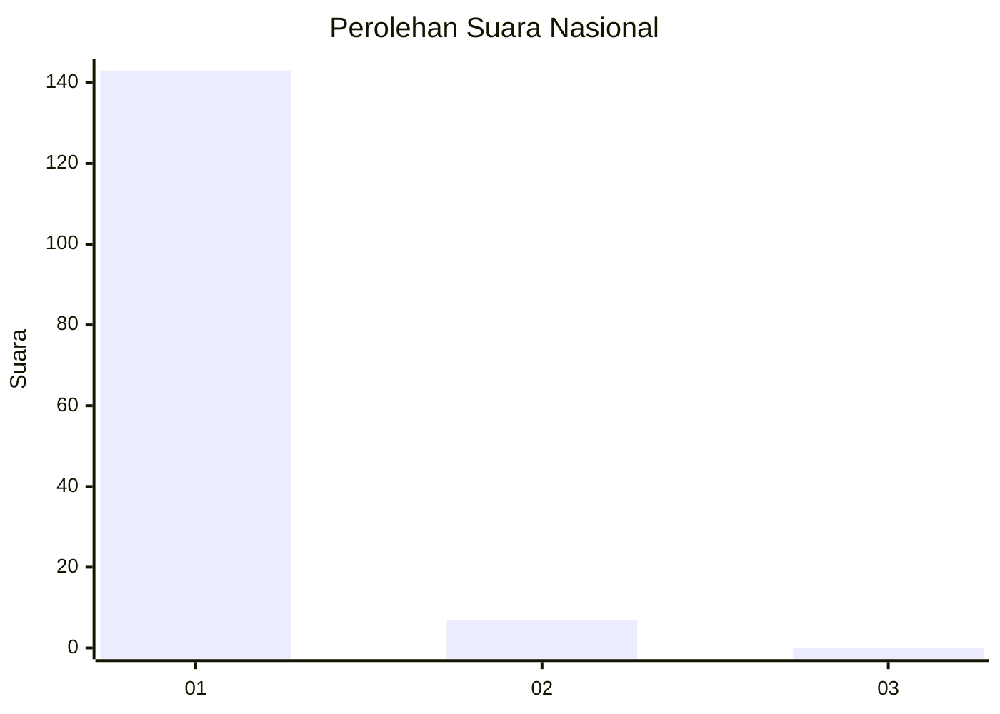
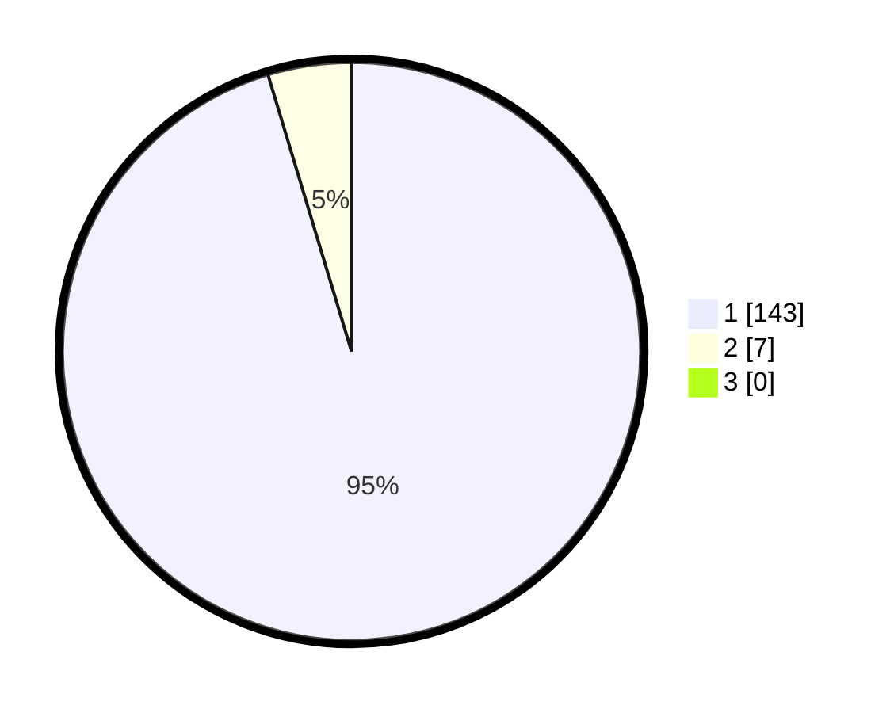

# Hasil

## Grafik

## Tabel

| No. | Nama Paslon    | Suara | Suara (raw) | Persentase |
|:--- |:-------------- | -----:| -----------:| ----------:|
| 1   | ANIES MUHAIMIN | 143   | [143][p-1]  | 95,33      |
| 2   | PRABOWO GIBRAN | 7     | [7][p-2]    | 4,67       |
| 3   | GANJAR MAHFUD  | 0     | [0][p-3]    | 0,00       |

[p-1]: https://github.com/gigit-pemilu/pemilu-2024/blob/main/pilpres/hitung-suara/sub/11-aceh/sub/03-aceh-timur/sub/01-darul-aman/sub/2046-meunasah-blang/sub/001-tps/sub/paslon-1.txt
[p-2]: https://github.com/gigit-pemilu/pemilu-2024/blob/main/pilpres/hitung-suara/sub/11-aceh/sub/03-aceh-timur/sub/01-darul-aman/sub/2046-meunasah-blang/sub/001-tps/sub/paslon-2.txt
[p-3]: https://github.com/gigit-pemilu/pemilu-2024/blob/main/pilpres/hitung-suara/sub/11-aceh/sub/03-aceh-timur/sub/01-darul-aman/sub/2046-meunasah-blang/sub/001-tps/sub/paslon-3.txt

## Foto C Plano

https://sirekap-obj-formc.kpu.go.id/2950/pemilu/ppwp/11/03/01/20/46/1103012046001-20240222-153541--5d5a7ef8-725d-48d5-9509-d235495a501d.jpg

https://sirekap-obj-formc.kpu.go.id/2950/pemilu/ppwp/11/03/01/20/46/1103012046001-20240222-151333--dc0bd762-0f1a-44fd-9a32-78b5971d7f41.jpg

https://sirekap-obj-formc.kpu.go.id/2950/pemilu/ppwp/11/03/01/20/46/1103012046001-20240222-151228--e472fee8-090c-45b4-a121-25a8ca0b2542.jpg

## Metadata

| Key        | Value               |
| ---------- | ------------------- |
| Time Stamp | 2024-02-22 16:00:00 |

