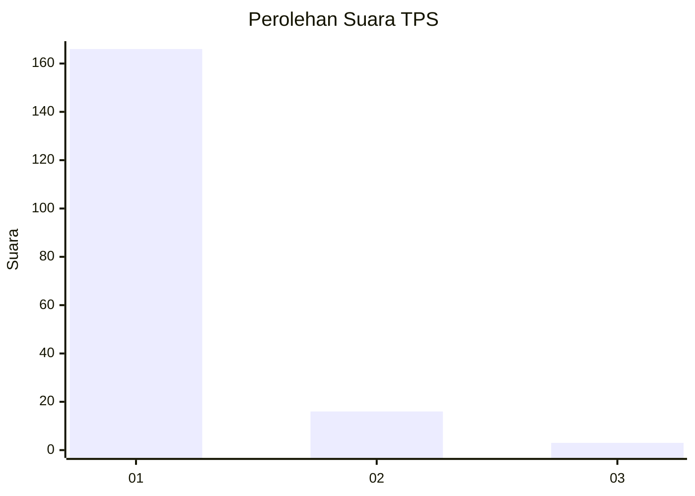
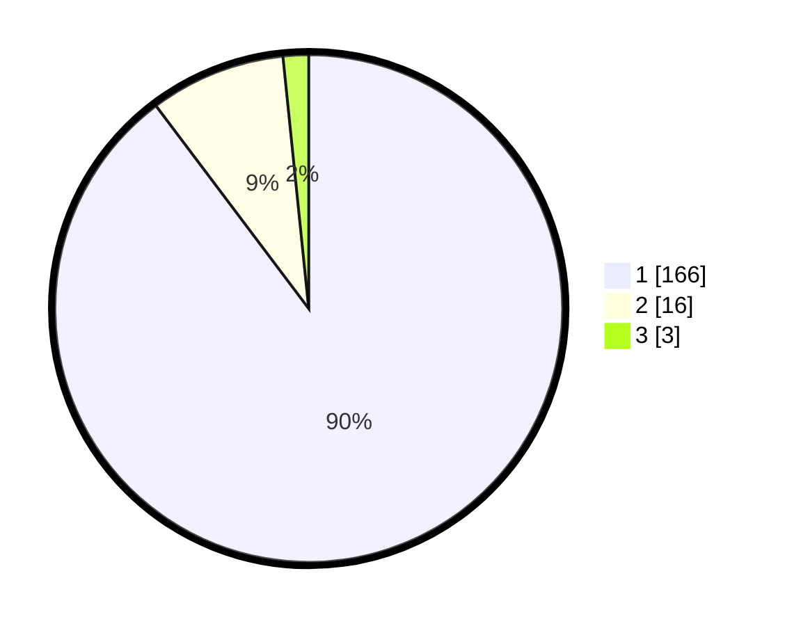

# Hasil

## Grafik

## Tabel

| No. | Nama Paslon    | Suara | Suara (raw) | Persentase |
|:--- |:-------------- | -----:| -----------:| ----------:|
| 1   | ANIES MUHAIMIN | 166   | [166][p-1]  | 89,73      |
| 2   | PRABOWO GIBRAN | 16    | [16][p-2]   | 8,65       |
| 3   | GANJAR MAHFUD  | 3     | [3][p-3]    | 1,62       |

[p-1]: https://github.com/gigit-pemilu/pemilu-2024-11-aceh/blob/main/pilpres/hitung-suara/sub/11-aceh/sub/03-aceh-timur/sub/02-julok/sub/2002-blang-jambee/sub/001-tps/sub/paslon-1.txt
[p-2]: https://github.com/gigit-pemilu/pemilu-2024-11-aceh/blob/main/pilpres/hitung-suara/sub/11-aceh/sub/03-aceh-timur/sub/02-julok/sub/2002-blang-jambee/sub/001-tps/sub/paslon-2.txt
[p-3]: https://github.com/gigit-pemilu/pemilu-2024-11-aceh/blob/main/pilpres/hitung-suara/sub/11-aceh/sub/03-aceh-timur/sub/02-julok/sub/2002-blang-jambee/sub/001-tps/sub/paslon-3.txt

## Foto C Plano

https://sirekap-obj-formc.kpu.go.id/1788/pemilu/ppwp/11/03/02/20/02/1103022002001-20240223-102622--3e8e92f1-7068-46e0-a096-1116ec57de5b.jpg

https://sirekap-obj-formc.kpu.go.id/1788/pemilu/ppwp/11/03/02/20/02/1103022002001-20240223-102646--52f10db6-b381-42f4-9500-56a9f9185989.jpg

https://sirekap-obj-formc.kpu.go.id/1788/pemilu/ppwp/11/03/02/20/02/1103022002001-20240223-102658--b5e973df-4652-4e16-82b9-01ca40289df3.jpg

## Metadata

| Key        | Value               |
| ---------- | ------------------- |
| Time Stamp | 2024-02-25 17:00:00 |

