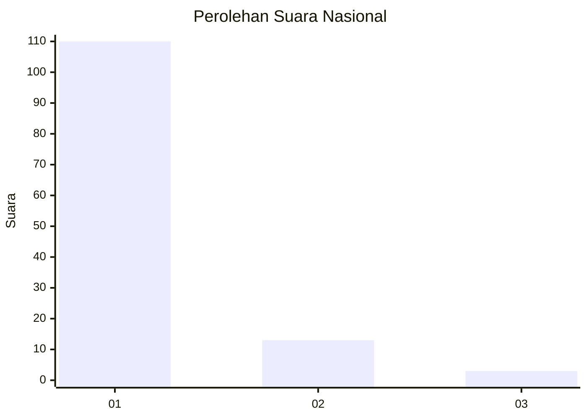
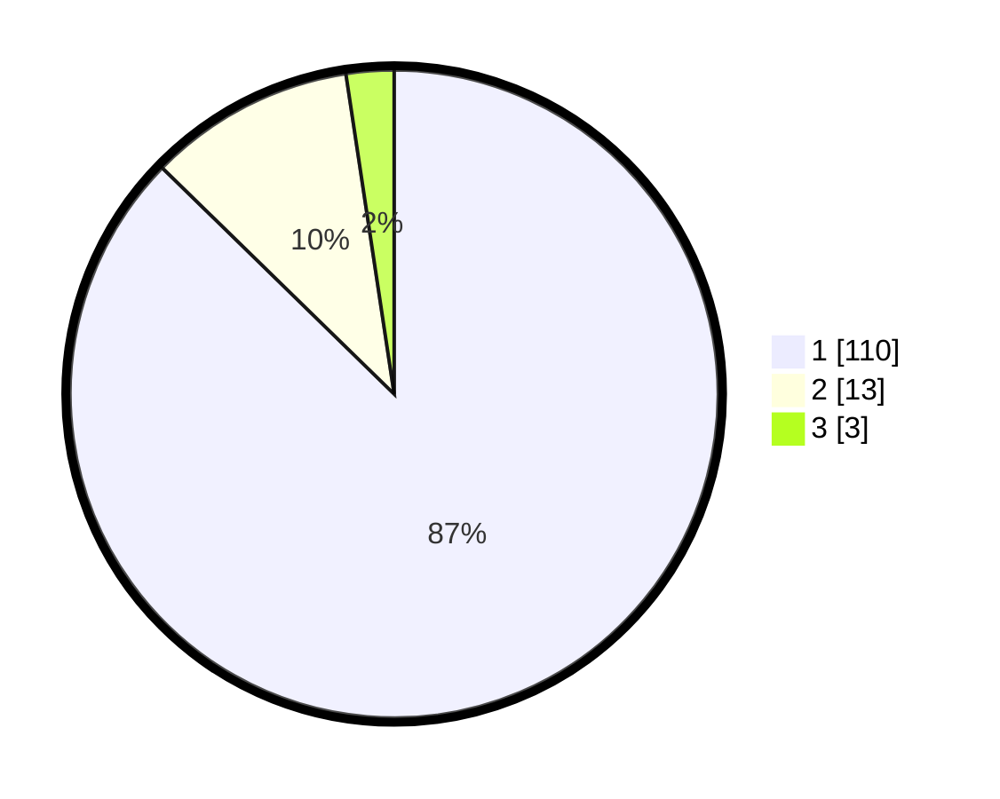

# Hasil

## Grafik

## Tabel

| No. | Nama Paslon    | Suara | Suara (raw) | Persentase |
|:--- |:-------------- | -----:| -----------:| ----------:|
| 1   | ANIES MUHAIMIN | 110   | [110][p-1]  | 87,30      |
| 2   | PRABOWO GIBRAN | 13    | [13][p-2]   | 10,32      |
| 3   | GANJAR MAHFUD  | 3     | [3][p-3]    | 2,38       |

[p-1]: https://github.com/gigit-pemilu/pemilu-2024/blob/main/pilpres/hitung-suara/sub/11-aceh/sub/03-aceh-timur/sub/02-julok/sub/2007-seuneubok-baro/sub/001-tps/sub/paslon-1.txt
[p-2]: https://github.com/gigit-pemilu/pemilu-2024/blob/main/pilpres/hitung-suara/sub/11-aceh/sub/03-aceh-timur/sub/02-julok/sub/2007-seuneubok-baro/sub/001-tps/sub/paslon-2.txt
[p-3]: https://github.com/gigit-pemilu/pemilu-2024/blob/main/pilpres/hitung-suara/sub/11-aceh/sub/03-aceh-timur/sub/02-julok/sub/2007-seuneubok-baro/sub/001-tps/sub/paslon-3.txt

## Foto C Plano

https://sirekap-obj-formc.kpu.go.id/77d7/pemilu/ppwp/11/03/02/20/07/1103022007001-20240215-011447--fb0a87a3-b416-48a3-8004-528d9e839726.jpg

https://sirekap-obj-formc.kpu.go.id/77d7/pemilu/ppwp/11/03/02/20/07/1103022007001-20240215-011625--640b49fe-eb34-4a79-ba11-c856f47137b7.jpg

https://sirekap-obj-formc.kpu.go.id/77d7/pemilu/ppwp/11/03/02/20/07/1103022007001-20240215-011823--4cf6afcf-9a8c-410b-8494-92a92c70688e.jpg

## Metadata

| Key        | Value               |
| ---------- | ------------------- |
| Time Stamp | 2024-02-17 19:00:04 |

