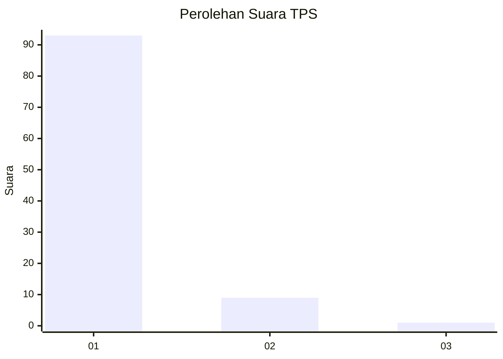
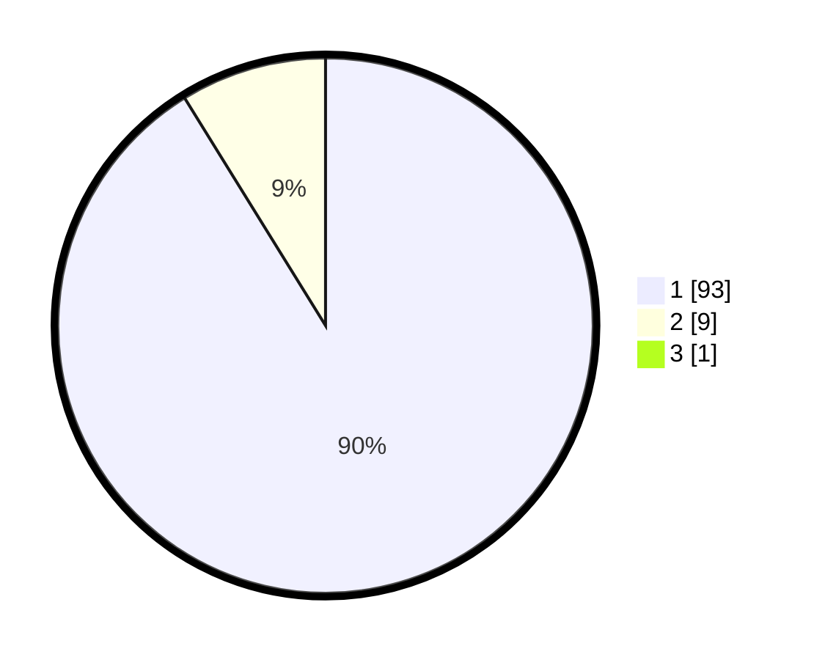

# Hasil

## Grafik

## Tabel

| No. | Nama Paslon    | Suara | Suara (raw) | Persentase |
|:--- |:-------------- | -----:| -----------:| ----------:|
| 1   | ANIES MUHAIMIN | 93    | [93][p-1]   | 90,29      |
| 2   | PRABOWO GIBRAN | 9     | [9][p-2]    | 8,74       |
| 3   | GANJAR MAHFUD  | 1     | [1][p-3]    | 0,97       |

[p-1]: https://github.com/gigit-pemilu/pemilu-2024-11-aceh/blob/main/pilpres/hitung-suara/sub/11-aceh/sub/03-aceh-timur/sub/02-julok/sub/2007-seuneubok-baro/sub/002-tps/sub/paslon-1.txt
[p-2]: https://github.com/gigit-pemilu/pemilu-2024-11-aceh/blob/main/pilpres/hitung-suara/sub/11-aceh/sub/03-aceh-timur/sub/02-julok/sub/2007-seuneubok-baro/sub/002-tps/sub/paslon-2.txt
[p-3]: https://github.com/gigit-pemilu/pemilu-2024-11-aceh/blob/main/pilpres/hitung-suara/sub/11-aceh/sub/03-aceh-timur/sub/02-julok/sub/2007-seuneubok-baro/sub/002-tps/sub/paslon-3.txt

## Foto C Plano

https://sirekap-obj-formc.kpu.go.id/0789/pemilu/ppwp/11/03/02/20/07/1103022007002-20240215-034714--c452bbb0-86e0-47ca-842a-b052baacb6be.jpg

https://sirekap-obj-formc.kpu.go.id/0789/pemilu/ppwp/11/03/02/20/07/1103022007002-20240215-034740--cb781faf-77b3-4a57-a70e-eaf9d804d8ea.jpg

https://sirekap-obj-formc.kpu.go.id/0789/pemilu/ppwp/11/03/02/20/07/1103022007002-20240215-015655--b2f52cd2-30cb-4f67-ba4b-83079d6cea57.jpg

## Metadata

| Key        | Value               |
| ---------- | ------------------- |
| Time Stamp | 2024-02-16 17:00:00 |

## DATA PEMILIH TETAP

Jumlah pemilih dalam DPT: **162**.
 * L: **86**.
 * P: **76**.

## DATA PENGGUNA HAK PILIH

Jumlah pengguna hak pilih dalam DPT: **164**.
 * L: **76**.
 * P: **58**.

Jumlah pengguna hak pilih dalam DPTb: **404**.
 * L: **4**.
 * P: **0**.

Jumlah pengguna hak pilih dalam DPK: **1**.
 * L: **1**.
 * P: **0**.

Jumlah pengguna hak pilih: **115**.
 * L: **57**.
 * P: **58**.

## JUMLAH SUARA SAH DAN TIDAK SAH

JUMLAH SELURUH SUARA SAH: **103**.

JUMLAH SUARA TIDAK SAH: **12**.

JUMLAH SELURUH SUARA SAH DAN SUARA TIDAK SAH: **115**.

