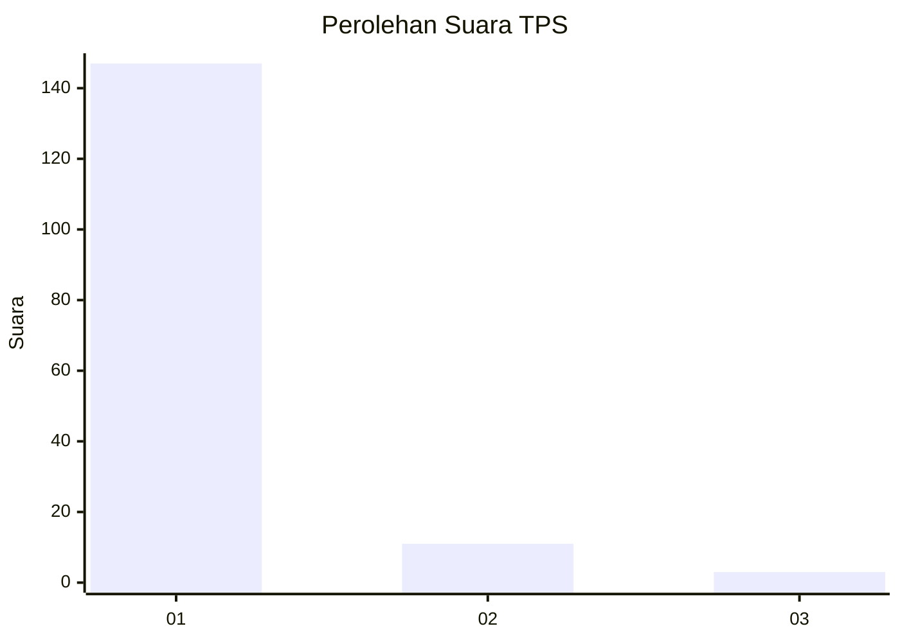
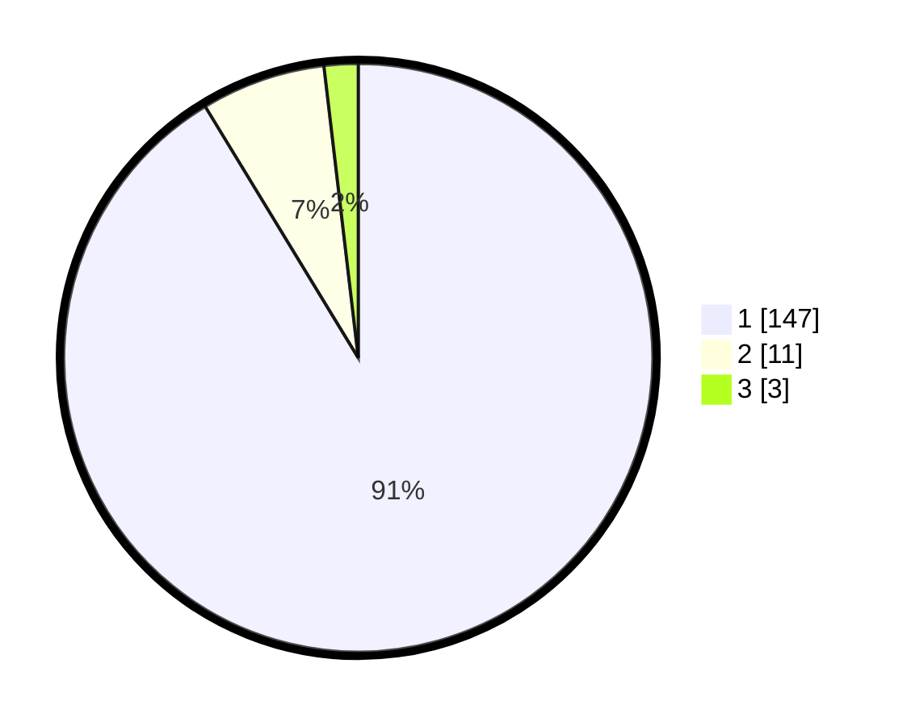

# Hasil

## Grafik

## Tabel

| No. | Nama Paslon    | Suara | Suara (raw) | Persentase |
|:--- |:-------------- | -----:| -----------:| ----------:|
| 1   | ANIES MUHAIMIN | 147   | [147][p-1]  | 91,30      |
| 2   | PRABOWO GIBRAN | 11    | [11][p-2]   | 6,83       |
| 3   | GANJAR MAHFUD  | 3     | [3][p-3]    | 1,86       |

[p-1]: https://github.com/gigit-pemilu/pemilu-2024-11-aceh/blob/main/pilpres/hitung-suara/sub/11-aceh/sub/03-aceh-timur/sub/02-julok/sub/2008-blang-mideun/sub/001-tps/sub/paslon-1.txt
[p-2]: https://github.com/gigit-pemilu/pemilu-2024-11-aceh/blob/main/pilpres/hitung-suara/sub/11-aceh/sub/03-aceh-timur/sub/02-julok/sub/2008-blang-mideun/sub/001-tps/sub/paslon-2.txt
[p-3]: https://github.com/gigit-pemilu/pemilu-2024-11-aceh/blob/main/pilpres/hitung-suara/sub/11-aceh/sub/03-aceh-timur/sub/02-julok/sub/2008-blang-mideun/sub/001-tps/sub/paslon-3.txt

## Foto C Plano

https://sirekap-obj-formc.kpu.go.id/9248/pemilu/ppwp/11/03/02/20/08/1103022008001-20240218-122524--502bc443-7717-4c78-ab24-a59257cf7ee1.jpg

https://sirekap-obj-formc.kpu.go.id/9248/pemilu/ppwp/11/03/02/20/08/1103022008001-20240215-020820--f38c4baf-a3c9-4247-8823-e15a5d04eaa5.jpg

https://sirekap-obj-formc.kpu.go.id/9248/pemilu/ppwp/11/03/02/20/08/1103022008001-20240215-033035--9dab59b4-150e-4453-8f91-ce40da4ef57a.jpg

## Metadata

| Key        | Value               |
| ---------- | ------------------- |
| Time Stamp | 2024-02-24 22:31:28 |

