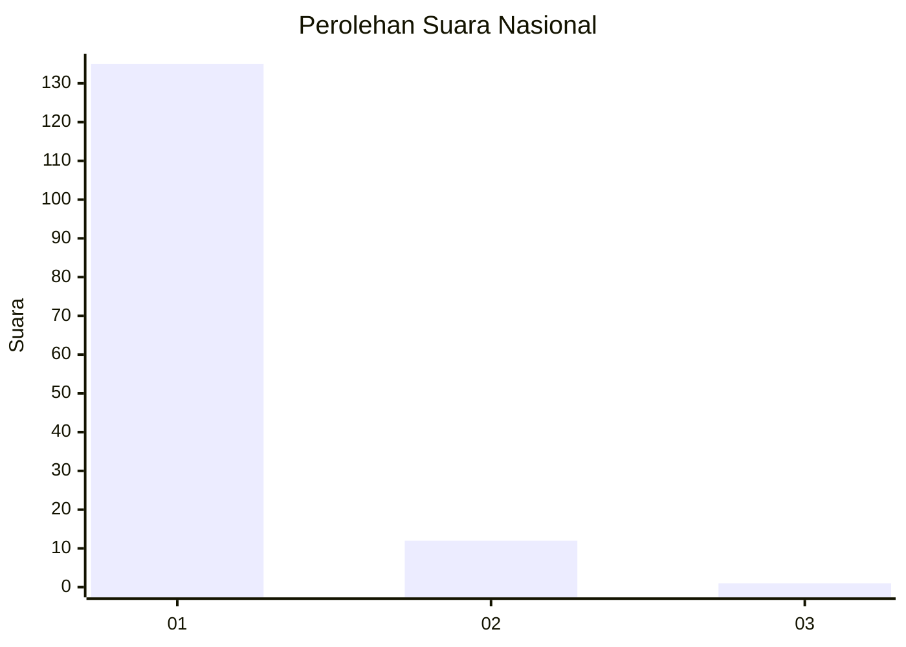
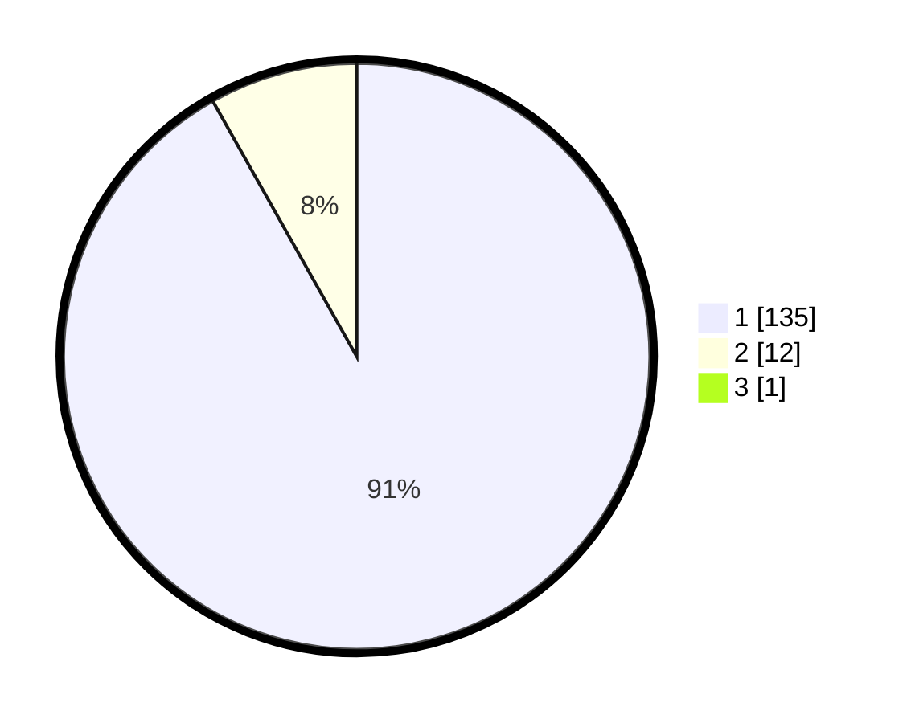

# Hasil

## Grafik

## Tabel

| No. | Nama Paslon    | Suara | Suara (raw) | Persentase |
|:--- |:-------------- | -----:| -----------:| ----------:|
| 1   | ANIES MUHAIMIN | 135   | [135][p-1]  | 91,22      |
| 2   | PRABOWO GIBRAN | 12    | [12][p-2]   | 8,11       |
| 3   | GANJAR MAHFUD  | 1     | [1][p-3]    | 0,68       |

[p-1]: https://github.com/gigit-pemilu/pemilu-2024/blob/main/pilpres/hitung-suara/sub/11-aceh/sub/03-aceh-timur/sub/02-julok/sub/2008-blang-mideun/sub/002-tps/sub/paslon-1.txt
[p-2]: https://github.com/gigit-pemilu/pemilu-2024/blob/main/pilpres/hitung-suara/sub/11-aceh/sub/03-aceh-timur/sub/02-julok/sub/2008-blang-mideun/sub/002-tps/sub/paslon-2.txt
[p-3]: https://github.com/gigit-pemilu/pemilu-2024/blob/main/pilpres/hitung-suara/sub/11-aceh/sub/03-aceh-timur/sub/02-julok/sub/2008-blang-mideun/sub/002-tps/sub/paslon-3.txt

## Foto C Plano

https://sirekap-obj-formc.kpu.go.id/47d0/pemilu/ppwp/11/03/02/20/08/1103022008002-20240217-165610--23c873d6-03df-4b2f-9fce-c9f4572e63a4.jpg

https://sirekap-obj-formc.kpu.go.id/47d0/pemilu/ppwp/11/03/02/20/08/1103022008002-20240217-171010--0a680fff-debb-4de1-9e67-5c463c49f5cf.jpg

https://sirekap-obj-formc.kpu.go.id/47d0/pemilu/ppwp/11/03/02/20/08/1103022008002-20240216-180937--938f1e0e-223b-4534-a685-d9ec076d94e8.jpg

## Metadata

| Key        | Value               |
| ---------- | ------------------- |
| Time Stamp | 2024-02-24 22:31:28 |

## DATA PEMILIH TETAP

Jumlah pemilih dalam DPT: **191**.
 * L: **86**.
 * P: **105**.

## DATA PENGGUNA HAK PILIH

Jumlah pengguna hak pilih dalam DPT: **149**.
 * L: **68**.
 * P: **81**.

Jumlah pengguna hak pilih dalam DPTb: **0**.
 * L: **0**.
 * P: **0**.

Jumlah pengguna hak pilih dalam DPK: **0**.
 * L: **0**.
 * P: **0**.

Jumlah pengguna hak pilih: **149**.
 * L: **68**.
 * P: **81**.

## JUMLAH SUARA SAH DAN TIDAK SAH

JUMLAH SELURUH SUARA SAH: **148**.

JUMLAH SUARA TIDAK SAH: **1**.

JUMLAH SELURUH SUARA SAH DAN SUARA TIDAK SAH: **149**.

