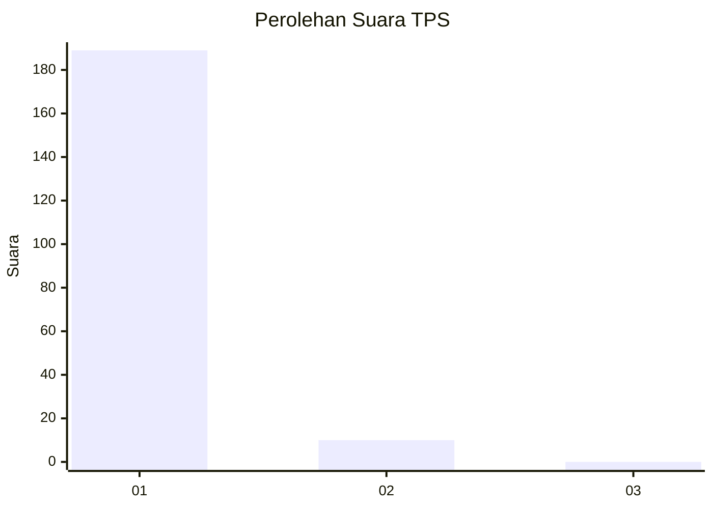
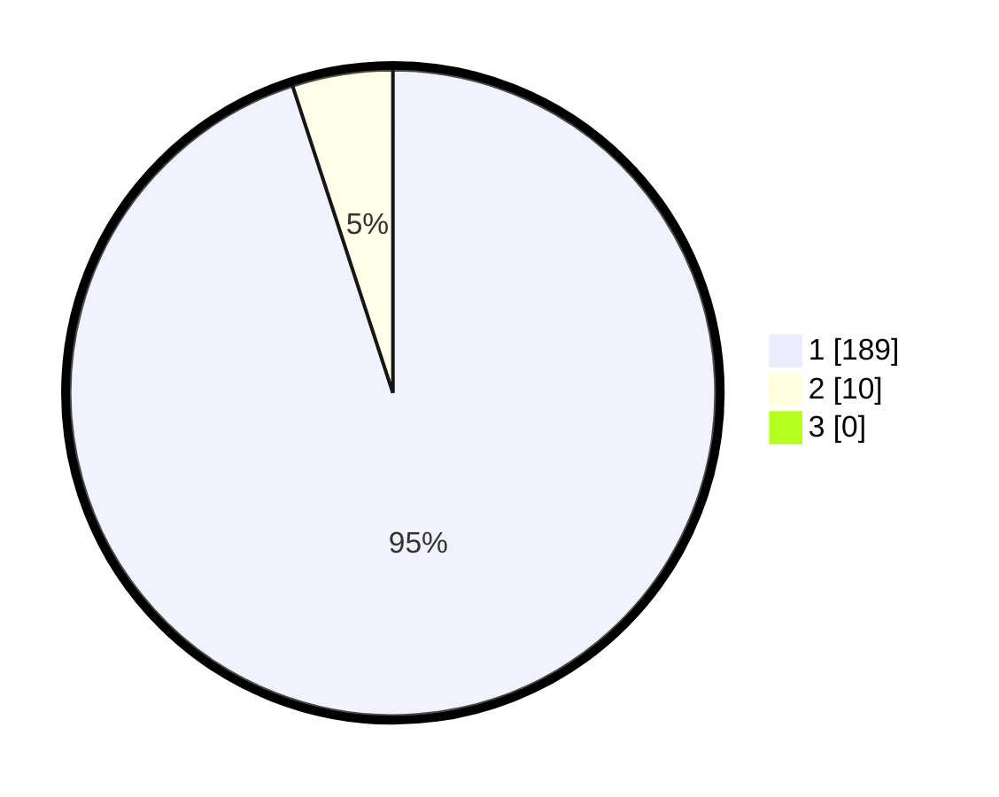

# Hasil

## Grafik

## Tabel

| No. | Nama Paslon    | Suara | Suara (raw) | Persentase |
|:--- |:-------------- | -----:| -----------:| ----------:|
| 1   | ANIES MUHAIMIN | 189   | [189][p-1]  | 94,97      |
| 2   | PRABOWO GIBRAN | 10    | [10][p-2]   | 5,03       |
| 3   | GANJAR MAHFUD  | 0     | [0][p-3]    | 0,00       |

[p-1]: https://github.com/gigit-pemilu/pemilu-2024-11-aceh/blob/main/pilpres/hitung-suara/sub/11-aceh/sub/03-aceh-timur/sub/02-julok/sub/2012-julok-tunong/sub/001-tps/sub/paslon-1.txt
[p-2]: https://github.com/gigit-pemilu/pemilu-2024-11-aceh/blob/main/pilpres/hitung-suara/sub/11-aceh/sub/03-aceh-timur/sub/02-julok/sub/2012-julok-tunong/sub/001-tps/sub/paslon-2.txt
[p-3]: https://github.com/gigit-pemilu/pemilu-2024-11-aceh/blob/main/pilpres/hitung-suara/sub/11-aceh/sub/03-aceh-timur/sub/02-julok/sub/2012-julok-tunong/sub/001-tps/sub/paslon-3.txt

## Foto C Plano

https://sirekap-obj-formc.kpu.go.id/504d/pemilu/ppwp/11/03/02/20/12/1103022012001-20240215-055205--70a61e2a-042f-4247-ab83-affdeed7db8a.jpg

https://sirekap-obj-formc.kpu.go.id/504d/pemilu/ppwp/11/03/02/20/12/1103022012001-20240215-054921--62d479e0-fbac-4e15-90e9-6e97be0d6d0d.jpg

https://sirekap-obj-formc.kpu.go.id/504d/pemilu/ppwp/11/03/02/20/12/1103022012001-20240215-055026--fb29a20d-bb67-44ff-b9c8-60c66f0c6f46.jpg

## Metadata

| Key        | Value               |
| ---------- | ------------------- |
| Time Stamp | 2024-02-17 19:00:04 |

