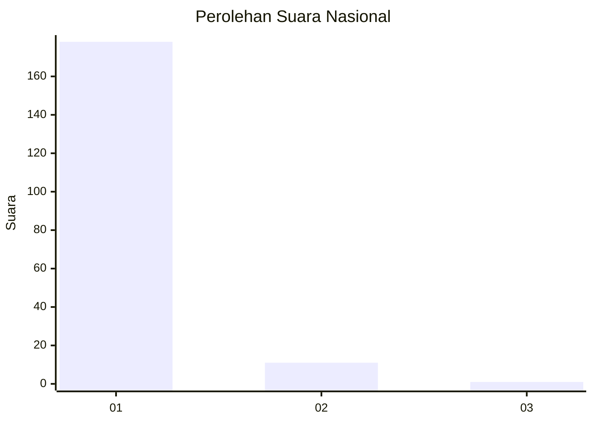
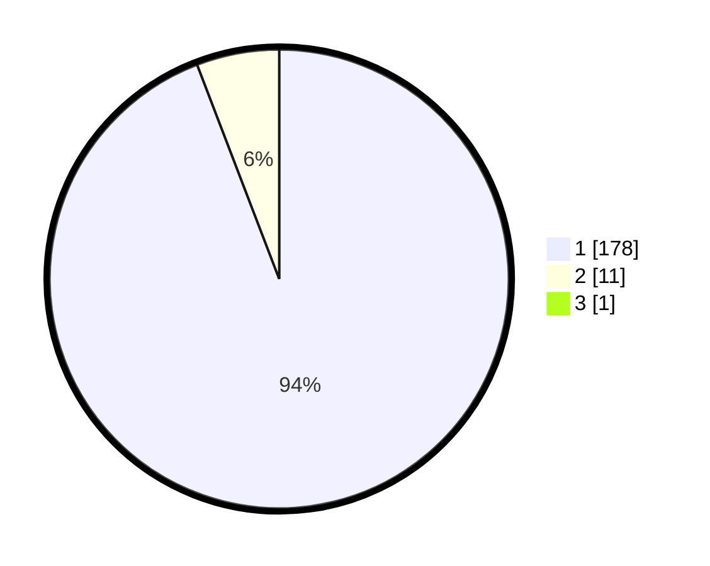

# Hasil

## Grafik

## Tabel

| No. | Nama Paslon    | Suara | Suara (raw) | Persentase |
|:--- |:-------------- | -----:| -----------:| ----------:|
| 1   | ANIES MUHAIMIN | 178   | [178][p-1]  | 93,68      |
| 2   | PRABOWO GIBRAN | 11    | [11][p-2]   | 5,79       |
| 3   | GANJAR MAHFUD  | 1     | [1][p-3]    | 0,53       |

[p-1]: https://github.com/gigit-pemilu/pemilu-2024/blob/main/pilpres/hitung-suara/sub/11-aceh/sub/03-aceh-timur/sub/02-julok/sub/2012-julok-tunong/sub/002-tps/sub/paslon-1.txt
[p-2]: https://github.com/gigit-pemilu/pemilu-2024/blob/main/pilpres/hitung-suara/sub/11-aceh/sub/03-aceh-timur/sub/02-julok/sub/2012-julok-tunong/sub/002-tps/sub/paslon-2.txt
[p-3]: https://github.com/gigit-pemilu/pemilu-2024/blob/main/pilpres/hitung-suara/sub/11-aceh/sub/03-aceh-timur/sub/02-julok/sub/2012-julok-tunong/sub/002-tps/sub/paslon-3.txt

## Foto C Plano

https://sirekap-obj-formc.kpu.go.id/822d/pemilu/ppwp/11/03/02/20/12/1103022012002-20240215-040021--443e82e9-7747-4abb-b26a-bb9b8f782bbc.jpg

https://sirekap-obj-formc.kpu.go.id/822d/pemilu/ppwp/11/03/02/20/12/1103022012002-20240215-040033--693e88dd-70e9-4aa8-8512-b940fad6d813.jpg

https://sirekap-obj-formc.kpu.go.id/822d/pemilu/ppwp/11/03/02/20/12/1103022012002-20240215-040039--25b559d6-c65a-49f7-84f8-819fe996320d.jpg

## Metadata

| Key        | Value               |
| ---------- | ------------------- |
| Time Stamp | 2024-02-17 19:00:04 |

