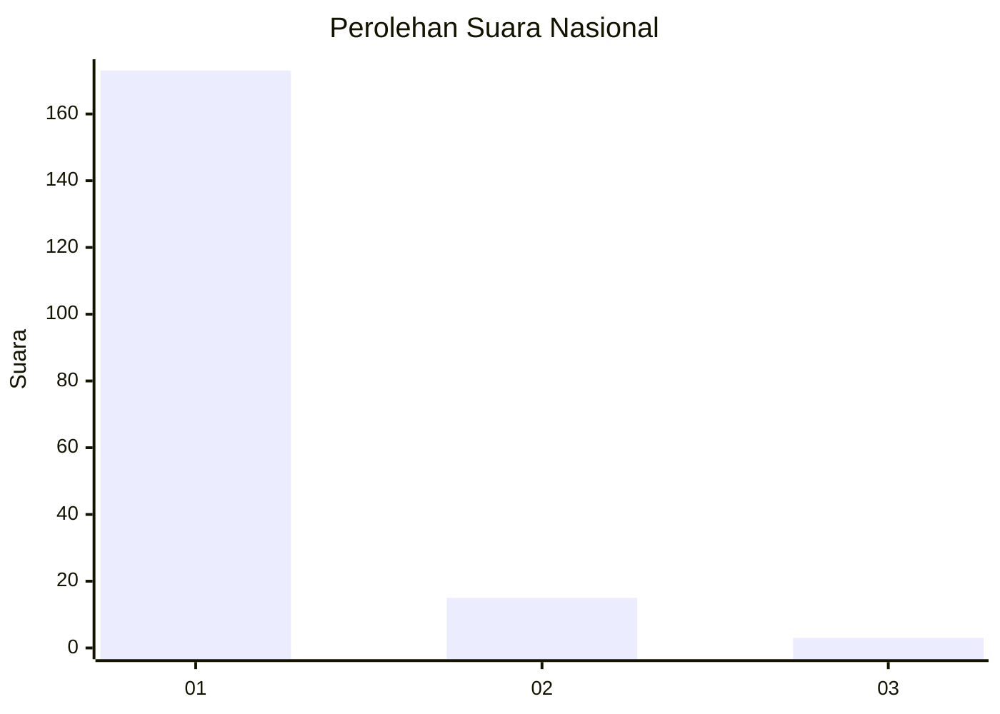
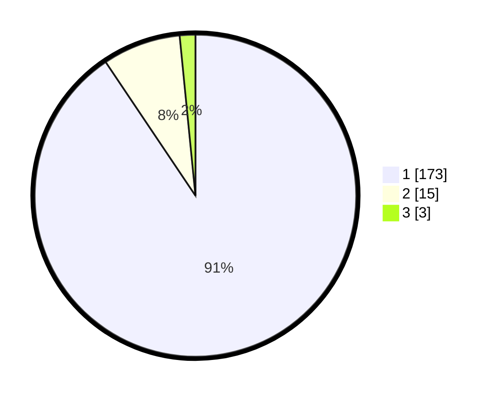

# Hasil

## Grafik

## Tabel

| No. | Nama Paslon    | Suara | Suara (raw) | Persentase |
|:--- |:-------------- | -----:| -----------:| ----------:|
| 1   | ANIES MUHAIMIN | 173   | [173][p-1]  | 90,58      |
| 2   | PRABOWO GIBRAN | 15    | [15][p-2]   | 7,85       |
| 3   | GANJAR MAHFUD  | 3     | [3][p-3]    | 1,57       |

[p-1]: https://github.com/gigit-pemilu/pemilu-2024/blob/main/pilpres/hitung-suara/sub/11-aceh/sub/03-aceh-timur/sub/02-julok/sub/2012-julok-tunong/sub/004-tps/sub/paslon-1.txt
[p-2]: https://github.com/gigit-pemilu/pemilu-2024/blob/main/pilpres/hitung-suara/sub/11-aceh/sub/03-aceh-timur/sub/02-julok/sub/2012-julok-tunong/sub/004-tps/sub/paslon-2.txt
[p-3]: https://github.com/gigit-pemilu/pemilu-2024/blob/main/pilpres/hitung-suara/sub/11-aceh/sub/03-aceh-timur/sub/02-julok/sub/2012-julok-tunong/sub/004-tps/sub/paslon-3.txt

## Foto C Plano

https://sirekap-obj-formc.kpu.go.id/5585/pemilu/ppwp/11/03/02/20/12/1103022012004-20240215-010356--43120597-9ba6-4c53-a03d-75b6e292fc0a.jpg

https://sirekap-obj-formc.kpu.go.id/5585/pemilu/ppwp/11/03/02/20/12/1103022012004-20240215-010912--0b5a71f0-299b-401b-a7fa-e6421d3e2f13.jpg

https://sirekap-obj-formc.kpu.go.id/5585/pemilu/ppwp/11/03/02/20/12/1103022012004-20240215-011456--09d1239c-49c1-46fd-b77d-d72157668c63.jpg

## Metadata

| Key        | Value               |
| ---------- | ------------------- |
| Time Stamp | 2024-02-17 19:00:04 |

