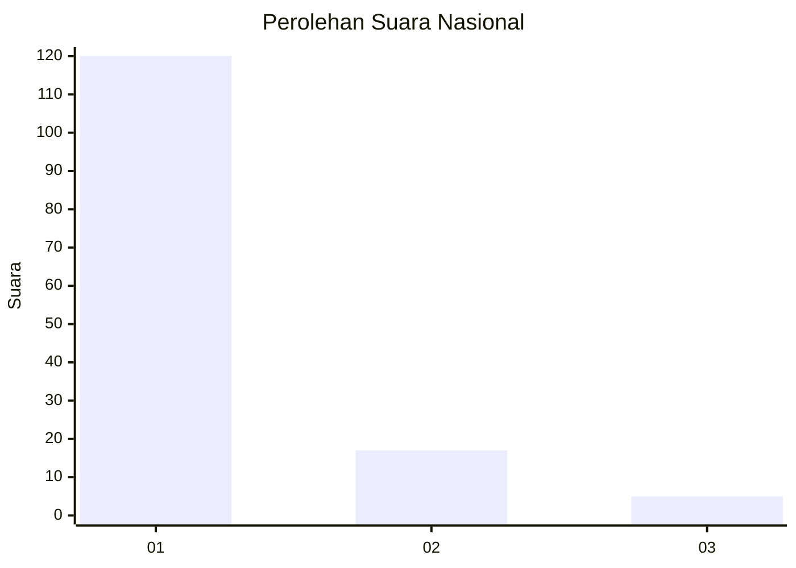
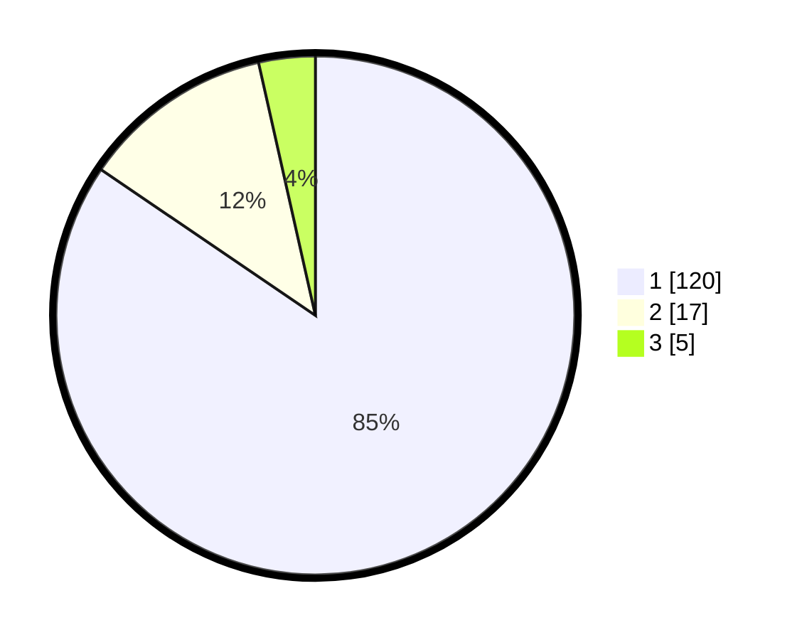

# Hasil

## Grafik

## Tabel

| No. | Nama Paslon    | Suara | Suara (raw) | Persentase |
|:--- |:-------------- | -----:| -----------:| ----------:|
| 1   | ANIES MUHAIMIN | 120   | [120][p-1]  | 84,51      |
| 2   | PRABOWO GIBRAN | 17    | [17][p-2]   | 11,97      |
| 3   | GANJAR MAHFUD  | 5     | [5][p-3]    | 3,52       |

[p-1]: https://github.com/gigit-pemilu/pemilu-2024/blob/main/pilpres/hitung-suara/sub/11-aceh/sub/03-aceh-timur/sub/02-julok/sub/2014-ulee-blang/sub/001-tps/sub/paslon-1.txt
[p-2]: https://github.com/gigit-pemilu/pemilu-2024/blob/main/pilpres/hitung-suara/sub/11-aceh/sub/03-aceh-timur/sub/02-julok/sub/2014-ulee-blang/sub/001-tps/sub/paslon-2.txt
[p-3]: https://github.com/gigit-pemilu/pemilu-2024/blob/main/pilpres/hitung-suara/sub/11-aceh/sub/03-aceh-timur/sub/02-julok/sub/2014-ulee-blang/sub/001-tps/sub/paslon-3.txt

## Foto C Plano

https://sirekap-obj-formc.kpu.go.id/6fd4/pemilu/ppwp/11/03/02/20/14/1103022014001-20240215-023947--4b6a984e-c7c7-49c1-97a3-46b9cfd4b194.jpg

https://sirekap-obj-formc.kpu.go.id/6fd4/pemilu/ppwp/11/03/02/20/14/1103022014001-20240215-024116--ae9aa247-5ef6-482c-a7a3-b2f1a1d6d3e4.jpg

https://sirekap-obj-formc.kpu.go.id/6fd4/pemilu/ppwp/11/03/02/20/14/1103022014001-20240215-024211--f71d7cc5-4aa2-47f1-bb54-1d05e3f7980b.jpg

## Metadata

| Key        | Value               |
| ---------- | ------------------- |
| Time Stamp | 2024-02-24 22:31:28 |

## DATA PEMILIH TETAP

Jumlah pemilih dalam DPT: **176**.
 * L: **82**.
 * P: **94**.

## DATA PENGGUNA HAK PILIH

Jumlah pengguna hak pilih dalam DPT: **145**.
 * L: **63**.
 * P: **82**.

Jumlah pengguna hak pilih dalam DPTb: **0**.
 * L: **0**.
 * P: **0**.

Jumlah pengguna hak pilih dalam DPK: **1**.
 * L: **1**.
 * P: **0**.

Jumlah pengguna hak pilih: **146**.
 * L: **64**.
 * P: **82**.

## JUMLAH SUARA SAH DAN TIDAK SAH

JUMLAH SELURUH SUARA SAH: **142**.

JUMLAH SUARA TIDAK SAH: **4**.

JUMLAH SELURUH SUARA SAH DAN SUARA TIDAK SAH: **146**.

