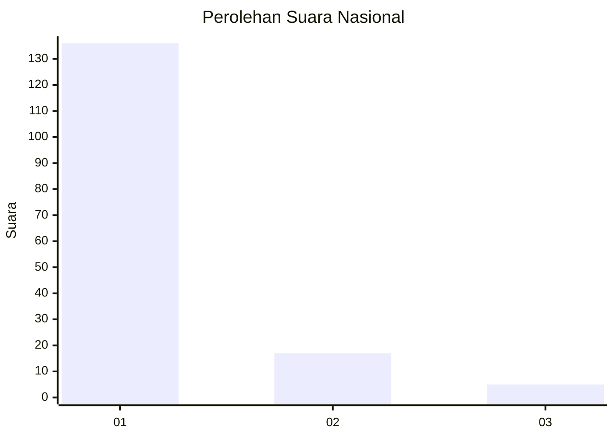
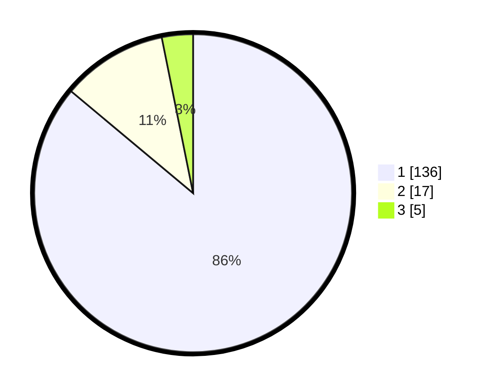

# Hasil

## Grafik

## Tabel

| No. | Nama Paslon    | Suara | Suara (raw) | Persentase |
|:--- |:-------------- | -----:| -----------:| ----------:|
| 1   | ANIES MUHAIMIN | 136   | [136][p-1]  | 86,08      |
| 2   | PRABOWO GIBRAN | 17    | [17][p-2]   | 10,76      |
| 3   | GANJAR MAHFUD  | 5     | [5][p-3]    | 3,16       |

[p-1]: https://github.com/gigit-pemilu/pemilu-2024/blob/main/pilpres/hitung-suara/sub/11-aceh/sub/03-aceh-timur/sub/02-julok/sub/2014-ulee-blang/sub/002-tps/sub/paslon-1.txt
[p-2]: https://github.com/gigit-pemilu/pemilu-2024/blob/main/pilpres/hitung-suara/sub/11-aceh/sub/03-aceh-timur/sub/02-julok/sub/2014-ulee-blang/sub/002-tps/sub/paslon-2.txt
[p-3]: https://github.com/gigit-pemilu/pemilu-2024/blob/main/pilpres/hitung-suara/sub/11-aceh/sub/03-aceh-timur/sub/02-julok/sub/2014-ulee-blang/sub/002-tps/sub/paslon-3.txt

## Foto C Plano

https://sirekap-obj-formc.kpu.go.id/1604/pemilu/ppwp/11/03/02/20/14/1103022014002-20240215-071515--cb603b58-ef33-4a92-85d8-f4432388127d.jpg

https://sirekap-obj-formc.kpu.go.id/1604/pemilu/ppwp/11/03/02/20/14/1103022014002-20240215-071803--523e2c65-d4da-4eff-9fb4-03b31a4bb659.jpg

## Metadata

| Key        | Value               |
| ---------- | ------------------- |
| Time Stamp | 2024-02-24 22:31:28 |

