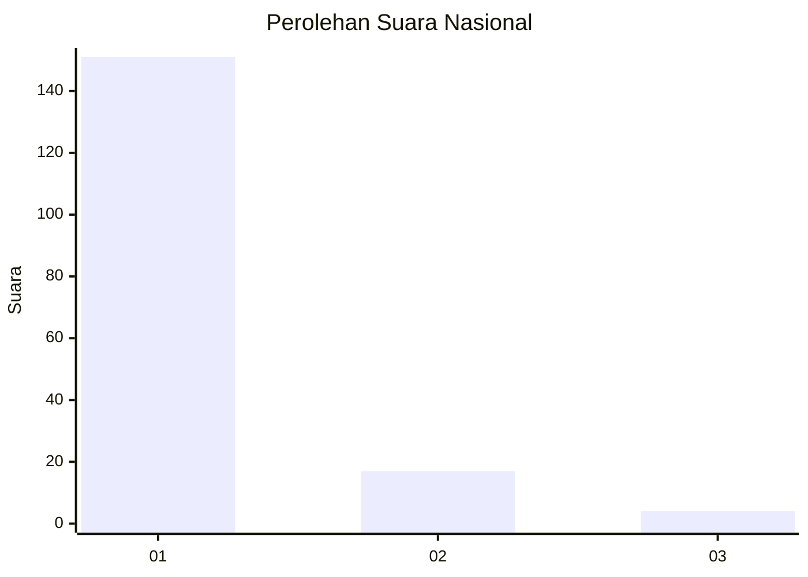
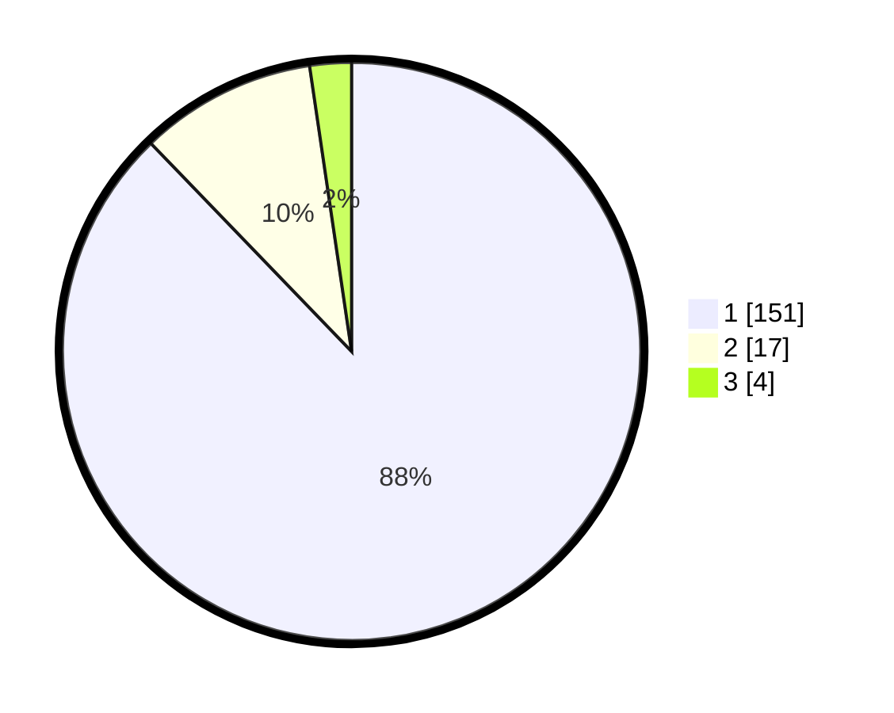

# Hasil

## Grafik

## Tabel

| No. | Nama Paslon    | Suara | Suara (raw) | Persentase |
|:--- |:-------------- | -----:| -----------:| ----------:|
| 1   | ANIES MUHAIMIN | 151   | [151][p-1]  | 87,79      |
| 2   | PRABOWO GIBRAN | 17    | [17][p-2]   | 9,88       |
| 3   | GANJAR MAHFUD  | 4     | [4][p-3]    | 2,33       |

[p-1]: https://github.com/gigit-pemilu/pemilu-2024/blob/main/pilpres/hitung-suara/sub/11-aceh/sub/03-aceh-timur/sub/02-julok/sub/2017-mane-rampak/sub/001-tps/sub/paslon-1.txt
[p-2]: https://github.com/gigit-pemilu/pemilu-2024/blob/main/pilpres/hitung-suara/sub/11-aceh/sub/03-aceh-timur/sub/02-julok/sub/2017-mane-rampak/sub/001-tps/sub/paslon-2.txt
[p-3]: https://github.com/gigit-pemilu/pemilu-2024/blob/main/pilpres/hitung-suara/sub/11-aceh/sub/03-aceh-timur/sub/02-julok/sub/2017-mane-rampak/sub/001-tps/sub/paslon-3.txt

## Foto C Plano

https://sirekap-obj-formc.kpu.go.id/daa5/pemilu/ppwp/11/03/02/20/17/1103022017001-20240215-073823--b36d5fbf-572c-4497-9a14-65dbba6c6932.jpg

https://sirekap-obj-formc.kpu.go.id/daa5/pemilu/ppwp/11/03/02/20/17/1103022017001-20240215-074008--b281ead5-d069-4284-a604-f65a53a2741f.jpg

https://sirekap-obj-formc.kpu.go.id/daa5/pemilu/ppwp/11/03/02/20/17/1103022017001-20240215-074149--bb2e93a2-ab6a-4aa8-9f05-463cce2a1257.jpg

## Metadata

| Key        | Value               |
| ---------- | ------------------- |
| Time Stamp | 2024-02-19 06:16:00 |

