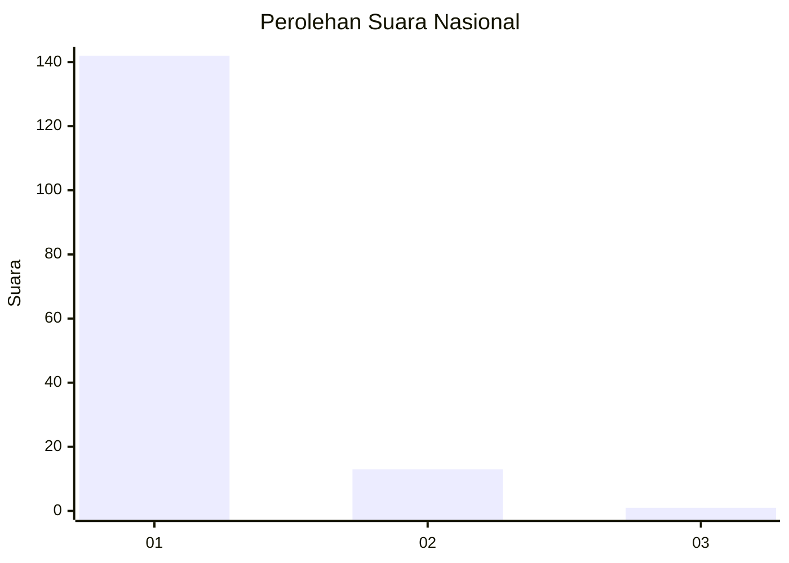
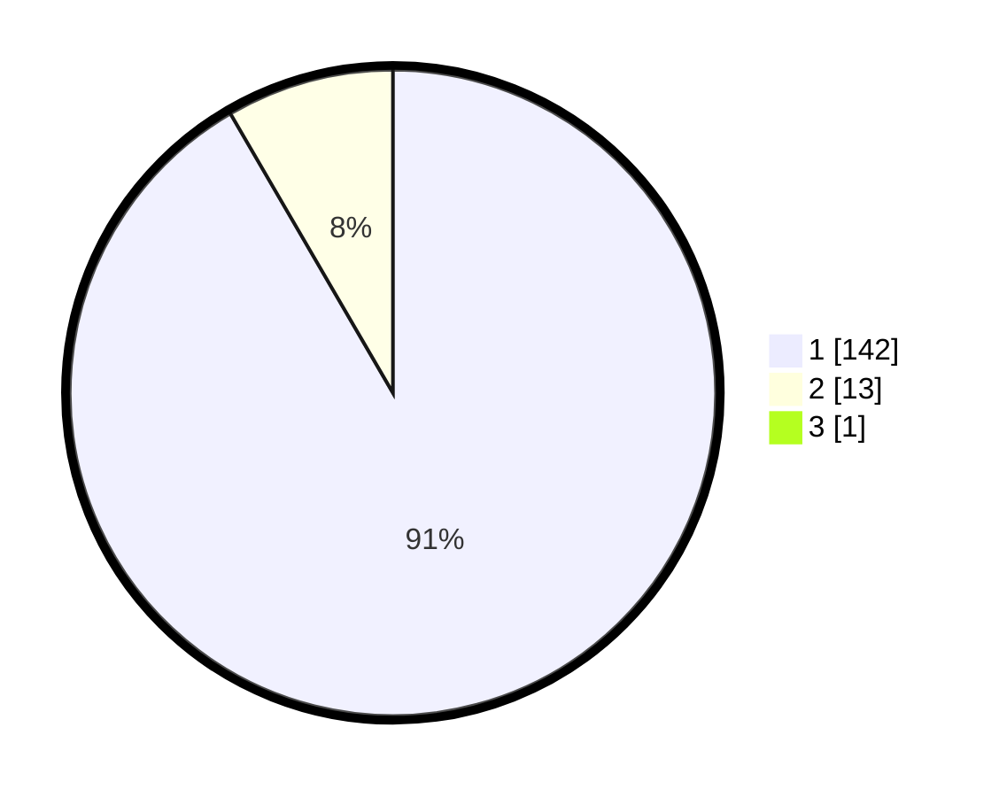

# Hasil

## Grafik

## Tabel

| No. | Nama Paslon    | Suara | Suara (raw) | Persentase |
|:--- |:-------------- | -----:| -----------:| ----------:|
| 1   | ANIES MUHAIMIN | 142   | [142][p-1]  | 91,03      |
| 2   | PRABOWO GIBRAN | 13    | [13][p-2]   | 8,33       |
| 3   | GANJAR MAHFUD  | 1     | [1][p-3]    | 0,64       |

[p-1]: https://github.com/gigit-pemilu/pemilu-2024/blob/main/pilpres/hitung-suara/sub/11-aceh/sub/03-aceh-timur/sub/02-julok/sub/2017-mane-rampak/sub/002-tps/sub/paslon-1.txt
[p-2]: https://github.com/gigit-pemilu/pemilu-2024/blob/main/pilpres/hitung-suara/sub/11-aceh/sub/03-aceh-timur/sub/02-julok/sub/2017-mane-rampak/sub/002-tps/sub/paslon-2.txt
[p-3]: https://github.com/gigit-pemilu/pemilu-2024/blob/main/pilpres/hitung-suara/sub/11-aceh/sub/03-aceh-timur/sub/02-julok/sub/2017-mane-rampak/sub/002-tps/sub/paslon-3.txt

## Foto C Plano

https://sirekap-obj-formc.kpu.go.id/4734/pemilu/ppwp/11/03/02/20/17/1103022017002-20240214-155306--5a1821de-d45d-4830-b768-e555f121adec.jpg

https://sirekap-obj-formc.kpu.go.id/4734/pemilu/ppwp/11/03/02/20/17/1103022017002-20240214-155558--4427d431-4d98-460d-b185-d1911af66f46.jpg

## Metadata

| Key        | Value               |
| ---------- | ------------------- |
| Time Stamp | 2024-02-19 06:16:00 |

