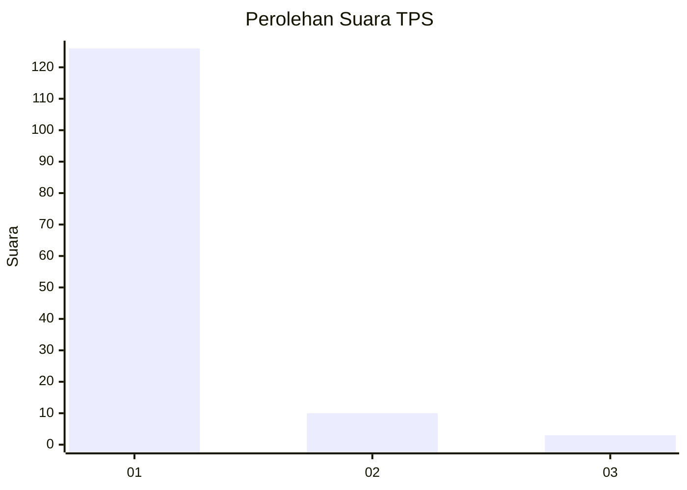
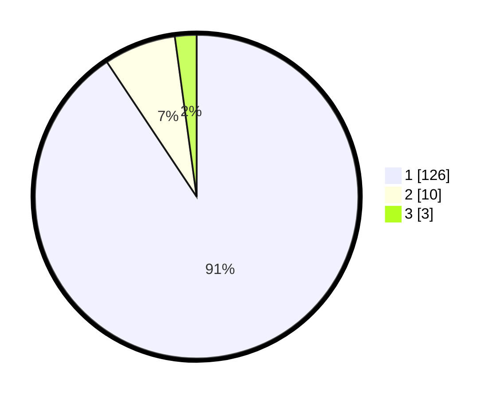

# Hasil

## Grafik

## Tabel

| No. | Nama Paslon    | Suara | Suara (raw) | Persentase |
|:--- |:-------------- | -----:| -----------:| ----------:|
| 1   | ANIES MUHAIMIN | 126   | [126][p-1]  | 90,65      |
| 2   | PRABOWO GIBRAN | 10    | [10][p-2]   | 7,19       |
| 3   | GANJAR MAHFUD  | 3     | [3][p-3]    | 2,16       |

[p-1]: https://github.com/gigit-pemilu/pemilu-2024-11-aceh/blob/main/pilpres/hitung-suara/sub/11-aceh/sub/03-aceh-timur/sub/02-julok/sub/2018-matang/sub/001-tps/sub/paslon-1.txt
[p-2]: https://github.com/gigit-pemilu/pemilu-2024-11-aceh/blob/main/pilpres/hitung-suara/sub/11-aceh/sub/03-aceh-timur/sub/02-julok/sub/2018-matang/sub/001-tps/sub/paslon-2.txt
[p-3]: https://github.com/gigit-pemilu/pemilu-2024-11-aceh/blob/main/pilpres/hitung-suara/sub/11-aceh/sub/03-aceh-timur/sub/02-julok/sub/2018-matang/sub/001-tps/sub/paslon-3.txt

## Foto C Plano

https://sirekap-obj-formc.kpu.go.id/84ec/pemilu/ppwp/11/03/02/20/18/1103022018001-20240214-231003--2454f1a6-d06b-41b0-9ee0-054993212dc7.jpg

https://sirekap-obj-formc.kpu.go.id/84ec/pemilu/ppwp/11/03/02/20/18/1103022018001-20240214-194218--95b44326-7713-4c21-85d5-e8ac12a74fcc.jpg

https://sirekap-obj-formc.kpu.go.id/84ec/pemilu/ppwp/11/03/02/20/18/1103022018001-20240214-194316--e092d5b6-868e-40f6-9432-68b83238bfb4.jpg

## Metadata

| Key        | Value               |
| ---------- | ------------------- |
| Time Stamp | 2024-02-19 06:16:00 |

