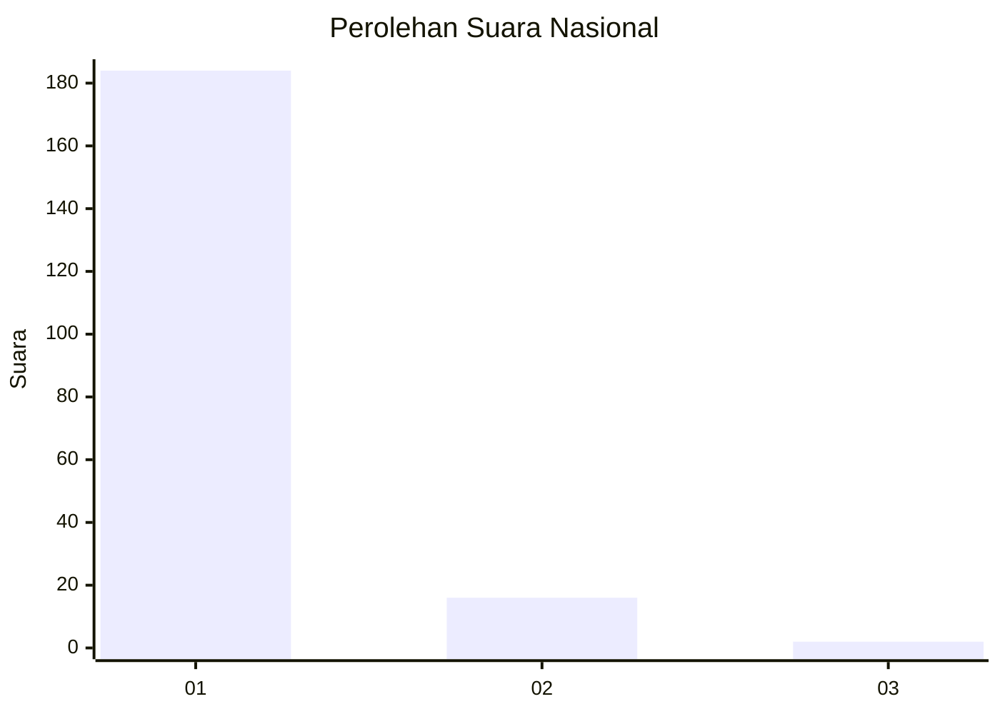
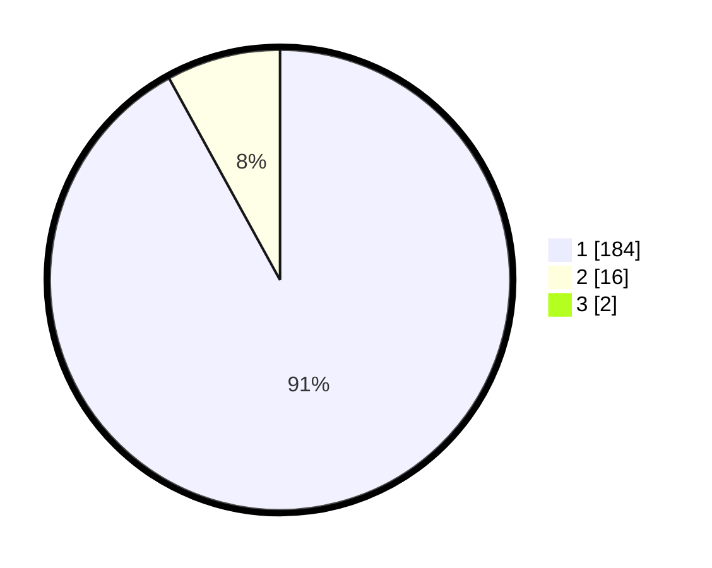

# Hasil

## Grafik

## Tabel

| No. | Nama Paslon    | Suara | Suara (raw) | Persentase |
|:--- |:-------------- | -----:| -----------:| ----------:|
| 1   | ANIES MUHAIMIN | 184   | [184][p-1]  | 91,09      |
| 2   | PRABOWO GIBRAN | 16    | [16][p-2]   | 7,92       |
| 3   | GANJAR MAHFUD  | 2     | [2][p-3]    | 0,99       |

[p-1]: https://github.com/gigit-pemilu/pemilu-2024/blob/main/pilpres/hitung-suara/sub/11-aceh/sub/03-aceh-timur/sub/02-julok/sub/2019-blang-uyok/sub/001-tps/sub/paslon-1.txt
[p-2]: https://github.com/gigit-pemilu/pemilu-2024/blob/main/pilpres/hitung-suara/sub/11-aceh/sub/03-aceh-timur/sub/02-julok/sub/2019-blang-uyok/sub/001-tps/sub/paslon-2.txt
[p-3]: https://github.com/gigit-pemilu/pemilu-2024/blob/main/pilpres/hitung-suara/sub/11-aceh/sub/03-aceh-timur/sub/02-julok/sub/2019-blang-uyok/sub/001-tps/sub/paslon-3.txt

## Foto C Plano

https://sirekap-obj-formc.kpu.go.id/3194/pemilu/ppwp/11/03/02/20/19/1103022019001-20240214-235047--c5c57f0d-052a-4cf6-8cc1-4125425c87c3.jpg

https://sirekap-obj-formc.kpu.go.id/3194/pemilu/ppwp/11/03/02/20/19/1103022019001-20240214-235130--1dd13e28-d5b4-4f6d-85e8-4c9704a9e2d3.jpg

https://sirekap-obj-formc.kpu.go.id/3194/pemilu/ppwp/11/03/02/20/19/1103022019001-20240214-235223--e557b84b-4e6f-4041-afce-91de003c5edd.jpg

## Metadata

| Key        | Value               |
| ---------- | ------------------- |
| Time Stamp | 2024-02-19 06:16:00 |

