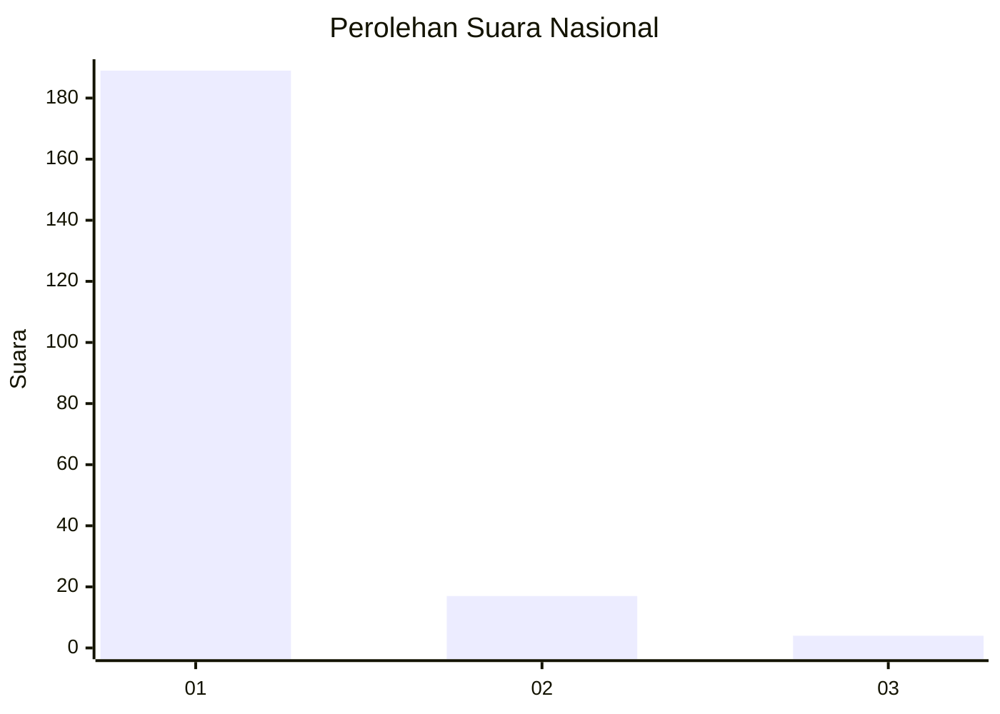
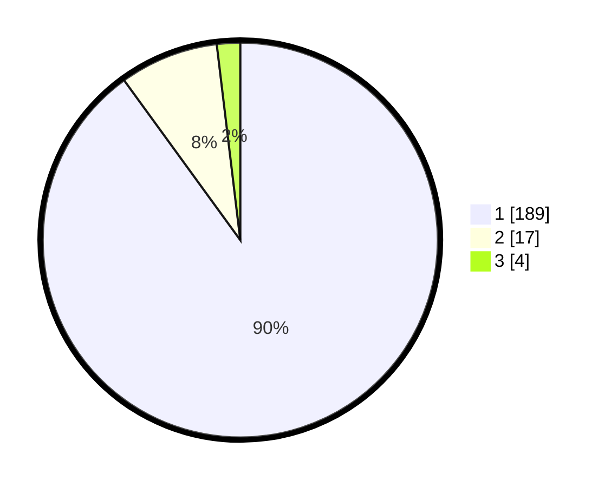

# Hasil

## Grafik

## Tabel

| No. | Nama Paslon    | Suara | Suara (raw) | Persentase |
|:--- |:-------------- | -----:| -----------:| ----------:|
| 1   | ANIES MUHAIMIN | 189   | [189][p-1]  | 90,00      |
| 2   | PRABOWO GIBRAN | 17    | [17][p-2]   | 8,10       |
| 3   | GANJAR MAHFUD  | 4     | [4][p-3]    | 1,90       |

[p-1]: https://github.com/gigit-pemilu/pemilu-2024/blob/main/pilpres/hitung-suara/sub/11-aceh/sub/03-aceh-timur/sub/02-julok/sub/2019-blang-uyok/sub/002-tps/sub/paslon-1.txt
[p-2]: https://github.com/gigit-pemilu/pemilu-2024/blob/main/pilpres/hitung-suara/sub/11-aceh/sub/03-aceh-timur/sub/02-julok/sub/2019-blang-uyok/sub/002-tps/sub/paslon-2.txt
[p-3]: https://github.com/gigit-pemilu/pemilu-2024/blob/main/pilpres/hitung-suara/sub/11-aceh/sub/03-aceh-timur/sub/02-julok/sub/2019-blang-uyok/sub/002-tps/sub/paslon-3.txt

## Foto C Plano

https://sirekap-obj-formc.kpu.go.id/61ab/pemilu/ppwp/11/03/02/20/19/1103022019002-20240215-053740--80826978-79db-4083-88c5-b3fba6355675.jpg

https://sirekap-obj-formc.kpu.go.id/61ab/pemilu/ppwp/11/03/02/20/19/1103022019002-20240214-214002--9a0cc27d-7b96-41a0-9339-edefcf3248d3.jpg

https://sirekap-obj-formc.kpu.go.id/61ab/pemilu/ppwp/11/03/02/20/19/1103022019002-20240214-214107--6b205d2e-53c3-4e7e-8024-06291d778460.jpg

## Metadata

| Key        | Value               |
| ---------- | ------------------- |
| Time Stamp | 2024-02-19 06:16:00 |

