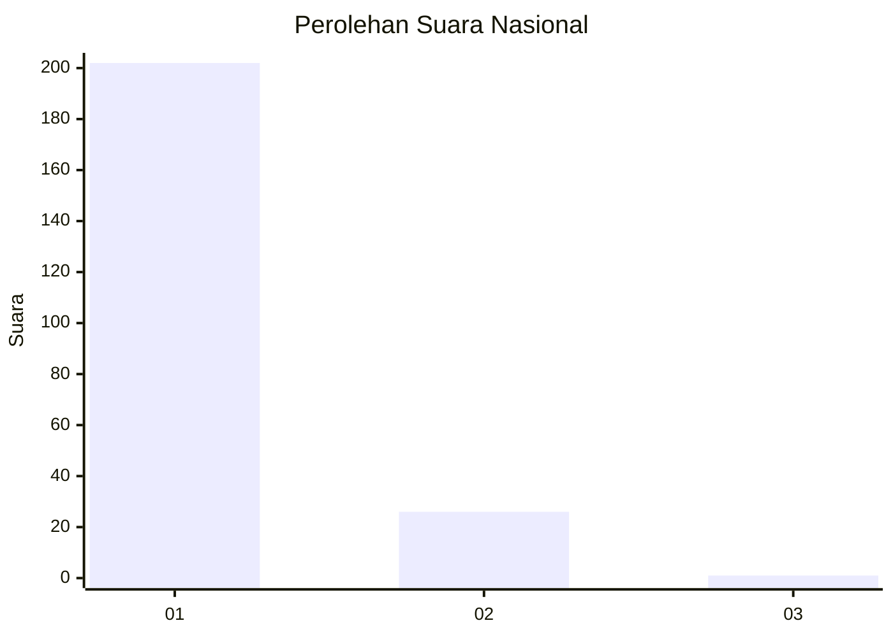
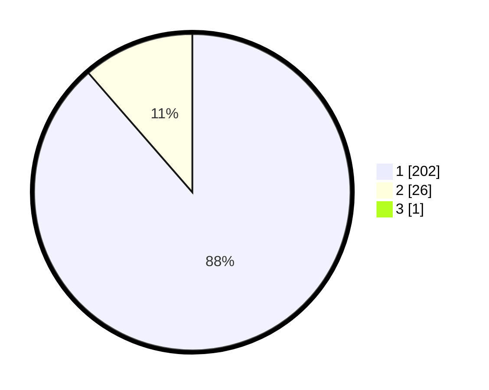

# Hasil

## Grafik

## Tabel

| No. | Nama Paslon    | Suara | Suara (raw) | Persentase |
|:--- |:-------------- | -----:| -----------:| ----------:|
| 1   | ANIES MUHAIMIN | 202   | [202][p-1]  | 88,21      |
| 2   | PRABOWO GIBRAN | 26    | [26][p-2]   | 11,35      |
| 3   | GANJAR MAHFUD  | 1     | [1][p-3]    | 0,44       |

[p-1]: https://github.com/gigit-pemilu/pemilu-2024/blob/main/pilpres/hitung-suara/sub/11-aceh/sub/03-aceh-timur/sub/02-julok/sub/2019-blang-uyok/sub/003-tps/sub/paslon-1.txt
[p-2]: https://github.com/gigit-pemilu/pemilu-2024/blob/main/pilpres/hitung-suara/sub/11-aceh/sub/03-aceh-timur/sub/02-julok/sub/2019-blang-uyok/sub/003-tps/sub/paslon-2.txt
[p-3]: https://github.com/gigit-pemilu/pemilu-2024/blob/main/pilpres/hitung-suara/sub/11-aceh/sub/03-aceh-timur/sub/02-julok/sub/2019-blang-uyok/sub/003-tps/sub/paslon-3.txt

## Foto C Plano

https://sirekap-obj-formc.kpu.go.id/03e5/pemilu/ppwp/11/03/02/20/19/1103022019003-20240214-223615--53bbb489-03ba-4df1-b262-1041ddd1ad2f.jpg

https://sirekap-obj-formc.kpu.go.id/03e5/pemilu/ppwp/11/03/02/20/19/1103022019003-20240214-224252--c10d76a7-a3a6-41f1-8dbf-8d2c70587651.jpg

https://sirekap-obj-formc.kpu.go.id/03e5/pemilu/ppwp/11/03/02/20/19/1103022019003-20240214-213116--6d0b781c-e9d7-4d7a-a49e-2c611940b86a.jpg

## Metadata

| Key        | Value               |
| ---------- | ------------------- |
| Time Stamp | 2024-02-19 06:16:00 |

