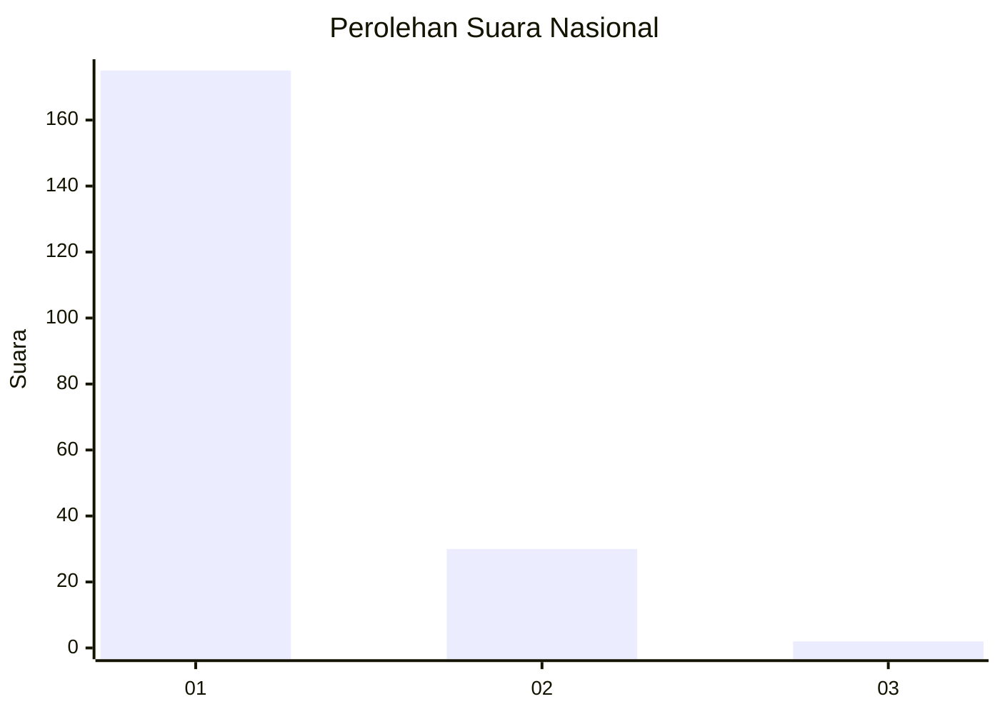
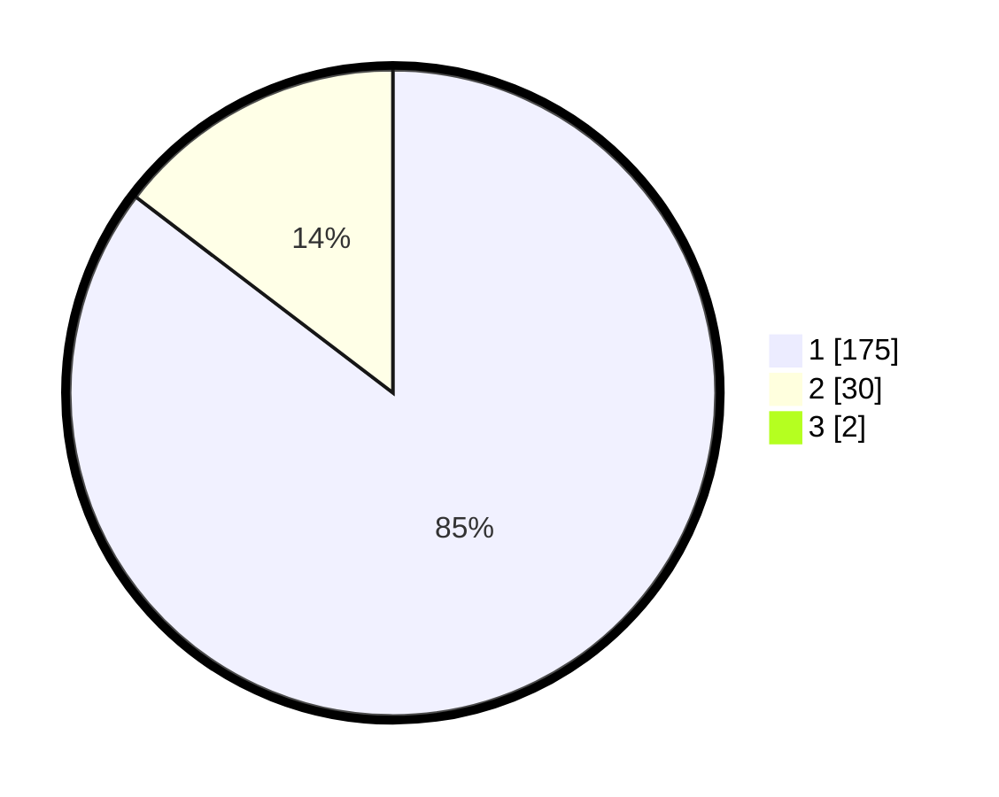

# Hasil

## Grafik

## Tabel

| No. | Nama Paslon    | Suara | Suara (raw) | Persentase |
|:--- |:-------------- | -----:| -----------:| ----------:|
| 1   | ANIES MUHAIMIN | 175   | [175][p-1]  | 84,54      |
| 2   | PRABOWO GIBRAN | 30    | [30][p-2]   | 14,49      |
| 3   | GANJAR MAHFUD  | 2     | [2][p-3]    | 0,97       |

[p-1]: https://github.com/gigit-pemilu/pemilu-2024/blob/main/pilpres/hitung-suara/sub/11-aceh/sub/03-aceh-timur/sub/02-julok/sub/2019-blang-uyok/sub/004-tps/sub/paslon-1.txt
[p-2]: https://github.com/gigit-pemilu/pemilu-2024/blob/main/pilpres/hitung-suara/sub/11-aceh/sub/03-aceh-timur/sub/02-julok/sub/2019-blang-uyok/sub/004-tps/sub/paslon-2.txt
[p-3]: https://github.com/gigit-pemilu/pemilu-2024/blob/main/pilpres/hitung-suara/sub/11-aceh/sub/03-aceh-timur/sub/02-julok/sub/2019-blang-uyok/sub/004-tps/sub/paslon-3.txt

## Foto C Plano

https://sirekap-obj-formc.kpu.go.id/b2d0/pemilu/ppwp/11/03/02/20/19/1103022019004-20240215-044314--9370d8fc-1bab-466f-80e7-b394b8f5fd14.jpg

https://sirekap-obj-formc.kpu.go.id/b2d0/pemilu/ppwp/11/03/02/20/19/1103022019004-20240215-045217--488070b0-7a3c-445c-856b-f197876af3be.jpg

https://sirekap-obj-formc.kpu.go.id/b2d0/pemilu/ppwp/11/03/02/20/19/1103022019004-20240215-050118--09aaf56c-cdad-49eb-b699-3bb8878fa686.jpg

## Metadata

| Key        | Value               |
| ---------- | ------------------- |
| Time Stamp | 2024-02-19 06:16:00 |

