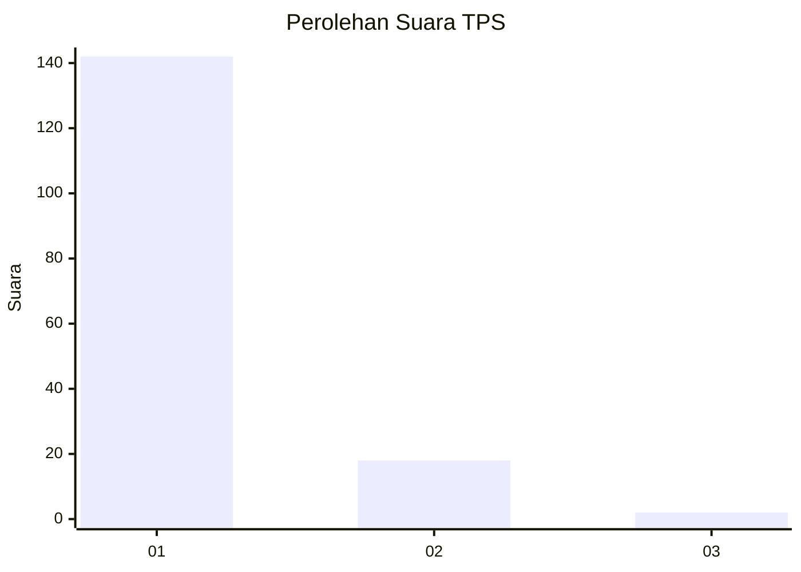
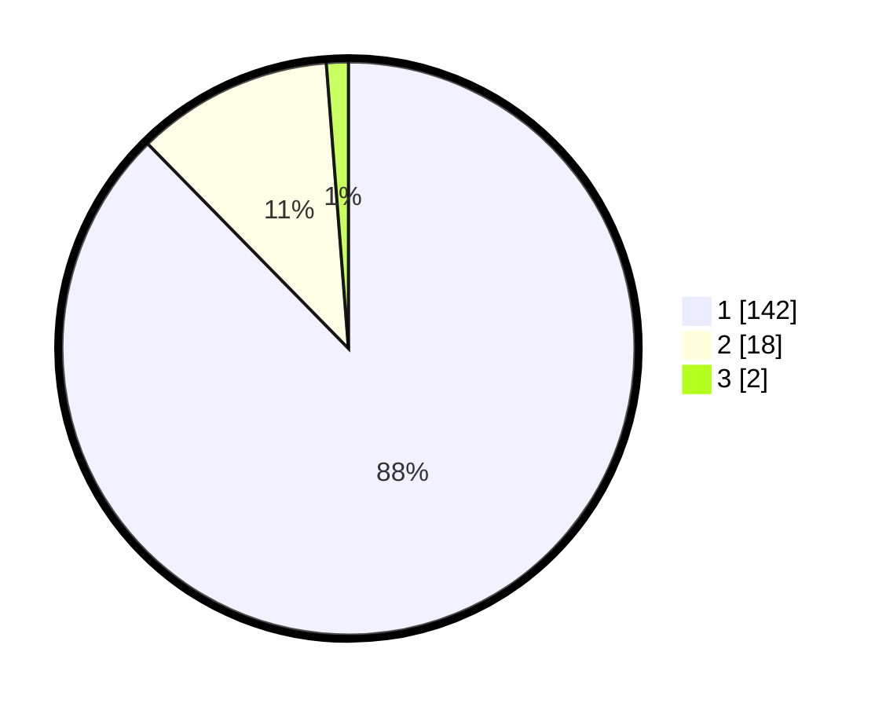

# Hasil

## Grafik

## Tabel

| No. | Nama Paslon    | Suara | Suara (raw) | Persentase |
|:--- |:-------------- | -----:| -----------:| ----------:|
| 1   | ANIES MUHAIMIN | 142   | [142][p-1]  | 87,65      |
| 2   | PRABOWO GIBRAN | 18    | [18][p-2]   | 11,11      |
| 3   | GANJAR MAHFUD  | 2     | [2][p-3]    | 1,23       |

[p-1]: https://github.com/gigit-pemilu/pemilu-2024-11-aceh/blob/main/pilpres/hitung-suara/sub/11-aceh/sub/03-aceh-timur/sub/02-julok/sub/2020-blang-pauh-sa/sub/004-tps/sub/paslon-1.txt
[p-2]: https://github.com/gigit-pemilu/pemilu-2024-11-aceh/blob/main/pilpres/hitung-suara/sub/11-aceh/sub/03-aceh-timur/sub/02-julok/sub/2020-blang-pauh-sa/sub/004-tps/sub/paslon-2.txt
[p-3]: https://github.com/gigit-pemilu/pemilu-2024-11-aceh/blob/main/pilpres/hitung-suara/sub/11-aceh/sub/03-aceh-timur/sub/02-julok/sub/2020-blang-pauh-sa/sub/004-tps/sub/paslon-3.txt

## Foto C Plano

https://sirekap-obj-formc.kpu.go.id/70fc/pemilu/ppwp/11/03/02/20/20/1103022020004-20240214-194945--311e9425-d967-4090-a39d-aa41e66c2f3c.jpg

https://sirekap-obj-formc.kpu.go.id/70fc/pemilu/ppwp/11/03/02/20/20/1103022020004-20240214-194104--800c8d6a-9ecf-4afb-952a-7e9d08e11aab.jpg

https://sirekap-obj-formc.kpu.go.id/70fc/pemilu/ppwp/11/03/02/20/20/1103022020004-20240214-194309--a24ea13b-ec82-485a-b6d2-4f3ae969caa1.jpg

## Metadata

| Key        | Value               |
| ---------- | ------------------- |
| Time Stamp | 2024-02-19 06:16:00 |

