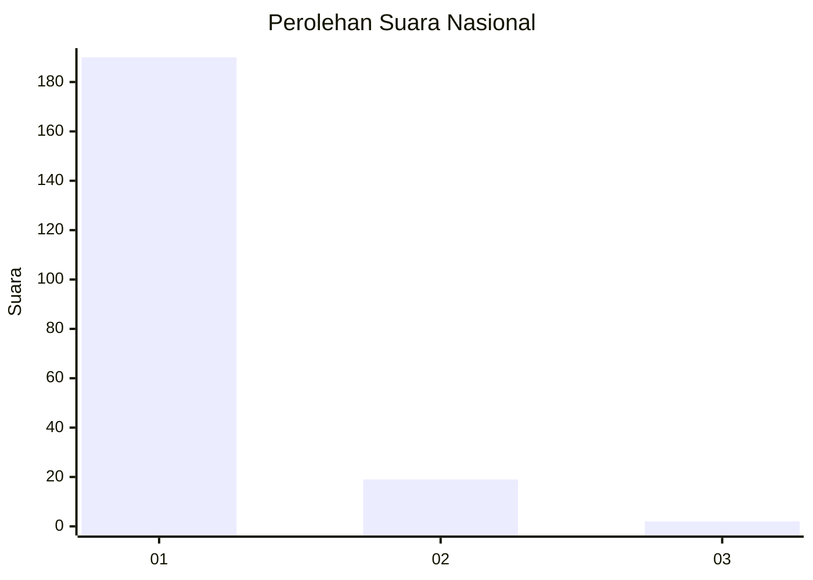
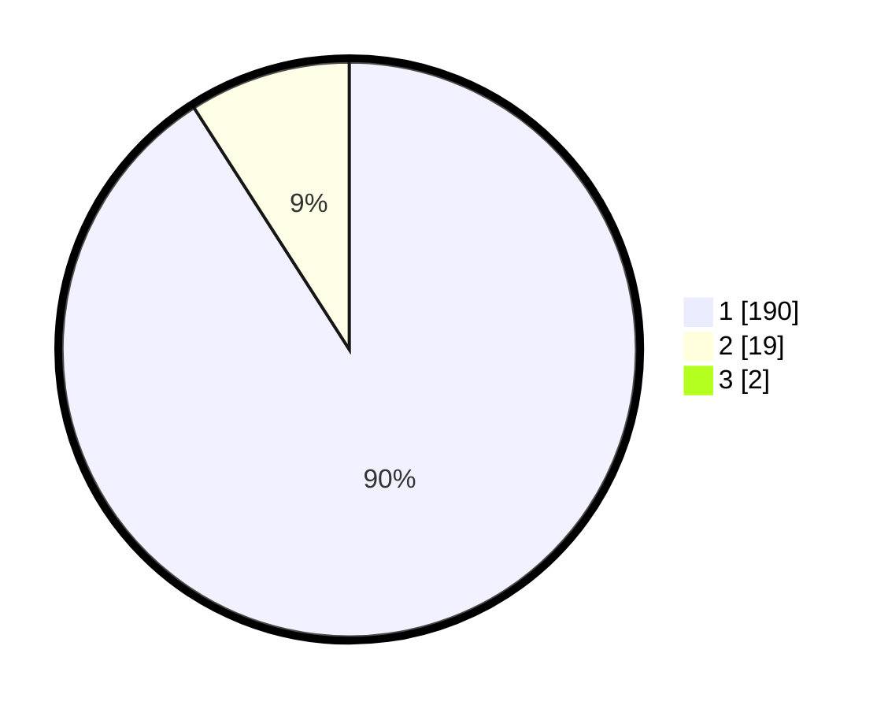

# Hasil

## Grafik

## Tabel

| No. | Nama Paslon    | Suara | Suara (raw) | Persentase |
|:--- |:-------------- | -----:| -----------:| ----------:|
| 1   | ANIES MUHAIMIN | 190   | [190][p-1]  | 90,05      |
| 2   | PRABOWO GIBRAN | 19    | [19][p-2]   | 9,00       |
| 3   | GANJAR MAHFUD  | 2     | [2][p-3]    | 0,95       |

[p-1]: https://github.com/gigit-pemilu/pemilu-2024/blob/main/pilpres/hitung-suara/sub/11-aceh/sub/03-aceh-timur/sub/02-julok/sub/2024-bukit-seroja/sub/001-tps/sub/paslon-1.txt
[p-2]: https://github.com/gigit-pemilu/pemilu-2024/blob/main/pilpres/hitung-suara/sub/11-aceh/sub/03-aceh-timur/sub/02-julok/sub/2024-bukit-seroja/sub/001-tps/sub/paslon-2.txt
[p-3]: https://github.com/gigit-pemilu/pemilu-2024/blob/main/pilpres/hitung-suara/sub/11-aceh/sub/03-aceh-timur/sub/02-julok/sub/2024-bukit-seroja/sub/001-tps/sub/paslon-3.txt

## Foto C Plano

https://sirekap-obj-formc.kpu.go.id/9218/pemilu/ppwp/11/03/02/20/24/1103022024001-20240215-012647--342a11c0-cb9d-494c-b271-ad77a2d12a5d.jpg

https://sirekap-obj-formc.kpu.go.id/9218/pemilu/ppwp/11/03/02/20/24/1103022024001-20240215-012937--aab3c5ea-011b-4ed3-8694-53fb09eb0c0b.jpg

https://sirekap-obj-formc.kpu.go.id/9218/pemilu/ppwp/11/03/02/20/24/1103022024001-20240215-013256--e8b71051-80bf-49df-a248-f2108be18fd6.jpg

## Metadata

| Key        | Value               |
| ---------- | ------------------- |
| Time Stamp | 2024-02-19 06:16:00 |

