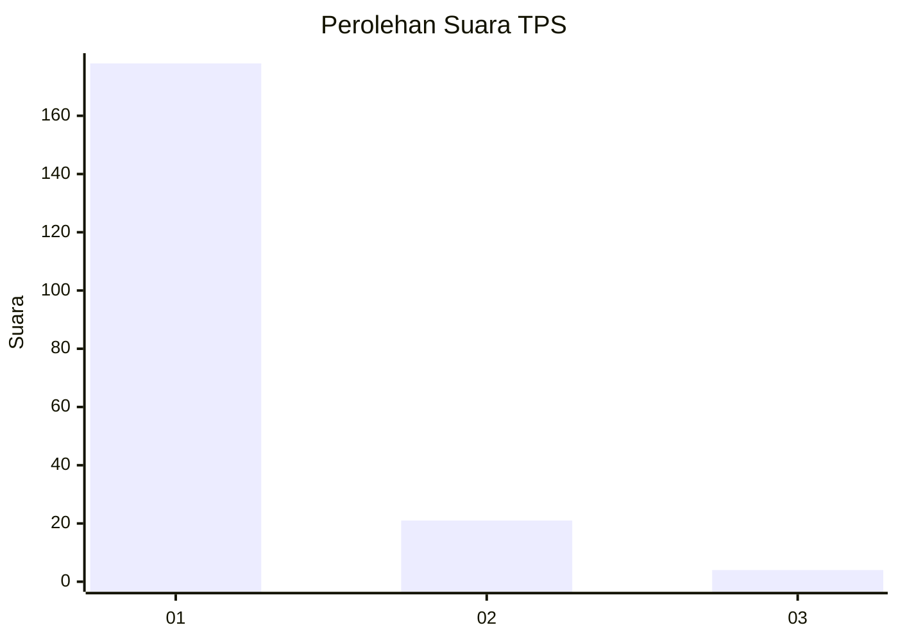
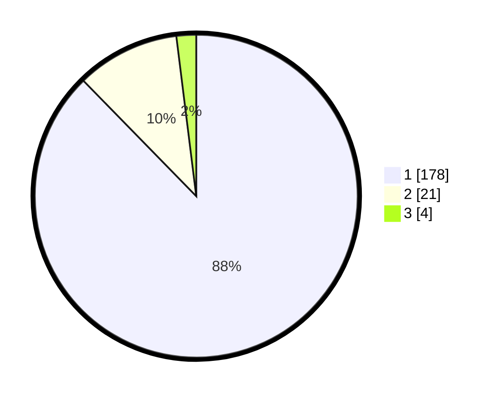

# Hasil

## Grafik

## Tabel

| No. | Nama Paslon    | Suara | Suara (raw) | Persentase |
|:--- |:-------------- | -----:| -----------:| ----------:|
| 1   | ANIES MUHAIMIN | 178   | [178][p-1]  | 87,68      |
| 2   | PRABOWO GIBRAN | 21    | [21][p-2]   | 10,34      |
| 3   | GANJAR MAHFUD  | 4     | [4][p-3]    | 1,97       |

[p-1]: https://github.com/gigit-pemilu/pemilu-2024-11-aceh/blob/main/pilpres/hitung-suara/sub/11-aceh/sub/03-aceh-timur/sub/02-julok/sub/2024-bukit-seroja/sub/002-tps/sub/paslon-1.txt
[p-2]: https://github.com/gigit-pemilu/pemilu-2024-11-aceh/blob/main/pilpres/hitung-suara/sub/11-aceh/sub/03-aceh-timur/sub/02-julok/sub/2024-bukit-seroja/sub/002-tps/sub/paslon-2.txt
[p-3]: https://github.com/gigit-pemilu/pemilu-2024-11-aceh/blob/main/pilpres/hitung-suara/sub/11-aceh/sub/03-aceh-timur/sub/02-julok/sub/2024-bukit-seroja/sub/002-tps/sub/paslon-3.txt

## Foto C Plano

https://sirekap-obj-formc.kpu.go.id/280e/pemilu/ppwp/11/03/02/20/24/1103022024002-20240215-010212--3b640b9b-0b45-4952-87f2-9932c9872fd8.jpg

https://sirekap-obj-formc.kpu.go.id/280e/pemilu/ppwp/11/03/02/20/24/1103022024002-20240215-010414--8fcdbc22-2763-4e75-ab1d-0c58031587d6.jpg

https://sirekap-obj-formc.kpu.go.id/280e/pemilu/ppwp/11/03/02/20/24/1103022024002-20240215-010709--88260cb7-86be-4e93-a506-38736db63295.jpg

## Metadata

| Key        | Value               |
| ---------- | ------------------- |
| Time Stamp | 2024-02-19 06:16:00 |

