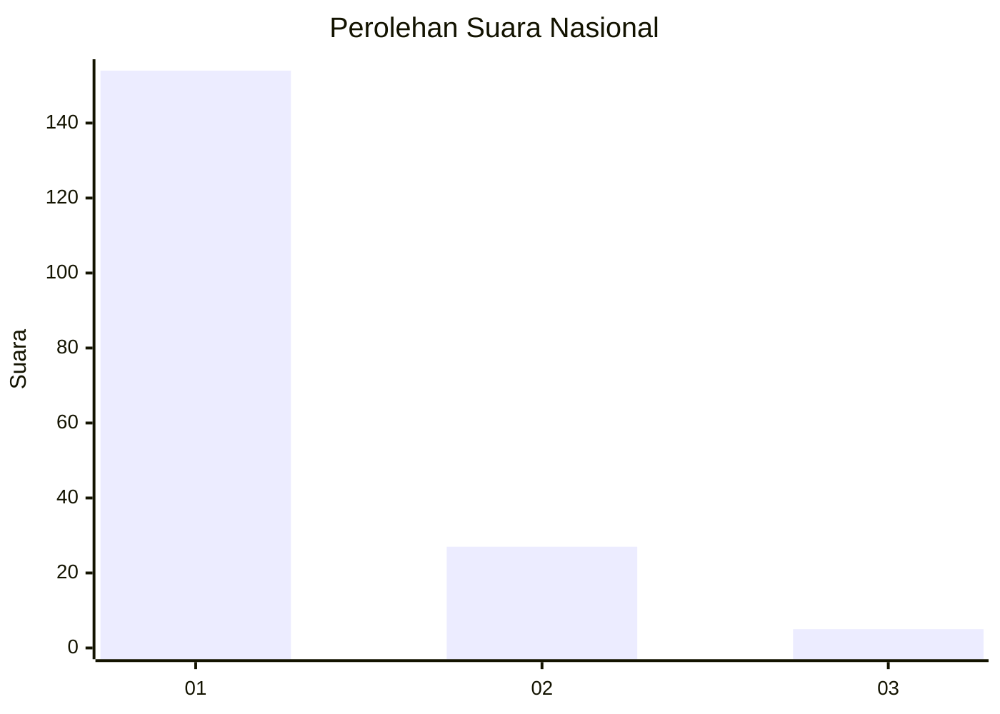
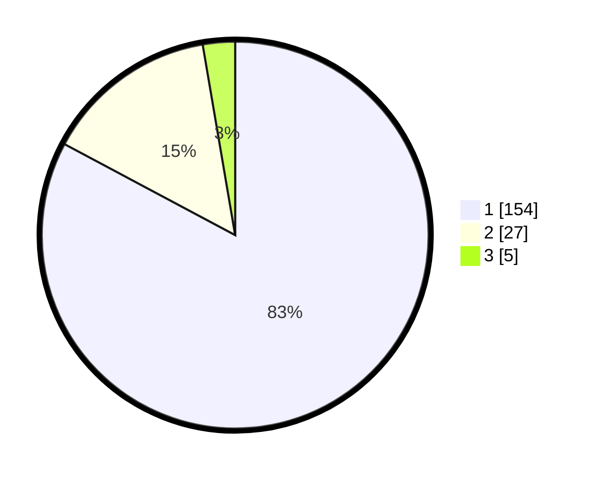

# Hasil

## Grafik

## Tabel

| No. | Nama Paslon    | Suara | Suara (raw) | Persentase |
|:--- |:-------------- | -----:| -----------:| ----------:|
| 1   | ANIES MUHAIMIN | 154   | [154][p-1]  | 82,80      |
| 2   | PRABOWO GIBRAN | 27    | [27][p-2]   | 14,52      |
| 3   | GANJAR MAHFUD  | 5     | [5][p-3]    | 2,69       |

[p-1]: https://github.com/gigit-pemilu/pemilu-2024/blob/main/pilpres/hitung-suara/sub/11-aceh/sub/03-aceh-timur/sub/02-julok/sub/2029-ujong-tunong/sub/001-tps/sub/paslon-1.txt
[p-2]: https://github.com/gigit-pemilu/pemilu-2024/blob/main/pilpres/hitung-suara/sub/11-aceh/sub/03-aceh-timur/sub/02-julok/sub/2029-ujong-tunong/sub/001-tps/sub/paslon-2.txt
[p-3]: https://github.com/gigit-pemilu/pemilu-2024/blob/main/pilpres/hitung-suara/sub/11-aceh/sub/03-aceh-timur/sub/02-julok/sub/2029-ujong-tunong/sub/001-tps/sub/paslon-3.txt

## Foto C Plano

https://sirekap-obj-formc.kpu.go.id/3c39/pemilu/ppwp/11/03/02/20/29/1103022029001-20240215-024902--be10f06c-cb76-429f-bbcb-5899d5e5aca6.jpg

https://sirekap-obj-formc.kpu.go.id/3c39/pemilu/ppwp/11/03/02/20/29/1103022029001-20240215-025042--d6f31831-7322-4683-9a96-fed95b38addb.jpg

## Metadata

| Key        | Value               |
| ---------- | ------------------- |
| Time Stamp | 2024-02-25 12:00:00 |

