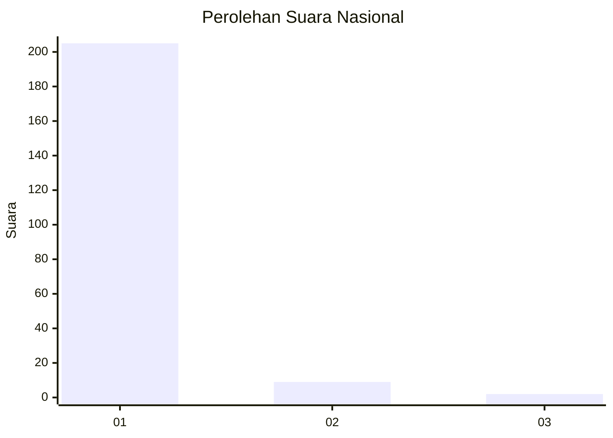
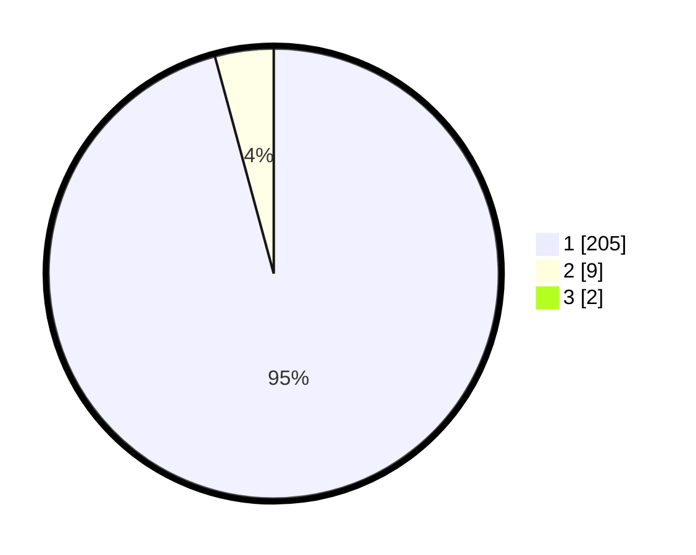

# Hasil

## Grafik

## Tabel

| No. | Nama Paslon    | Suara | Suara (raw) | Persentase |
|:--- |:-------------- | -----:| -----------:| ----------:|
| 1   | ANIES MUHAIMIN | 205   | [205][p-1]  | 94,91      |
| 2   | PRABOWO GIBRAN | 9     | [9][p-2]    | 4,17       |
| 3   | GANJAR MAHFUD  | 2     | [2][p-3]    | 0,93       |

[p-1]: https://github.com/gigit-pemilu/pemilu-2024/blob/main/pilpres/hitung-suara/sub/11-aceh/sub/03-aceh-timur/sub/02-julok/sub/2030-bukit-dindeng/sub/001-tps/sub/paslon-1.txt
[p-2]: https://github.com/gigit-pemilu/pemilu-2024/blob/main/pilpres/hitung-suara/sub/11-aceh/sub/03-aceh-timur/sub/02-julok/sub/2030-bukit-dindeng/sub/001-tps/sub/paslon-2.txt
[p-3]: https://github.com/gigit-pemilu/pemilu-2024/blob/main/pilpres/hitung-suara/sub/11-aceh/sub/03-aceh-timur/sub/02-julok/sub/2030-bukit-dindeng/sub/001-tps/sub/paslon-3.txt

## Foto C Plano

https://sirekap-obj-formc.kpu.go.id/d285/pemilu/ppwp/11/03/02/20/30/1103022030001-20240215-043402--92be68c8-775b-4ca3-8d76-59b2ef411992.jpg

https://sirekap-obj-formc.kpu.go.id/d285/pemilu/ppwp/11/03/02/20/30/1103022030001-20240215-043304--ed45eb0c-dc74-4642-9069-8c54b394f5fc.jpg

https://sirekap-obj-formc.kpu.go.id/d285/pemilu/ppwp/11/03/02/20/30/1103022030001-20240215-044002--4ee6515b-b8b6-451d-88d1-3cce9f98e43f.jpg

## Metadata

| Key        | Value               |
| ---------- | ------------------- |
| Time Stamp | 2024-02-19 06:16:00 |

