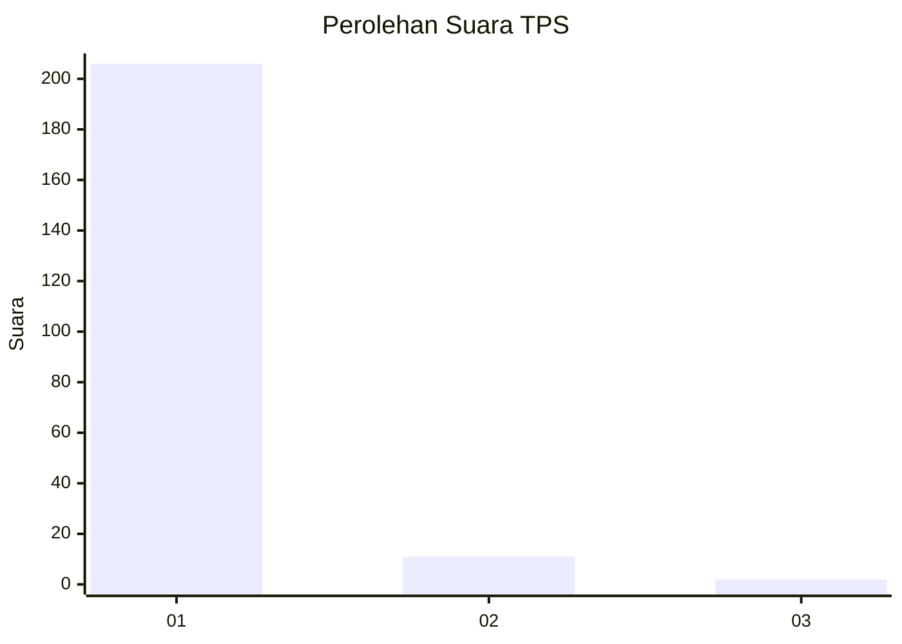
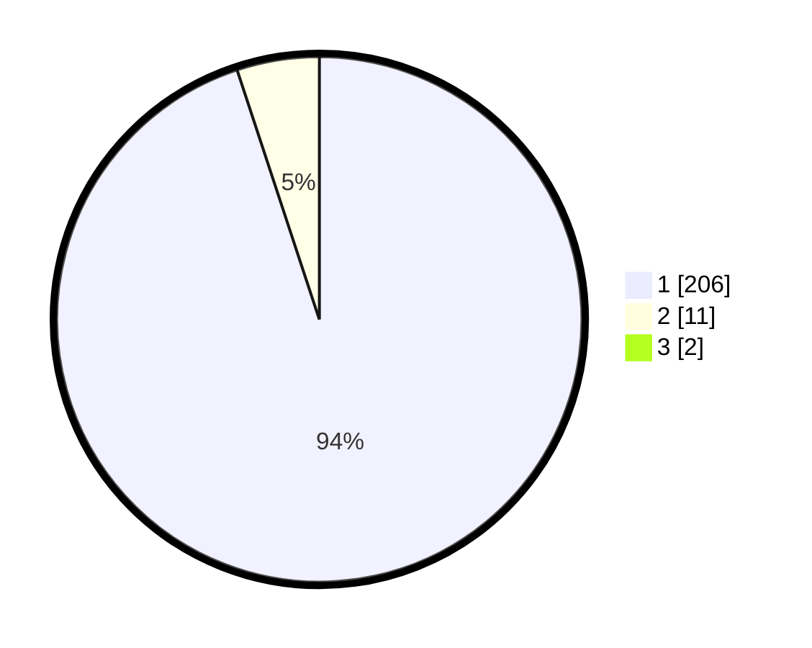

# Hasil

## Grafik

## Tabel

| No. | Nama Paslon    | Suara | Suara (raw) | Persentase |
|:--- |:-------------- | -----:| -----------:| ----------:|
| 1   | ANIES MUHAIMIN | 206   | [206][p-1]  | 94,06      |
| 2   | PRABOWO GIBRAN | 11    | [11][p-2]   | 5,02       |
| 3   | GANJAR MAHFUD  | 2     | [2][p-3]    | 0,91       |

[p-1]: https://github.com/gigit-pemilu/pemilu-2024-11-aceh/blob/main/pilpres/hitung-suara/sub/11-aceh/sub/03-aceh-timur/sub/02-julok/sub/2033-blang-gleum/sub/002-tps/sub/paslon-1.txt
[p-2]: https://github.com/gigit-pemilu/pemilu-2024-11-aceh/blob/main/pilpres/hitung-suara/sub/11-aceh/sub/03-aceh-timur/sub/02-julok/sub/2033-blang-gleum/sub/002-tps/sub/paslon-2.txt
[p-3]: https://github.com/gigit-pemilu/pemilu-2024-11-aceh/blob/main/pilpres/hitung-suara/sub/11-aceh/sub/03-aceh-timur/sub/02-julok/sub/2033-blang-gleum/sub/002-tps/sub/paslon-3.txt

## Foto C Plano

https://sirekap-obj-formc.kpu.go.id/8fe3/pemilu/ppwp/11/03/02/20/33/1103022033002-20240215-121559--2e094003-d19e-4bc9-a7e8-c2ebad28a537.jpg

https://sirekap-obj-formc.kpu.go.id/8fe3/pemilu/ppwp/11/03/02/20/33/1103022033002-20240215-121941--9408d306-ed89-4326-802e-2af5bfb5a230.jpg

https://sirekap-obj-formc.kpu.go.id/8fe3/pemilu/ppwp/11/03/02/20/33/1103022033002-20240215-122142--12c1fdf4-0daf-4b0b-b7a4-a15c8ad35afa.jpg

## Metadata

| Key        | Value               |
| ---------- | ------------------- |
| Time Stamp | 2024-02-19 06:16:00 |

