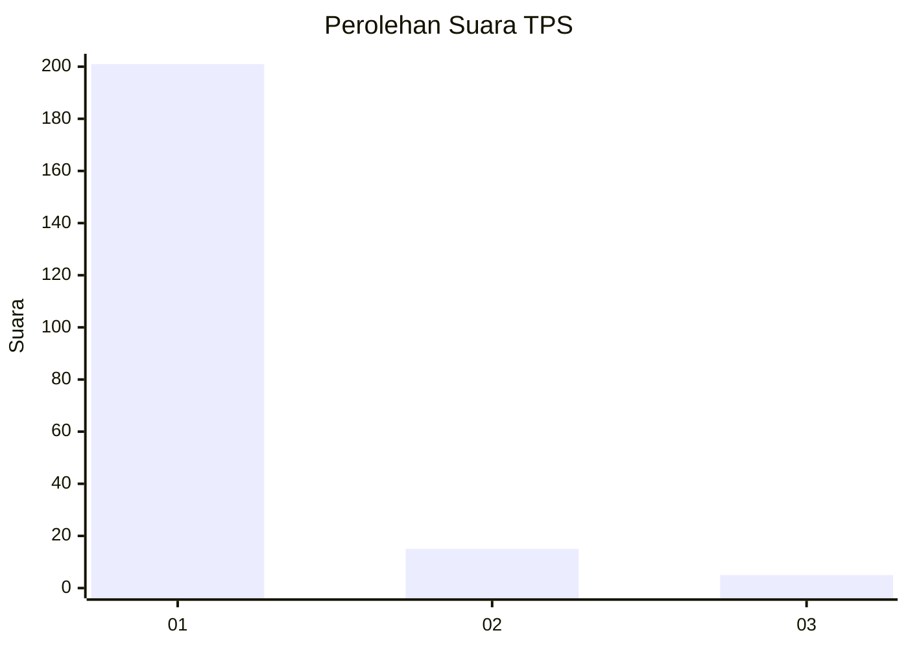
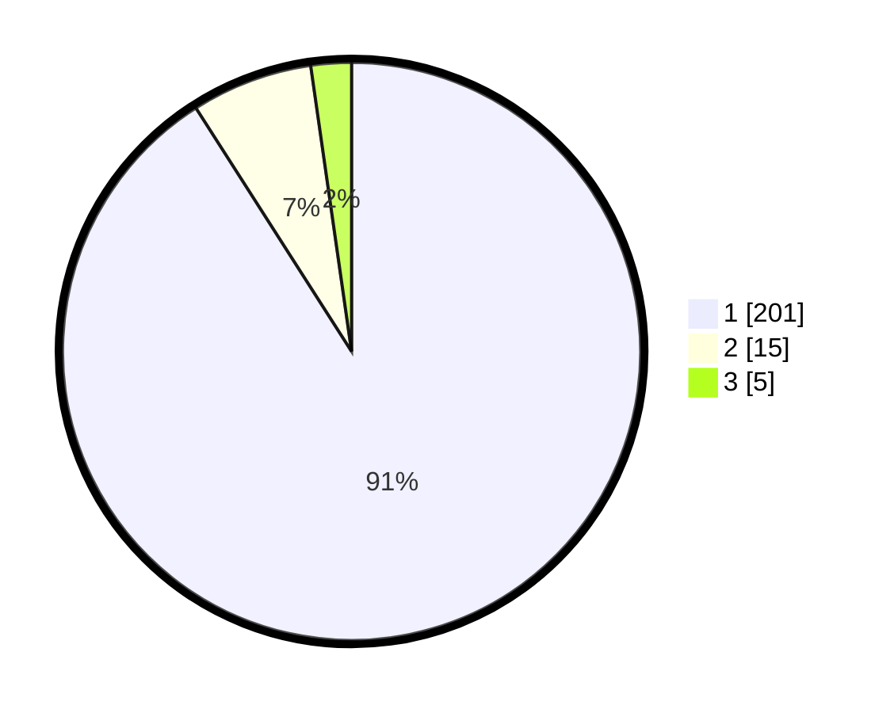

# Hasil

## Grafik

## Tabel

| No. | Nama Paslon    | Suara | Suara (raw) | Persentase |
|:--- |:-------------- | -----:| -----------:| ----------:|
| 1   | ANIES MUHAIMIN | 201   | [201][p-1]  | 90,95      |
| 2   | PRABOWO GIBRAN | 15    | [15][p-2]   | 6,79       |
| 3   | GANJAR MAHFUD  | 5     | [5][p-3]    | 2,26       |

[p-1]: https://github.com/gigit-pemilu/pemilu-2024-11-aceh/blob/main/pilpres/hitung-suara/sub/11-aceh/sub/03-aceh-timur/sub/02-julok/sub/2033-blang-gleum/sub/003-tps/sub/paslon-1.txt
[p-2]: https://github.com/gigit-pemilu/pemilu-2024-11-aceh/blob/main/pilpres/hitung-suara/sub/11-aceh/sub/03-aceh-timur/sub/02-julok/sub/2033-blang-gleum/sub/003-tps/sub/paslon-2.txt
[p-3]: https://github.com/gigit-pemilu/pemilu-2024-11-aceh/blob/main/pilpres/hitung-suara/sub/11-aceh/sub/03-aceh-timur/sub/02-julok/sub/2033-blang-gleum/sub/003-tps/sub/paslon-3.txt

## Foto C Plano

https://sirekap-obj-formc.kpu.go.id/c519/pemilu/ppwp/11/03/02/20/33/1103022033003-20240215-124841--163982eb-7b87-4e3b-abf5-f0e34214b683.jpg

https://sirekap-obj-formc.kpu.go.id/c519/pemilu/ppwp/11/03/02/20/33/1103022033003-20240215-125623--d92b8b59-5a8f-4e20-bb5f-0c6af6be7a00.jpg

https://sirekap-obj-formc.kpu.go.id/c519/pemilu/ppwp/11/03/02/20/33/1103022033003-20240215-125752--6f7c0a6c-4c5b-480b-ad17-3259dd38f683.jpg

## Metadata

| Key        | Value               |
| ---------- | ------------------- |
| Time Stamp | 2024-02-19 06:16:00 |

