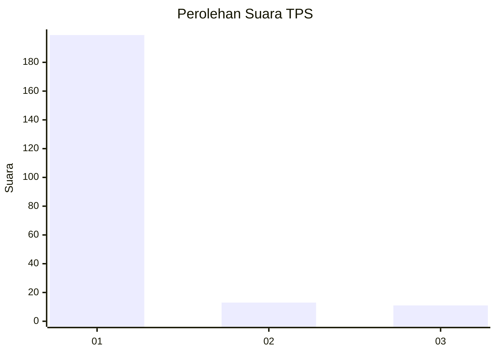
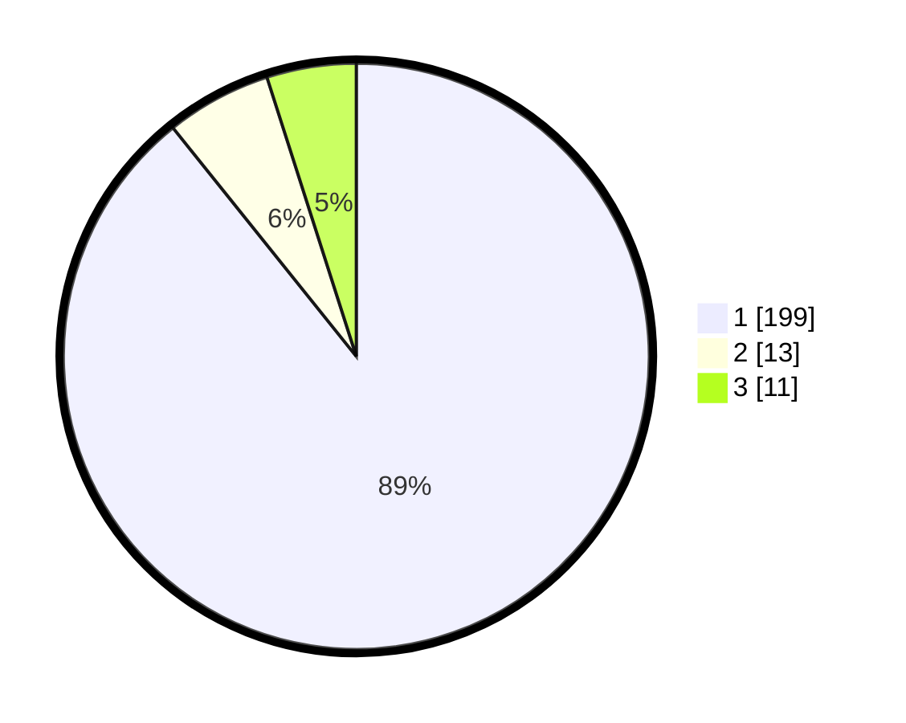

# Hasil

## Grafik

## Tabel

| No. | Nama Paslon    | Suara | Suara (raw) | Persentase |
|:--- |:-------------- | -----:| -----------:| ----------:|
| 1   | ANIES MUHAIMIN | 199   | [199][p-1]  | 89,24      |
| 2   | PRABOWO GIBRAN | 13    | [13][p-2]   | 5,83       |
| 3   | GANJAR MAHFUD  | 11    | [11][p-3]   | 4,93       |

[p-1]: https://github.com/gigit-pemilu/pemilu-2024-11-aceh/blob/main/pilpres/hitung-suara/sub/11-aceh/sub/03-aceh-timur/sub/02-julok/sub/2033-blang-gleum/sub/004-tps/sub/paslon-1.txt
[p-2]: https://github.com/gigit-pemilu/pemilu-2024-11-aceh/blob/main/pilpres/hitung-suara/sub/11-aceh/sub/03-aceh-timur/sub/02-julok/sub/2033-blang-gleum/sub/004-tps/sub/paslon-2.txt
[p-3]: https://github.com/gigit-pemilu/pemilu-2024-11-aceh/blob/main/pilpres/hitung-suara/sub/11-aceh/sub/03-aceh-timur/sub/02-julok/sub/2033-blang-gleum/sub/004-tps/sub/paslon-3.txt

## Foto C Plano

https://sirekap-obj-formc.kpu.go.id/93b0/pemilu/ppwp/11/03/02/20/33/1103022033004-20240215-133827--a377c09e-381c-444c-94f8-8aa32b70ee48.jpg

https://sirekap-obj-formc.kpu.go.id/93b0/pemilu/ppwp/11/03/02/20/33/1103022033004-20240215-134618--dd01b9ea-7d82-4e79-8cde-3111b57b8344.jpg

https://sirekap-obj-formc.kpu.go.id/93b0/pemilu/ppwp/11/03/02/20/33/1103022033004-20240215-134325--3d4a16b1-5e87-4f68-9fc8-d4f957d73a97.jpg

## Metadata

| Key        | Value               |
| ---------- | ------------------- |
| Time Stamp | 2024-02-19 06:16:00 |

