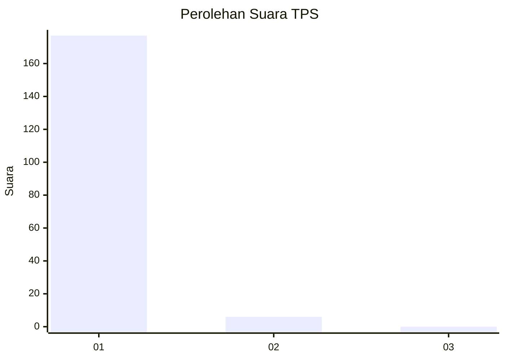
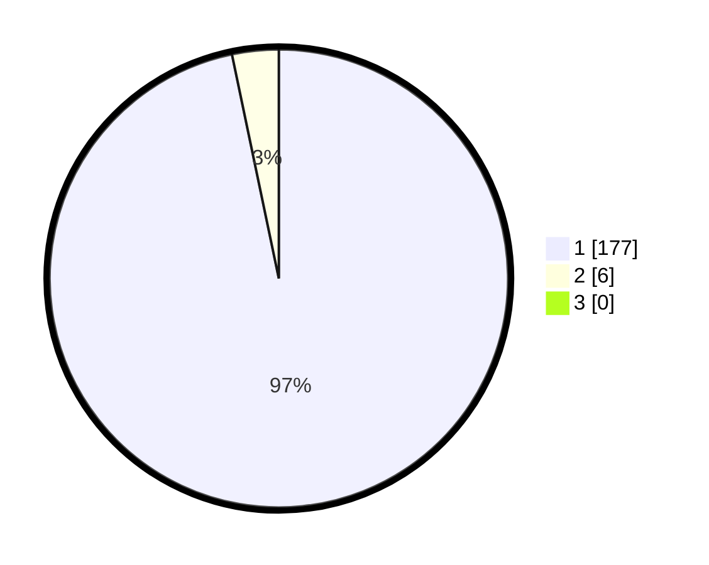

# Hasil

## Grafik

## Tabel

| No. | Nama Paslon    | Suara | Suara (raw) | Persentase |
|:--- |:-------------- | -----:| -----------:| ----------:|
| 1   | ANIES MUHAIMIN | 177   | [177][p-1]  | 96,72      |
| 2   | PRABOWO GIBRAN | 6     | [6][p-2]    | 3,28       |
| 3   | GANJAR MAHFUD  | 0     | [0][p-3]    | 0,00       |

[p-1]: https://github.com/gigit-pemilu/pemilu-2024-11-aceh/blob/main/pilpres/hitung-suara/sub/11-aceh/sub/03-aceh-timur/sub/02-julok/sub/2034-tanjong-tok-blang/sub/001-tps/sub/paslon-1.txt
[p-2]: https://github.com/gigit-pemilu/pemilu-2024-11-aceh/blob/main/pilpres/hitung-suara/sub/11-aceh/sub/03-aceh-timur/sub/02-julok/sub/2034-tanjong-tok-blang/sub/001-tps/sub/paslon-2.txt
[p-3]: https://github.com/gigit-pemilu/pemilu-2024-11-aceh/blob/main/pilpres/hitung-suara/sub/11-aceh/sub/03-aceh-timur/sub/02-julok/sub/2034-tanjong-tok-blang/sub/001-tps/sub/paslon-3.txt

## Foto C Plano

https://sirekap-obj-formc.kpu.go.id/aaa6/pemilu/ppwp/11/03/02/20/34/1103022034001-20240215-031232--76073ce5-f135-4bcf-abc6-a7e6c43033c1.jpg

https://sirekap-obj-formc.kpu.go.id/aaa6/pemilu/ppwp/11/03/02/20/34/1103022034001-20240215-031347--f4fdcadd-6a9c-4221-9b81-3356172bc859.jpg

https://sirekap-obj-formc.kpu.go.id/aaa6/pemilu/ppwp/11/03/02/20/34/1103022034001-20240215-031551--53a3a994-0974-4171-84df-e8961aa6d5f5.jpg

## Metadata

| Key        | Value               |
| ---------- | ------------------- |
| Time Stamp | 2024-02-19 06:16:00 |

