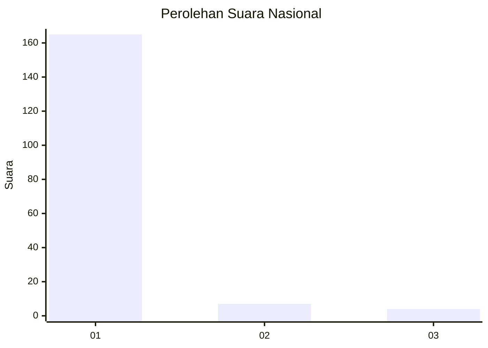
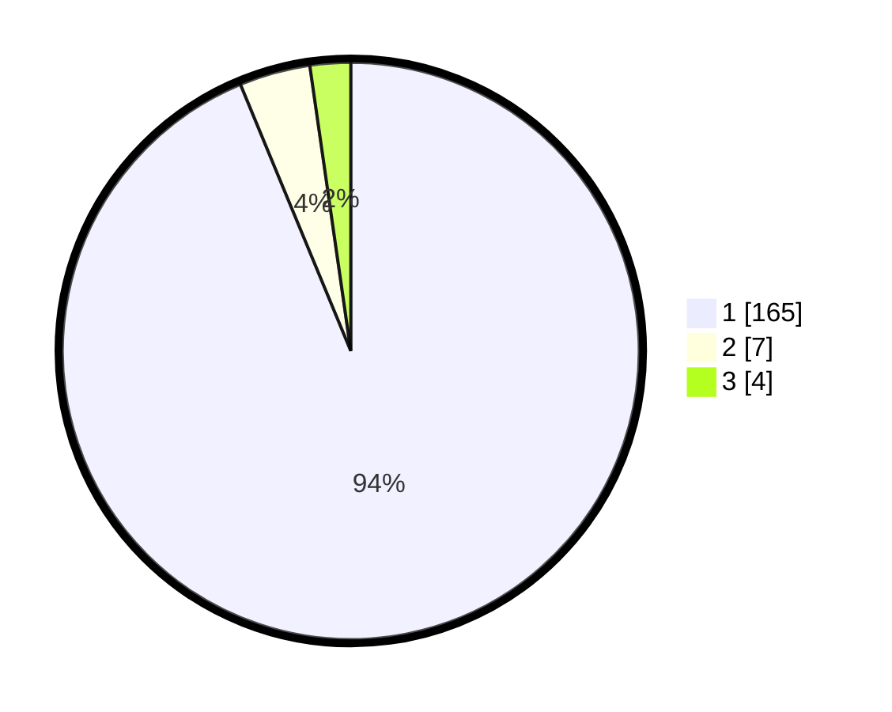

# Hasil

## Grafik

## Tabel

| No. | Nama Paslon    | Suara | Suara (raw) | Persentase |
|:--- |:-------------- | -----:| -----------:| ----------:|
| 1   | ANIES MUHAIMIN | 165   | [165][p-1]  | 93,75      |
| 2   | PRABOWO GIBRAN | 7     | [7][p-2]    | 3,98       |
| 3   | GANJAR MAHFUD  | 4     | [4][p-3]    | 2,27       |

[p-1]: https://github.com/gigit-pemilu/pemilu-2024/blob/main/pilpres/hitung-suara/sub/11-aceh/sub/03-aceh-timur/sub/02-julok/sub/2034-tanjong-tok-blang/sub/002-tps/sub/paslon-1.txt
[p-2]: https://github.com/gigit-pemilu/pemilu-2024/blob/main/pilpres/hitung-suara/sub/11-aceh/sub/03-aceh-timur/sub/02-julok/sub/2034-tanjong-tok-blang/sub/002-tps/sub/paslon-2.txt
[p-3]: https://github.com/gigit-pemilu/pemilu-2024/blob/main/pilpres/hitung-suara/sub/11-aceh/sub/03-aceh-timur/sub/02-julok/sub/2034-tanjong-tok-blang/sub/002-tps/sub/paslon-3.txt

## Foto C Plano

https://sirekap-obj-formc.kpu.go.id/f3a1/pemilu/ppwp/11/03/02/20/34/1103022034002-20240215-032515--5005fe88-ec75-4147-8d9e-86ef9180a03f.jpg

https://sirekap-obj-formc.kpu.go.id/f3a1/pemilu/ppwp/11/03/02/20/34/1103022034002-20240215-032947--30955b87-26a5-4cea-982f-06f478bcef85.jpg

https://sirekap-obj-formc.kpu.go.id/f3a1/pemilu/ppwp/11/03/02/20/34/1103022034002-20240215-033206--f790c8e8-67e5-4ec0-8df4-7509eebd5a3b.jpg

## Metadata

| Key        | Value               |
| ---------- | ------------------- |
| Time Stamp | 2024-02-19 06:16:00 |

