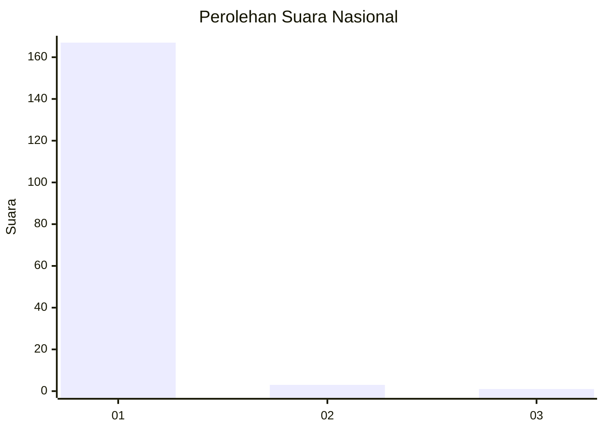
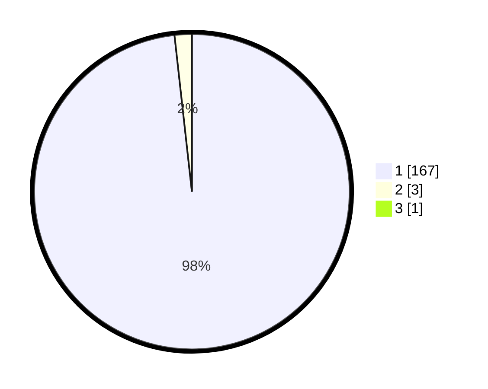

# Hasil

## Grafik

## Tabel

| No. | Nama Paslon    | Suara | Suara (raw) | Persentase |
|:--- |:-------------- | -----:| -----------:| ----------:|
| 1   | ANIES MUHAIMIN | 167   | [167][p-1]  | 97,66      |
| 2   | PRABOWO GIBRAN | 3     | [3][p-2]    | 1,75       |
| 3   | GANJAR MAHFUD  | 1     | [1][p-3]    | 0,58       |

[p-1]: https://github.com/gigit-pemilu/pemilu-2024/blob/main/pilpres/hitung-suara/sub/11-aceh/sub/03-aceh-timur/sub/02-julok/sub/2034-tanjong-tok-blang/sub/003-tps/sub/paslon-1.txt
[p-2]: https://github.com/gigit-pemilu/pemilu-2024/blob/main/pilpres/hitung-suara/sub/11-aceh/sub/03-aceh-timur/sub/02-julok/sub/2034-tanjong-tok-blang/sub/003-tps/sub/paslon-2.txt
[p-3]: https://github.com/gigit-pemilu/pemilu-2024/blob/main/pilpres/hitung-suara/sub/11-aceh/sub/03-aceh-timur/sub/02-julok/sub/2034-tanjong-tok-blang/sub/003-tps/sub/paslon-3.txt

## Foto C Plano

https://sirekap-obj-formc.kpu.go.id/bbf9/pemilu/ppwp/11/03/02/20/34/1103022034003-20240215-032530--563c706f-4025-488c-8aee-efbf3fc550e6.jpg

https://sirekap-obj-formc.kpu.go.id/bbf9/pemilu/ppwp/11/03/02/20/34/1103022034003-20240215-032735--dbe48a3d-2c78-4585-a5fd-8e1cd1b0b7ec.jpg

https://sirekap-obj-formc.kpu.go.id/bbf9/pemilu/ppwp/11/03/02/20/34/1103022034003-20240215-033055--bfb31e13-948d-4457-a1d6-46dce4e823a5.jpg

## Metadata

| Key        | Value               |
| ---------- | ------------------- |
| Time Stamp | 2024-02-19 06:16:00 |

