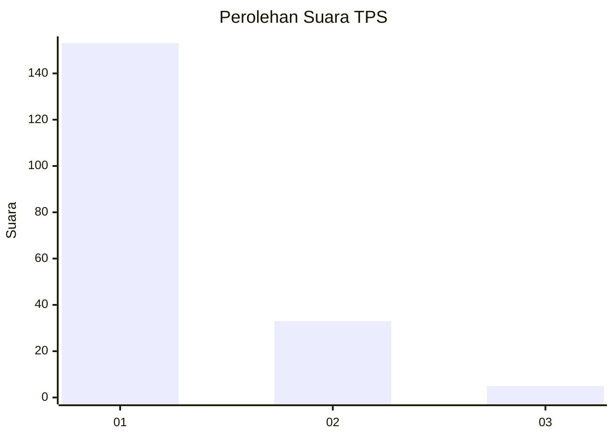
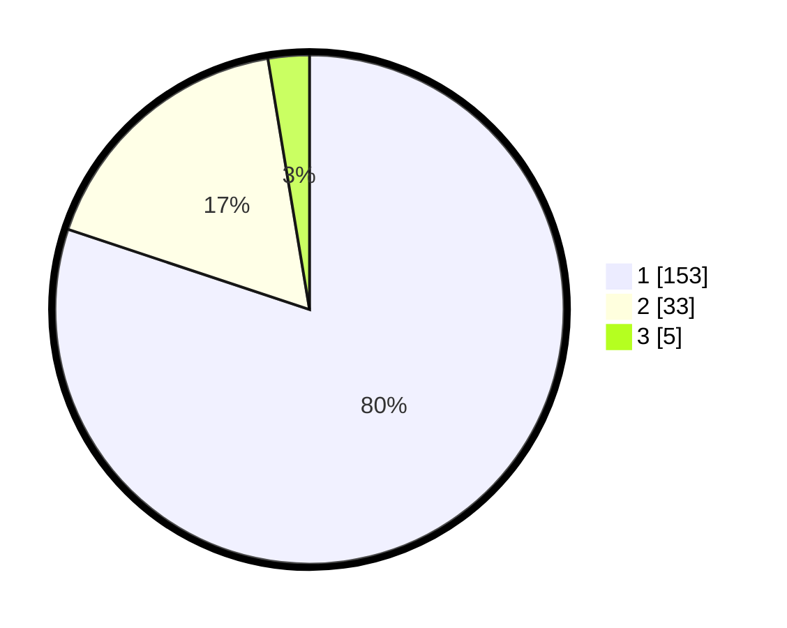

# Hasil

## Grafik

## Tabel

| No. | Nama Paslon    | Suara | Suara (raw) | Persentase |
|:--- |:-------------- | -----:| -----------:| ----------:|
| 1   | ANIES MUHAIMIN | 153   | [153][p-1]  | 80,10      |
| 2   | PRABOWO GIBRAN | 33    | [33][p-2]   | 17,28      |
| 3   | GANJAR MAHFUD  | 5     | [5][p-3]    | 2,62       |

[p-1]: https://github.com/gigit-pemilu/pemilu-2024-11-aceh/blob/main/pilpres/hitung-suara/sub/11-aceh/sub/03-aceh-timur/sub/03-idi-rayeuk/sub/2001-gampong-jawa/sub/001-tps/sub/paslon-1.txt
[p-2]: https://github.com/gigit-pemilu/pemilu-2024-11-aceh/blob/main/pilpres/hitung-suara/sub/11-aceh/sub/03-aceh-timur/sub/03-idi-rayeuk/sub/2001-gampong-jawa/sub/001-tps/sub/paslon-2.txt
[p-3]: https://github.com/gigit-pemilu/pemilu-2024-11-aceh/blob/main/pilpres/hitung-suara/sub/11-aceh/sub/03-aceh-timur/sub/03-idi-rayeuk/sub/2001-gampong-jawa/sub/001-tps/sub/paslon-3.txt

## Foto C Plano

https://sirekap-obj-formc.kpu.go.id/29ab/pemilu/ppwp/11/03/03/20/01/1103032001001-20240219-214329--5bcd7f3b-91df-4579-af4c-061810941c41.jpg

https://sirekap-obj-formc.kpu.go.id/29ab/pemilu/ppwp/11/03/03/20/01/1103032001001-20240219-214412--756ea65b-afd9-4bd5-a4f4-a612cda36924.jpg

https://sirekap-obj-formc.kpu.go.id/29ab/pemilu/ppwp/11/03/03/20/01/1103032001001-20240219-214503--b896763b-4d51-46b4-a821-79aac7167d28.jpg

## Metadata

| Key        | Value               |
| ---------- | ------------------- |
| Time Stamp | 2024-02-24 22:31:28 |

