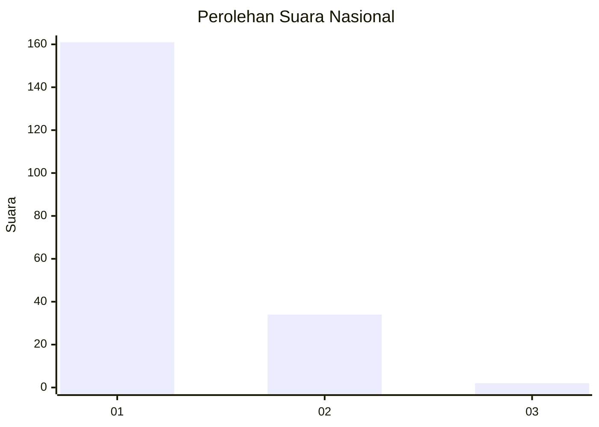
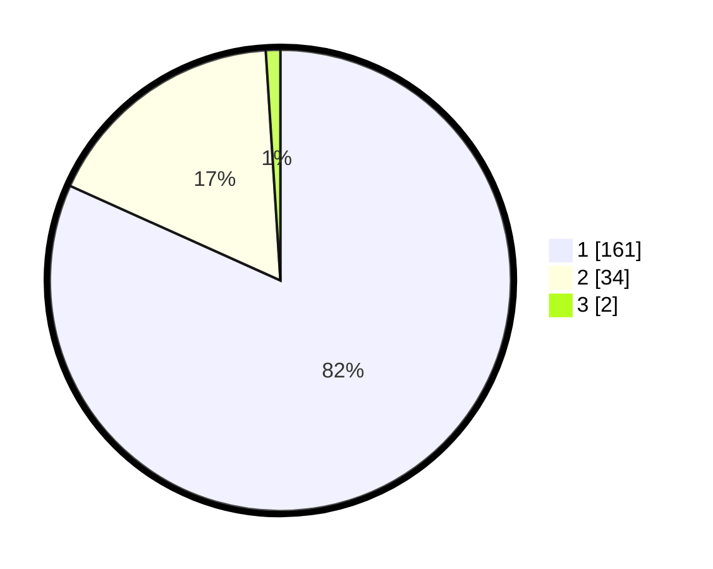

# Hasil

## Grafik

## Tabel

| No. | Nama Paslon    | Suara | Suara (raw) | Persentase |
|:--- |:-------------- | -----:| -----------:| ----------:|
| 1   | ANIES MUHAIMIN | 161   | [161][p-1]  | 81,73      |
| 2   | PRABOWO GIBRAN | 34    | [34][p-2]   | 17,26      |
| 3   | GANJAR MAHFUD  | 2     | [2][p-3]    | 1,02       |

[p-1]: https://github.com/gigit-pemilu/pemilu-2024/blob/main/pilpres/hitung-suara/sub/11-aceh/sub/03-aceh-timur/sub/03-idi-rayeuk/sub/2001-gampong-jawa/sub/002-tps/sub/paslon-1.txt
[p-2]: https://github.com/gigit-pemilu/pemilu-2024/blob/main/pilpres/hitung-suara/sub/11-aceh/sub/03-aceh-timur/sub/03-idi-rayeuk/sub/2001-gampong-jawa/sub/002-tps/sub/paslon-2.txt
[p-3]: https://github.com/gigit-pemilu/pemilu-2024/blob/main/pilpres/hitung-suara/sub/11-aceh/sub/03-aceh-timur/sub/03-idi-rayeuk/sub/2001-gampong-jawa/sub/002-tps/sub/paslon-3.txt

## Foto C Plano

https://sirekap-obj-formc.kpu.go.id/11d8/pemilu/ppwp/11/03/03/20/01/1103032001002-20240215-150634--202b8024-46a2-4d34-ab18-2db846bee4e3.jpg

https://sirekap-obj-formc.kpu.go.id/11d8/pemilu/ppwp/11/03/03/20/01/1103032001002-20240215-150750--2ac0590f-3540-4217-a9b8-d9a00d9349c5.jpg

https://sirekap-obj-formc.kpu.go.id/11d8/pemilu/ppwp/11/03/03/20/01/1103032001002-20240215-150902--888462bd-78c7-4739-8b80-75551a822b71.jpg

## Metadata

| Key        | Value               |
| ---------- | ------------------- |
| Time Stamp | 2024-02-19 14:00:00 |

