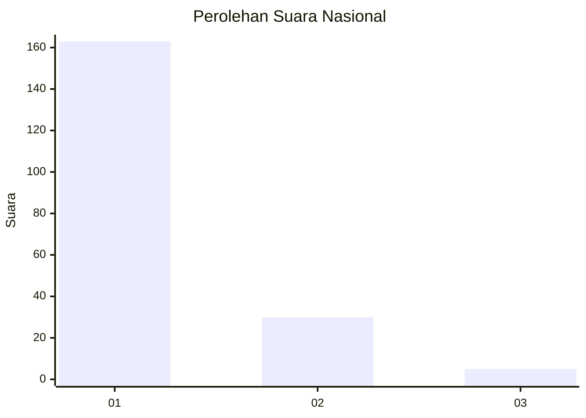
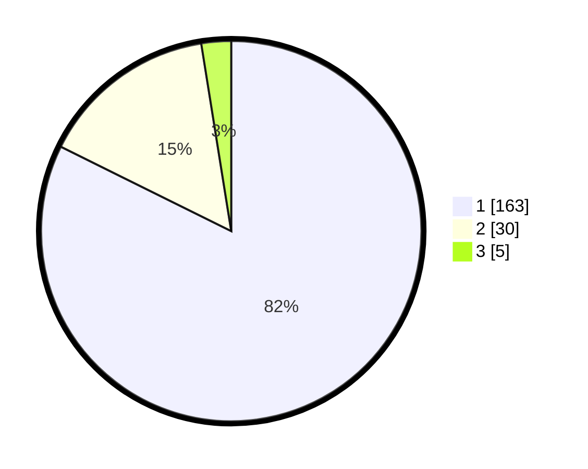

# Hasil

## Grafik

## Tabel

| No. | Nama Paslon    | Suara | Suara (raw) | Persentase |
|:--- |:-------------- | -----:| -----------:| ----------:|
| 1   | ANIES MUHAIMIN | 163   | [163][p-1]  | 82,32      |
| 2   | PRABOWO GIBRAN | 30    | [30][p-2]   | 15,15      |
| 3   | GANJAR MAHFUD  | 5     | [5][p-3]    | 2,53       |

[p-1]: https://github.com/gigit-pemilu/pemilu-2024/blob/main/pilpres/hitung-suara/sub/11-aceh/sub/03-aceh-timur/sub/03-idi-rayeuk/sub/2001-gampong-jawa/sub/003-tps/sub/paslon-1.txt
[p-2]: https://github.com/gigit-pemilu/pemilu-2024/blob/main/pilpres/hitung-suara/sub/11-aceh/sub/03-aceh-timur/sub/03-idi-rayeuk/sub/2001-gampong-jawa/sub/003-tps/sub/paslon-2.txt
[p-3]: https://github.com/gigit-pemilu/pemilu-2024/blob/main/pilpres/hitung-suara/sub/11-aceh/sub/03-aceh-timur/sub/03-idi-rayeuk/sub/2001-gampong-jawa/sub/003-tps/sub/paslon-3.txt

## Foto C Plano

https://sirekap-obj-formc.kpu.go.id/d2de/pemilu/ppwp/11/03/03/20/01/1103032001003-20240219-234156--da46049a-20eb-4749-9bb1-0e83a8cbcc03.jpg

https://sirekap-obj-formc.kpu.go.id/d2de/pemilu/ppwp/11/03/03/20/01/1103032001003-20240214-221014--4327d7f6-c1db-474c-99c0-ecbe0d1d3fd1.jpg

https://sirekap-obj-formc.kpu.go.id/d2de/pemilu/ppwp/11/03/03/20/01/1103032001003-20240214-221200--3cf86ecb-3771-4b0f-a72a-caf64dd8b4cc.jpg

## Metadata

| Key        | Value               |
| ---------- | ------------------- |
| Time Stamp | 2024-02-25 11:00:00 |

