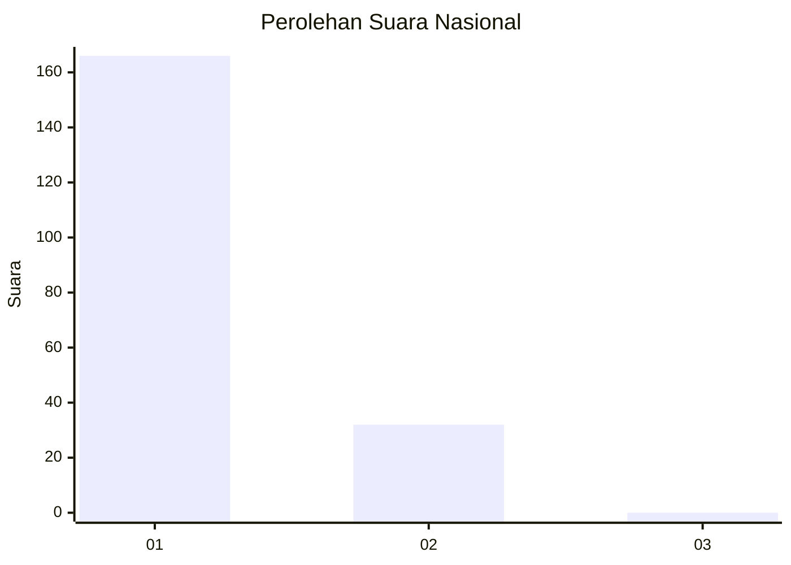
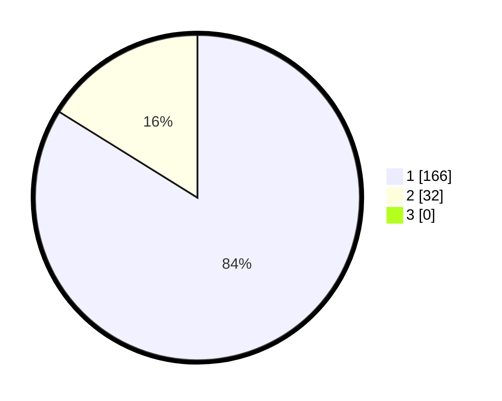

# Hasil

## Grafik

## Tabel

| No. | Nama Paslon    | Suara | Suara (raw) | Persentase |
|:--- |:-------------- | -----:| -----------:| ----------:|
| 1   | ANIES MUHAIMIN | 166   | [166][p-1]  | 83,84      |
| 2   | PRABOWO GIBRAN | 32    | [32][p-2]   | 16,16      |
| 3   | GANJAR MAHFUD  | 0     | [0][p-3]    | 0,00       |

[p-1]: https://github.com/gigit-pemilu/pemilu-2024/blob/main/pilpres/hitung-suara/sub/11-aceh/sub/03-aceh-timur/sub/03-idi-rayeuk/sub/2001-gampong-jawa/sub/004-tps/sub/paslon-1.txt
[p-2]: https://github.com/gigit-pemilu/pemilu-2024/blob/main/pilpres/hitung-suara/sub/11-aceh/sub/03-aceh-timur/sub/03-idi-rayeuk/sub/2001-gampong-jawa/sub/004-tps/sub/paslon-2.txt
[p-3]: https://github.com/gigit-pemilu/pemilu-2024/blob/main/pilpres/hitung-suara/sub/11-aceh/sub/03-aceh-timur/sub/03-idi-rayeuk/sub/2001-gampong-jawa/sub/004-tps/sub/paslon-3.txt

## Foto C Plano

https://sirekap-obj-formc.kpu.go.id/cf6e/pemilu/ppwp/11/03/03/20/01/1103032001004-20240220-093041--a109fd07-2ff7-482c-baa6-9dbe2a707f1d.jpg

https://sirekap-obj-formc.kpu.go.id/cf6e/pemilu/ppwp/11/03/03/20/01/1103032001004-20240215-022047--974cbb94-7645-47e3-977b-6a65bbfe6c6f.jpg

https://sirekap-obj-formc.kpu.go.id/cf6e/pemilu/ppwp/11/03/03/20/01/1103032001004-20240215-022241--8f419487-657f-4946-857f-a850035cd14c.jpg

## Metadata

| Key        | Value               |
| ---------- | ------------------- |
| Time Stamp | 2024-02-24 22:31:28 |

