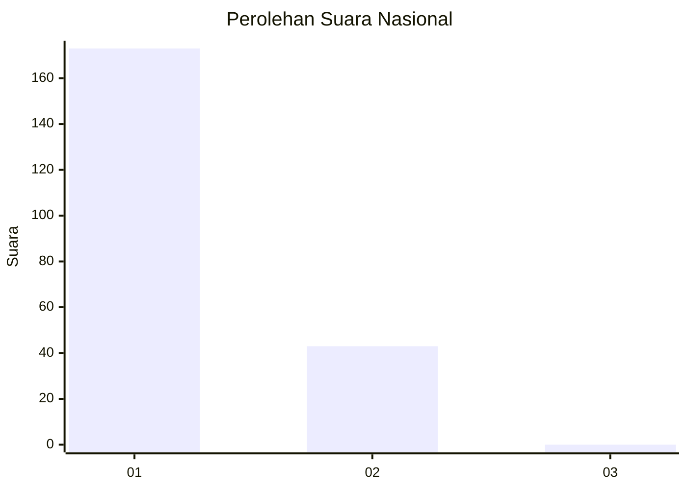
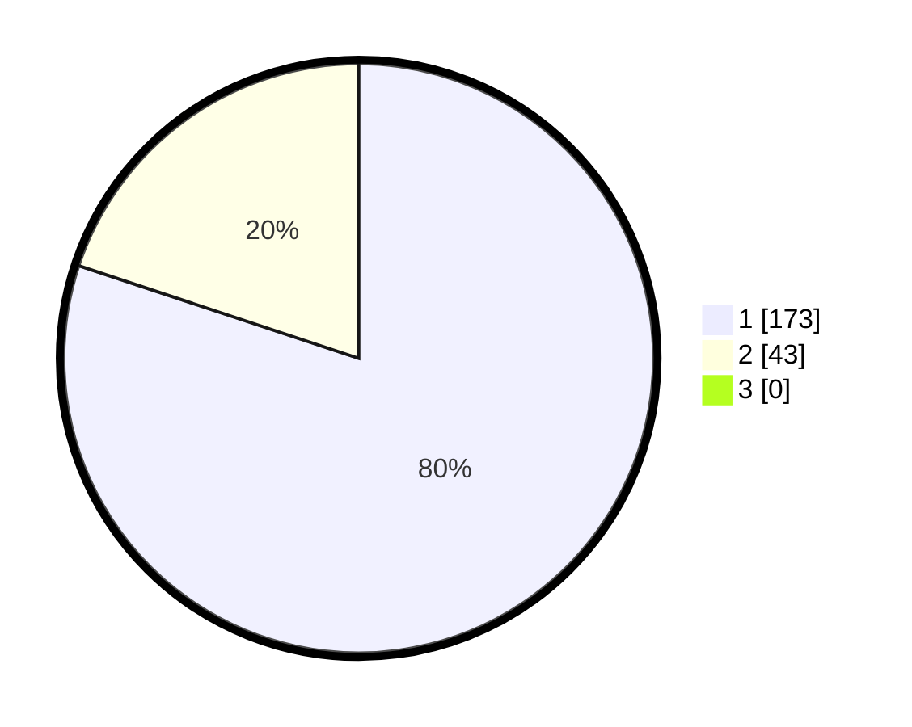

# Hasil

## Grafik

## Tabel

| No. | Nama Paslon    | Suara | Suara (raw) | Persentase |
|:--- |:-------------- | -----:| -----------:| ----------:|
| 1   | ANIES MUHAIMIN | 173   | [173][p-1]  | 80,09      |
| 2   | PRABOWO GIBRAN | 43    | [43][p-2]   | 19,91      |
| 3   | GANJAR MAHFUD  | 0     | [0][p-3]    | 0,00       |

[p-1]: https://github.com/gigit-pemilu/pemilu-2024/blob/main/pilpres/hitung-suara/sub/11-aceh/sub/03-aceh-timur/sub/03-idi-rayeuk/sub/2001-gampong-jawa/sub/005-tps/sub/paslon-1.txt
[p-2]: https://github.com/gigit-pemilu/pemilu-2024/blob/main/pilpres/hitung-suara/sub/11-aceh/sub/03-aceh-timur/sub/03-idi-rayeuk/sub/2001-gampong-jawa/sub/005-tps/sub/paslon-2.txt
[p-3]: https://github.com/gigit-pemilu/pemilu-2024/blob/main/pilpres/hitung-suara/sub/11-aceh/sub/03-aceh-timur/sub/03-idi-rayeuk/sub/2001-gampong-jawa/sub/005-tps/sub/paslon-3.txt

## Foto C Plano

https://sirekap-obj-formc.kpu.go.id/ff68/pemilu/ppwp/11/03/03/20/01/1103032001005-20240220-112556--0c084e31-d0ea-490f-8525-8937edf31916.jpg

https://sirekap-obj-formc.kpu.go.id/ff68/pemilu/ppwp/11/03/03/20/01/1103032001005-20240220-112639--af9b9cbd-8cea-4d53-8e06-b71f396d012d.jpg

https://sirekap-obj-formc.kpu.go.id/ff68/pemilu/ppwp/11/03/03/20/01/1103032001005-20240220-112726--99babf55-223c-4978-8541-5f4f93dcefd6.jpg

## Metadata

| Key        | Value               |
| ---------- | ------------------- |
| Time Stamp | 2024-02-24 22:31:28 |

