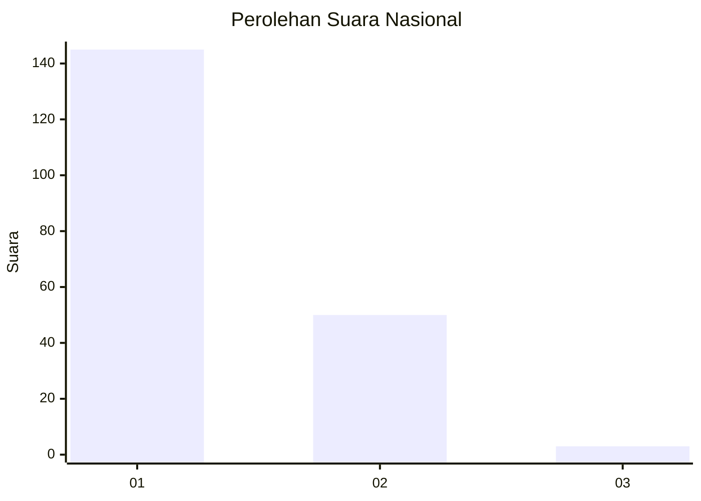
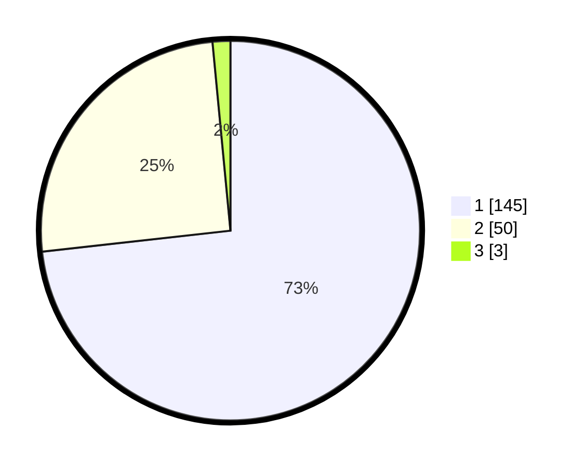

# Hasil

## Grafik

## Tabel

| No. | Nama Paslon    | Suara | Suara (raw) | Persentase |
|:--- |:-------------- | -----:| -----------:| ----------:|
| 1   | ANIES MUHAIMIN | 145   | [145][p-1]  | 73,23      |
| 2   | PRABOWO GIBRAN | 50    | [50][p-2]   | 25,25      |
| 3   | GANJAR MAHFUD  | 3     | [3][p-3]    | 1,52       |

[p-1]: https://github.com/gigit-pemilu/pemilu-2024/blob/main/pilpres/hitung-suara/sub/11-aceh/sub/03-aceh-timur/sub/03-idi-rayeuk/sub/2001-gampong-jawa/sub/006-tps/sub/paslon-1.txt
[p-2]: https://github.com/gigit-pemilu/pemilu-2024/blob/main/pilpres/hitung-suara/sub/11-aceh/sub/03-aceh-timur/sub/03-idi-rayeuk/sub/2001-gampong-jawa/sub/006-tps/sub/paslon-2.txt
[p-3]: https://github.com/gigit-pemilu/pemilu-2024/blob/main/pilpres/hitung-suara/sub/11-aceh/sub/03-aceh-timur/sub/03-idi-rayeuk/sub/2001-gampong-jawa/sub/006-tps/sub/paslon-3.txt

## Foto C Plano

https://sirekap-obj-formc.kpu.go.id/71e1/pemilu/ppwp/11/03/03/20/01/1103032001006-20240220-093233--4685d883-fef0-4d8b-8dcb-5eb10ad4d6b1.jpg

https://sirekap-obj-formc.kpu.go.id/71e1/pemilu/ppwp/11/03/03/20/01/1103032001006-20240220-093502--4c7641a8-5ee7-47c9-833b-0bebe4e56f10.jpg

https://sirekap-obj-formc.kpu.go.id/71e1/pemilu/ppwp/11/03/03/20/01/1103032001006-20240220-093618--d49f338f-4c28-4eb2-bc42-24f6e006a53d.jpg

## Metadata

| Key        | Value               |
| ---------- | ------------------- |
| Time Stamp | 2024-02-24 22:31:28 |

