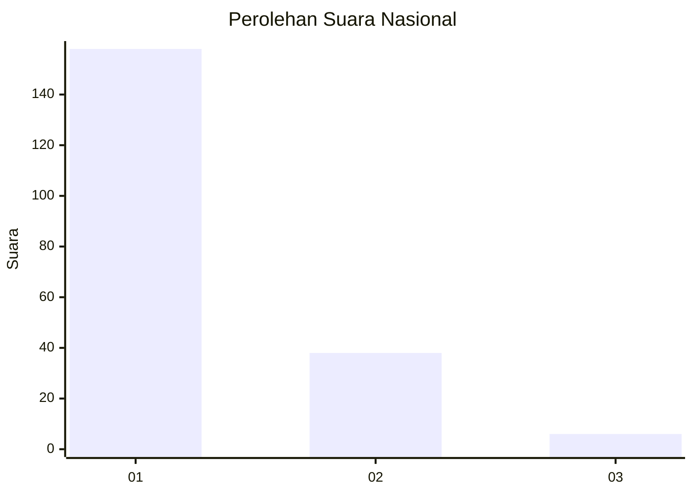
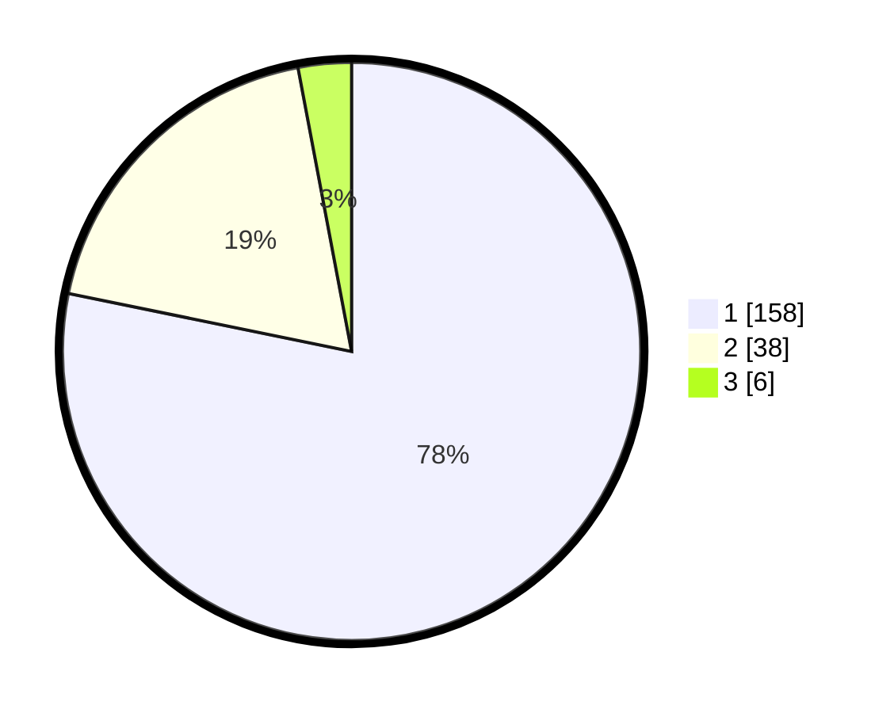

# Hasil

## Grafik

## Tabel

| No. | Nama Paslon    | Suara | Suara (raw) | Persentase |
|:--- |:-------------- | -----:| -----------:| ----------:|
| 1   | ANIES MUHAIMIN | 158   | [158][p-1]  | 78,22      |
| 2   | PRABOWO GIBRAN | 38    | [38][p-2]   | 18,81      |
| 3   | GANJAR MAHFUD  | 6     | [6][p-3]    | 2,97       |

[p-1]: https://github.com/gigit-pemilu/pemilu-2024/blob/main/pilpres/hitung-suara/sub/11-aceh/sub/03-aceh-timur/sub/03-idi-rayeuk/sub/2001-gampong-jawa/sub/007-tps/sub/paslon-1.txt
[p-2]: https://github.com/gigit-pemilu/pemilu-2024/blob/main/pilpres/hitung-suara/sub/11-aceh/sub/03-aceh-timur/sub/03-idi-rayeuk/sub/2001-gampong-jawa/sub/007-tps/sub/paslon-2.txt
[p-3]: https://github.com/gigit-pemilu/pemilu-2024/blob/main/pilpres/hitung-suara/sub/11-aceh/sub/03-aceh-timur/sub/03-idi-rayeuk/sub/2001-gampong-jawa/sub/007-tps/sub/paslon-3.txt

## Foto C Plano

https://sirekap-obj-formc.kpu.go.id/22b6/pemilu/ppwp/11/03/03/20/01/1103032001007-20240220-123618--2754929e-d156-414d-920f-022bedf511cc.jpg

https://sirekap-obj-formc.kpu.go.id/22b6/pemilu/ppwp/11/03/03/20/01/1103032001007-20240220-123731--8b8edcaf-803d-43dc-a408-3c288cc1a5a8.jpg

## Metadata

| Key        | Value               |
| ---------- | ------------------- |
| Time Stamp | 2024-02-24 22:31:28 |

