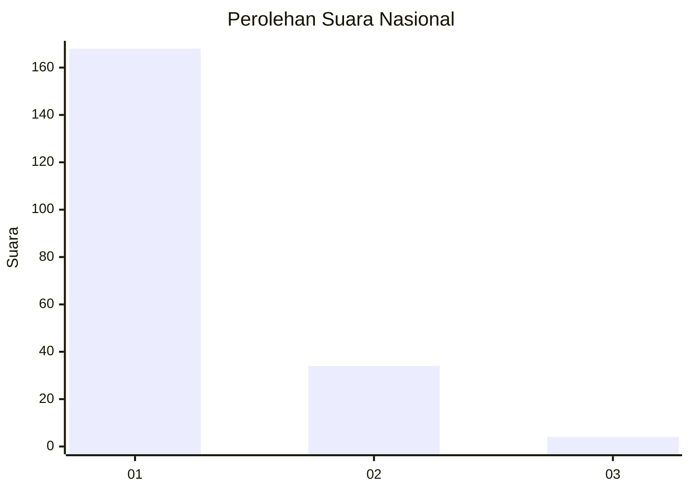
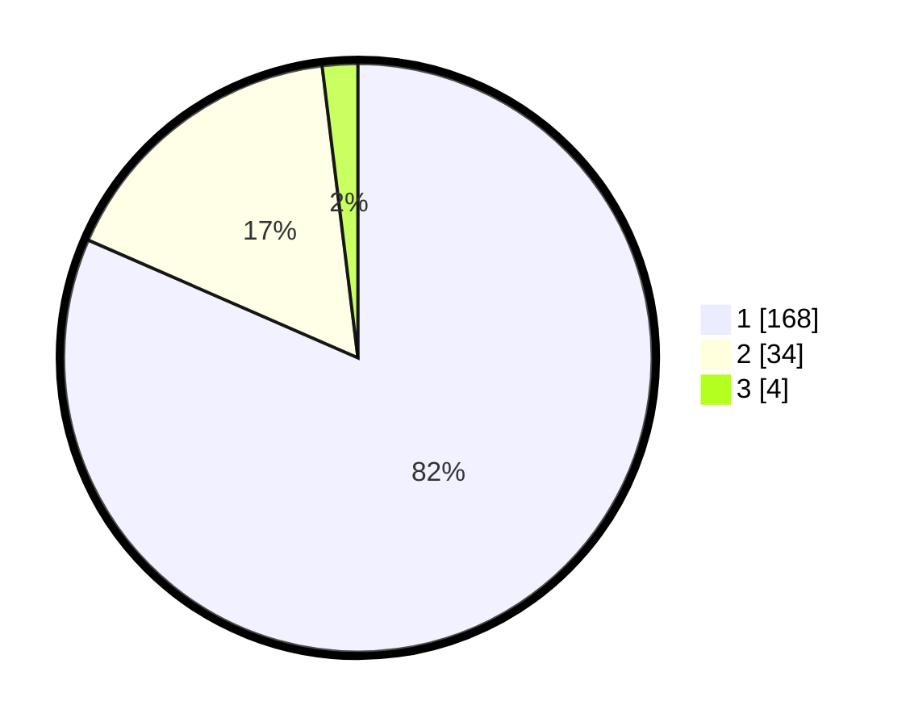

# Hasil

## Grafik

## Tabel

| No. | Nama Paslon    | Suara | Suara (raw) | Persentase |
|:--- |:-------------- | -----:| -----------:| ----------:|
| 1   | ANIES MUHAIMIN | 168   | [168][p-1]  | 81,55      |
| 2   | PRABOWO GIBRAN | 34    | [34][p-2]   | 16,50      |
| 3   | GANJAR MAHFUD  | 4     | [4][p-3]    | 1,94       |

[p-1]: https://github.com/gigit-pemilu/pemilu-2024/blob/main/pilpres/hitung-suara/sub/11-aceh/sub/03-aceh-timur/sub/03-idi-rayeuk/sub/2001-gampong-jawa/sub/010-tps/sub/paslon-1.txt
[p-2]: https://github.com/gigit-pemilu/pemilu-2024/blob/main/pilpres/hitung-suara/sub/11-aceh/sub/03-aceh-timur/sub/03-idi-rayeuk/sub/2001-gampong-jawa/sub/010-tps/sub/paslon-2.txt
[p-3]: https://github.com/gigit-pemilu/pemilu-2024/blob/main/pilpres/hitung-suara/sub/11-aceh/sub/03-aceh-timur/sub/03-idi-rayeuk/sub/2001-gampong-jawa/sub/010-tps/sub/paslon-3.txt

## Foto C Plano

https://sirekap-obj-formc.kpu.go.id/e94a/pemilu/ppwp/11/03/03/20/01/1103032001010-20240214-203848--55013206-835d-4569-b6ee-9c31a6fe297e.jpg

https://sirekap-obj-formc.kpu.go.id/e94a/pemilu/ppwp/11/03/03/20/01/1103032001010-20240214-203921--289c59c7-fa8e-4f80-b9a4-dcd3795f4fbd.jpg

https://sirekap-obj-formc.kpu.go.id/e94a/pemilu/ppwp/11/03/03/20/01/1103032001010-20240214-204005--fae79a9c-35b5-4ead-b9c5-ea8edcd83c3c.jpg

## Metadata

| Key        | Value               |
| ---------- | ------------------- |
| Time Stamp | 2024-02-25 12:00:00 |

