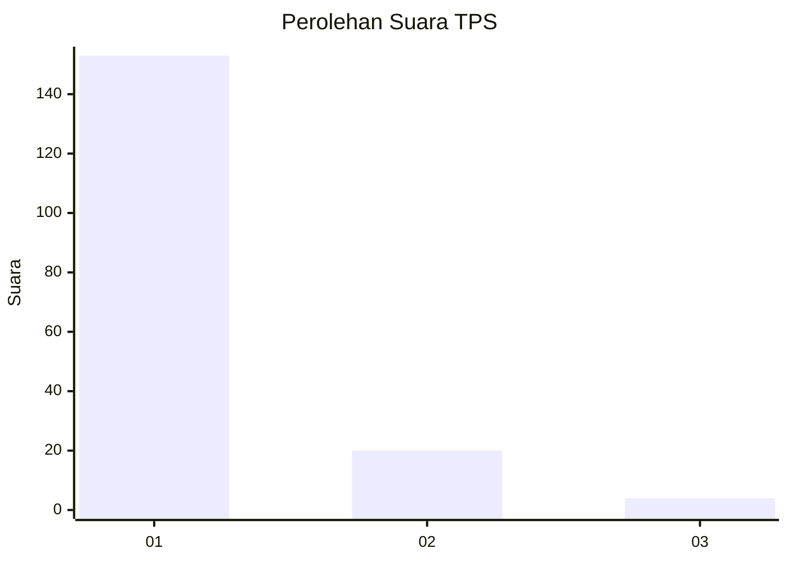
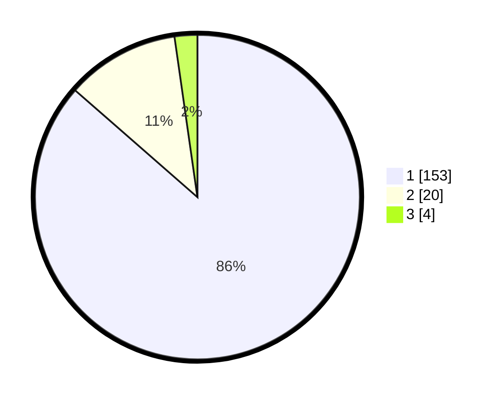

# Hasil

## Grafik

## Tabel

| No. | Nama Paslon    | Suara | Suara (raw) | Persentase |
|:--- |:-------------- | -----:| -----------:| ----------:|
| 1   | ANIES MUHAIMIN | 153   | [153][p-1]  | 86,44      |
| 2   | PRABOWO GIBRAN | 20    | [20][p-2]   | 11,30      |
| 3   | GANJAR MAHFUD  | 4     | [4][p-3]    | 2,26       |

[p-1]: https://github.com/gigit-pemilu/pemilu-2024-11-aceh/blob/main/pilpres/hitung-suara/sub/11-aceh/sub/03-aceh-timur/sub/03-idi-rayeuk/sub/2002-keude-blang/sub/001-tps/sub/paslon-1.txt
[p-2]: https://github.com/gigit-pemilu/pemilu-2024-11-aceh/blob/main/pilpres/hitung-suara/sub/11-aceh/sub/03-aceh-timur/sub/03-idi-rayeuk/sub/2002-keude-blang/sub/001-tps/sub/paslon-2.txt
[p-3]: https://github.com/gigit-pemilu/pemilu-2024-11-aceh/blob/main/pilpres/hitung-suara/sub/11-aceh/sub/03-aceh-timur/sub/03-idi-rayeuk/sub/2002-keude-blang/sub/001-tps/sub/paslon-3.txt

## Foto C Plano

https://sirekap-obj-formc.kpu.go.id/7fd2/pemilu/ppwp/11/03/03/20/02/1103032002001-20240215-083127--0ac93f6e-09d7-4992-8b55-4e9d0bdd767a.jpg

https://sirekap-obj-formc.kpu.go.id/7fd2/pemilu/ppwp/11/03/03/20/02/1103032002001-20240215-083214--e0b9c4c6-8f3d-4d7a-b41f-0046da24775d.jpg

https://sirekap-obj-formc.kpu.go.id/7fd2/pemilu/ppwp/11/03/03/20/02/1103032002001-20240215-083241--9adcead7-7d9d-4983-822d-146309d64602.jpg

## Metadata

| Key        | Value               |
| ---------- | ------------------- |
| Time Stamp | 2024-02-24 22:31:28 |

