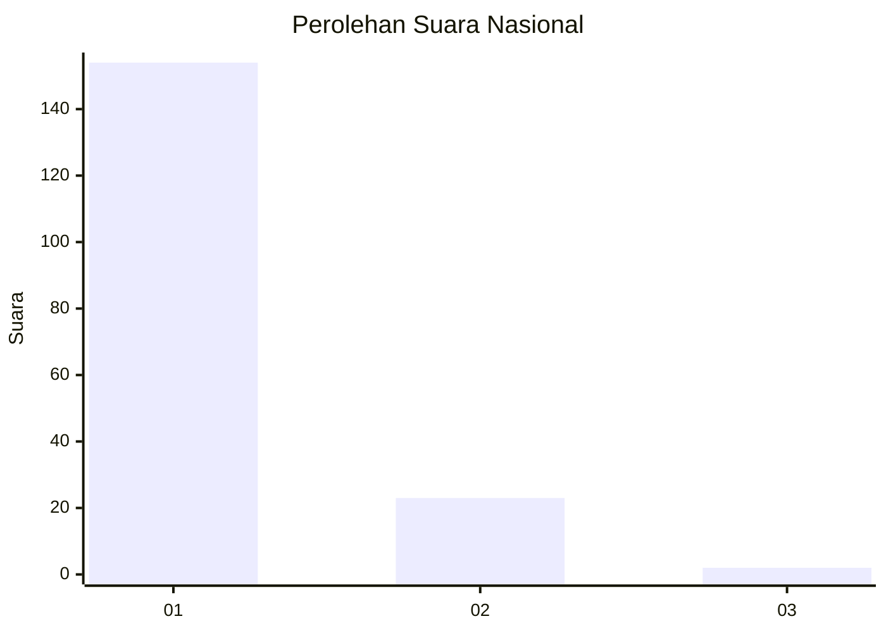
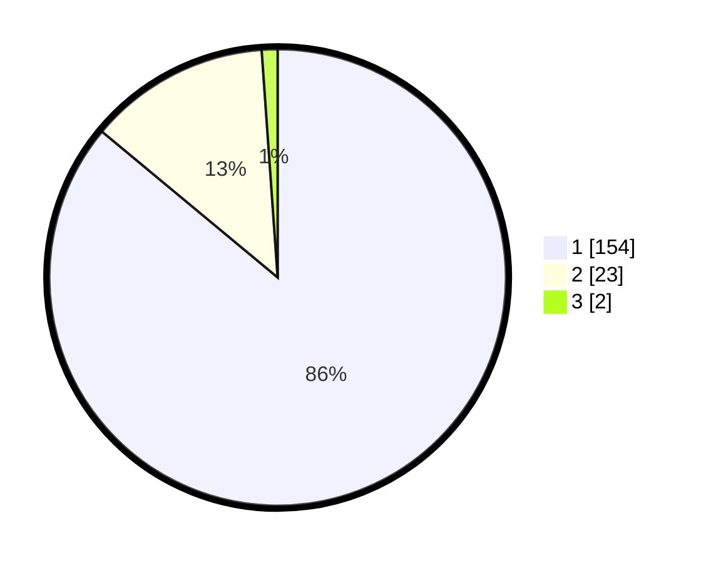

# Hasil

## Grafik

## Tabel

| No. | Nama Paslon    | Suara | Suara (raw) | Persentase |
|:--- |:-------------- | -----:| -----------:| ----------:|
| 1   | ANIES MUHAIMIN | 154   | [154][p-1]  | 86,03      |
| 2   | PRABOWO GIBRAN | 23    | [23][p-2]   | 12,85      |
| 3   | GANJAR MAHFUD  | 2     | [2][p-3]    | 1,12       |

[p-1]: https://github.com/gigit-pemilu/pemilu-2024/blob/main/pilpres/hitung-suara/sub/11-aceh/sub/03-aceh-timur/sub/03-idi-rayeuk/sub/2002-keude-blang/sub/002-tps/sub/paslon-1.txt
[p-2]: https://github.com/gigit-pemilu/pemilu-2024/blob/main/pilpres/hitung-suara/sub/11-aceh/sub/03-aceh-timur/sub/03-idi-rayeuk/sub/2002-keude-blang/sub/002-tps/sub/paslon-2.txt
[p-3]: https://github.com/gigit-pemilu/pemilu-2024/blob/main/pilpres/hitung-suara/sub/11-aceh/sub/03-aceh-timur/sub/03-idi-rayeuk/sub/2002-keude-blang/sub/002-tps/sub/paslon-3.txt

## Foto C Plano

https://sirekap-obj-formc.kpu.go.id/b46c/pemilu/ppwp/11/03/03/20/02/1103032002002-20240215-100249--59897260-22be-45a1-bad3-31624ea89e31.jpg

https://sirekap-obj-formc.kpu.go.id/b46c/pemilu/ppwp/11/03/03/20/02/1103032002002-20240215-100421--faf422e0-1df3-4d6f-b043-ae59f1b0ff59.jpg

https://sirekap-obj-formc.kpu.go.id/b46c/pemilu/ppwp/11/03/03/20/02/1103032002002-20240215-100543--1ff6b996-6375-40b4-9ffc-959344f7b85a.jpg

## Metadata

| Key        | Value               |
| ---------- | ------------------- |
| Time Stamp | 2024-02-24 22:31:28 |

