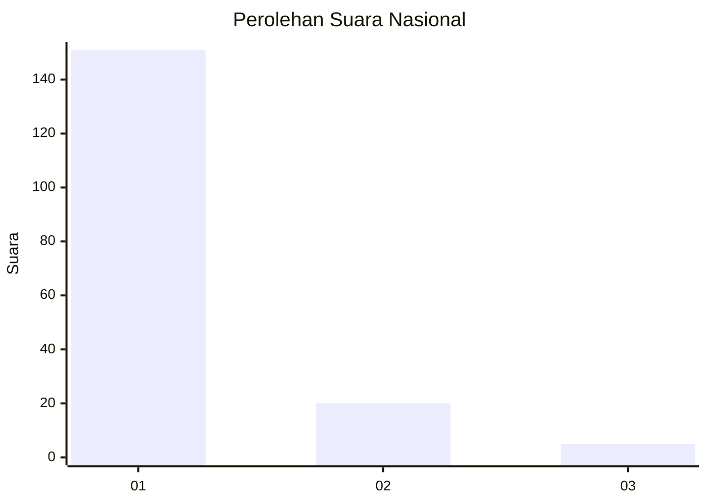
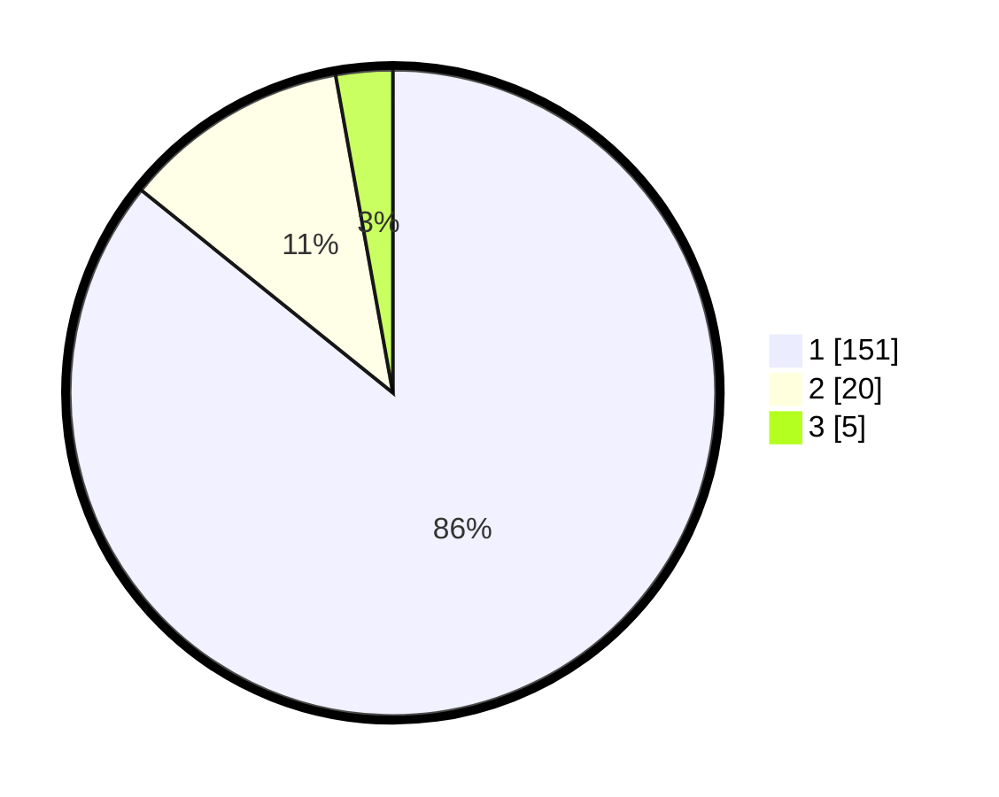

# Hasil

## Grafik

## Tabel

| No. | Nama Paslon    | Suara | Suara (raw) | Persentase |
|:--- |:-------------- | -----:| -----------:| ----------:|
| 1   | ANIES MUHAIMIN | 151   | [151][p-1]  | 85,80      |
| 2   | PRABOWO GIBRAN | 20    | [20][p-2]   | 11,36      |
| 3   | GANJAR MAHFUD  | 5     | [5][p-3]    | 2,84       |

[p-1]: https://github.com/gigit-pemilu/pemilu-2024/blob/main/pilpres/hitung-suara/sub/11-aceh/sub/03-aceh-timur/sub/03-idi-rayeuk/sub/2002-keude-blang/sub/003-tps/sub/paslon-1.txt
[p-2]: https://github.com/gigit-pemilu/pemilu-2024/blob/main/pilpres/hitung-suara/sub/11-aceh/sub/03-aceh-timur/sub/03-idi-rayeuk/sub/2002-keude-blang/sub/003-tps/sub/paslon-2.txt
[p-3]: https://github.com/gigit-pemilu/pemilu-2024/blob/main/pilpres/hitung-suara/sub/11-aceh/sub/03-aceh-timur/sub/03-idi-rayeuk/sub/2002-keude-blang/sub/003-tps/sub/paslon-3.txt

## Foto C Plano

https://sirekap-obj-formc.kpu.go.id/2650/pemilu/ppwp/11/03/03/20/02/1103032002003-20240215-082702--b69db275-e0bf-4207-9b7d-4c07818ea5a1.jpg

https://sirekap-obj-formc.kpu.go.id/2650/pemilu/ppwp/11/03/03/20/02/1103032002003-20240215-082828--1232e8ef-1de6-4af0-8955-b4afc28dcc88.jpg

https://sirekap-obj-formc.kpu.go.id/2650/pemilu/ppwp/11/03/03/20/02/1103032002003-20240215-083132--33ec56b2-0689-4097-92f7-ad08762ab92a.jpg

## Metadata

| Key        | Value               |
| ---------- | ------------------- |
| Time Stamp | 2024-02-24 22:31:28 |

