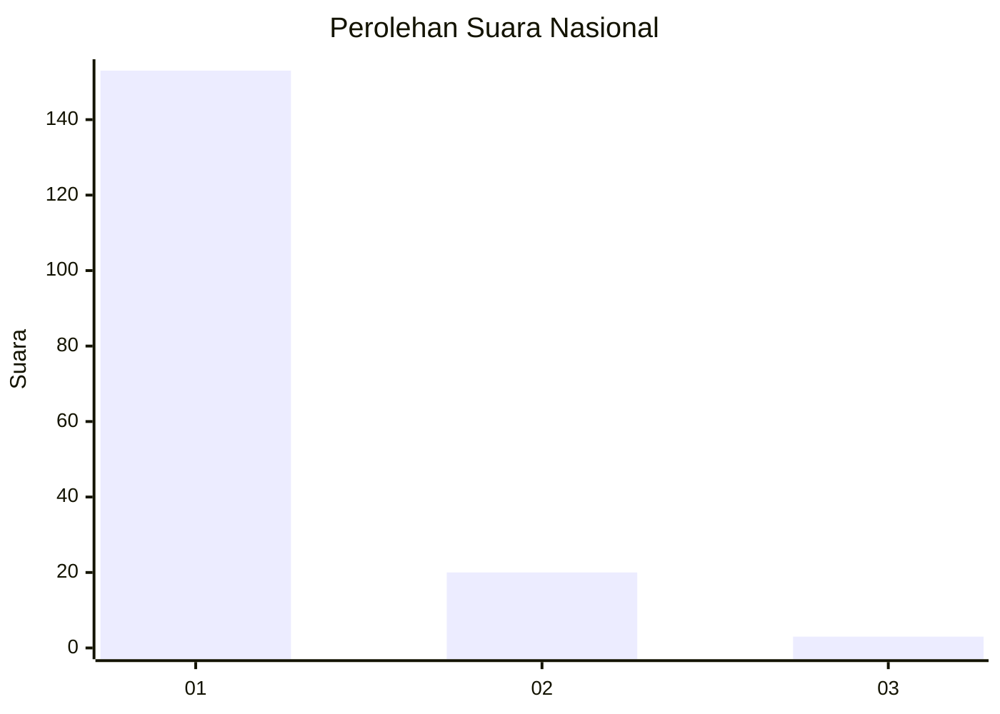
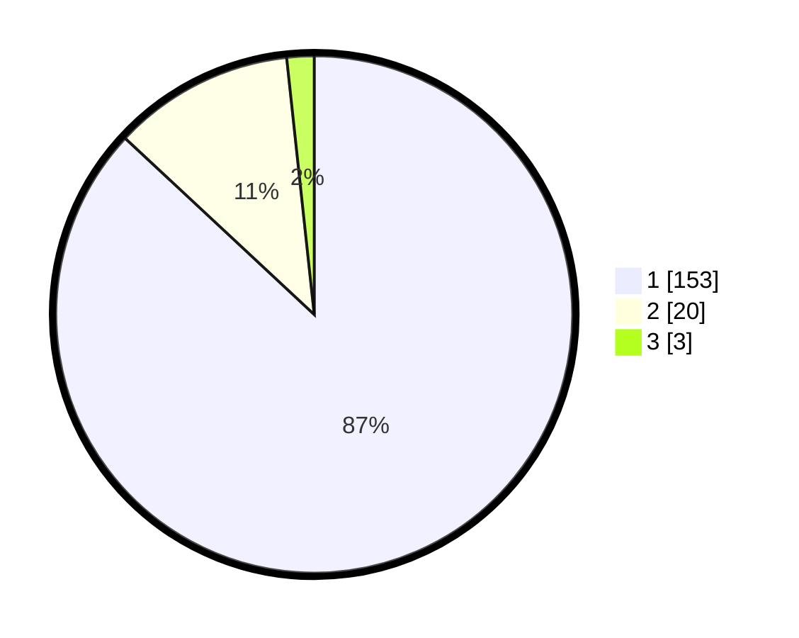

# Hasil

## Grafik

## Tabel

| No. | Nama Paslon    | Suara | Suara (raw) | Persentase |
|:--- |:-------------- | -----:| -----------:| ----------:|
| 1   | ANIES MUHAIMIN | 153   | [153][p-1]  | 86,93      |
| 2   | PRABOWO GIBRAN | 20    | [20][p-2]   | 11,36      |
| 3   | GANJAR MAHFUD  | 3     | [3][p-3]    | 1,70       |

[p-1]: https://github.com/gigit-pemilu/pemilu-2024/blob/main/pilpres/hitung-suara/sub/11-aceh/sub/03-aceh-timur/sub/03-idi-rayeuk/sub/2002-keude-blang/sub/004-tps/sub/paslon-1.txt
[p-2]: https://github.com/gigit-pemilu/pemilu-2024/blob/main/pilpres/hitung-suara/sub/11-aceh/sub/03-aceh-timur/sub/03-idi-rayeuk/sub/2002-keude-blang/sub/004-tps/sub/paslon-2.txt
[p-3]: https://github.com/gigit-pemilu/pemilu-2024/blob/main/pilpres/hitung-suara/sub/11-aceh/sub/03-aceh-timur/sub/03-idi-rayeuk/sub/2002-keude-blang/sub/004-tps/sub/paslon-3.txt

## Foto C Plano

https://sirekap-obj-formc.kpu.go.id/de60/pemilu/ppwp/11/03/03/20/02/1103032002004-20240222-124949--073b80d3-196b-48db-b38c-5229380c9310.jpg

https://sirekap-obj-formc.kpu.go.id/de60/pemilu/ppwp/11/03/03/20/02/1103032002004-20240222-125037--686983ff-f3d8-4b87-ac50-de4b6951f284.jpg

https://sirekap-obj-formc.kpu.go.id/de60/pemilu/ppwp/11/03/03/20/02/1103032002004-20240222-125116--be758e5f-5434-4733-a0e3-231f4845b5b4.jpg

## Metadata

| Key        | Value               |
| ---------- | ------------------- |
| Time Stamp | 2024-02-25 22:00:00 |

