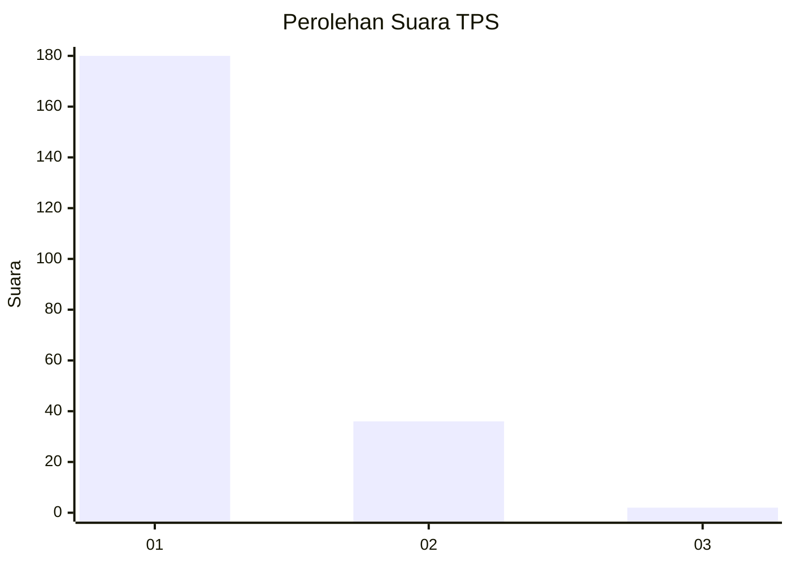
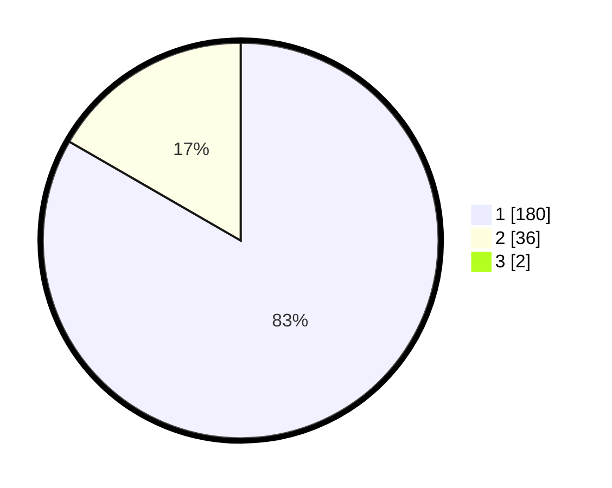

# Hasil

## Grafik

## Tabel

| No. | Nama Paslon    | Suara | Suara (raw) | Persentase |
|:--- |:-------------- | -----:| -----------:| ----------:|
| 1   | ANIES MUHAIMIN | 180   | [180][p-1]  | 82,57      |
| 2   | PRABOWO GIBRAN | 36    | [36][p-2]   | 16,51      |
| 3   | GANJAR MAHFUD  | 2     | [2][p-3]    | 0,92       |

[p-1]: https://github.com/gigit-pemilu/pemilu-2024-11-aceh/blob/main/pilpres/hitung-suara/sub/11-aceh/sub/03-aceh-timur/sub/03-idi-rayeuk/sub/2003-tanoh-anoe/sub/001-tps/sub/paslon-1.txt
[p-2]: https://github.com/gigit-pemilu/pemilu-2024-11-aceh/blob/main/pilpres/hitung-suara/sub/11-aceh/sub/03-aceh-timur/sub/03-idi-rayeuk/sub/2003-tanoh-anoe/sub/001-tps/sub/paslon-2.txt
[p-3]: https://github.com/gigit-pemilu/pemilu-2024-11-aceh/blob/main/pilpres/hitung-suara/sub/11-aceh/sub/03-aceh-timur/sub/03-idi-rayeuk/sub/2003-tanoh-anoe/sub/001-tps/sub/paslon-3.txt

## Foto C Plano

https://sirekap-obj-formc.kpu.go.id/4d29/pemilu/ppwp/11/03/03/20/03/1103032003001-20240218-140524--075d20e9-435c-4958-aaeb-7baaadbdce45.jpg

https://sirekap-obj-formc.kpu.go.id/4d29/pemilu/ppwp/11/03/03/20/03/1103032003001-20240218-140646--d10ffda8-f46f-4578-ab3b-2064889e52dd.jpg

https://sirekap-obj-formc.kpu.go.id/4d29/pemilu/ppwp/11/03/03/20/03/1103032003001-20240218-140734--3bcf0460-7aeb-4508-a254-ef8d22cae177.jpg

## Metadata

| Key        | Value               |
| ---------- | ------------------- |
| Time Stamp | 2024-02-24 22:31:28 |

## DATA PEMILIH TETAP

Jumlah pemilih dalam DPT: **279**.
 * L: **330**.
 * P: **149**.

## DATA PENGGUNA HAK PILIH

Jumlah pengguna hak pilih dalam DPT: **184**.
 * L: **81**.
 * P: **103**.

Jumlah pengguna hak pilih dalam DPTb: **2**.
 * L: **1**.
 * P: **1**.

Jumlah pengguna hak pilih dalam DPK: **38**.
 * L: **17**.
 * P: **21**.

Jumlah pengguna hak pilih: **224**.
 * L: **99**.
 * P: **125**.

## JUMLAH SUARA SAH DAN TIDAK SAH

JUMLAH SELURUH SUARA SAH: **218**.

JUMLAH SUARA TIDAK SAH: **6**.

JUMLAH SELURUH SUARA SAH DAN SUARA TIDAK SAH: **224**.

