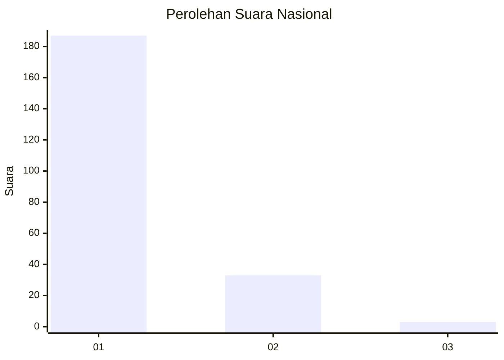
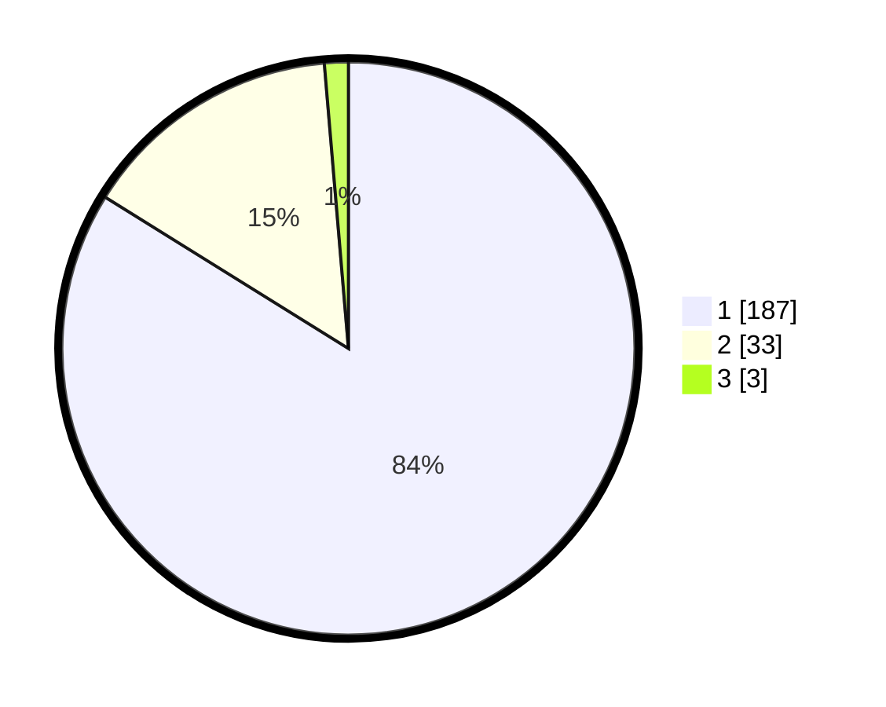

# Hasil

## Grafik

## Tabel

| No. | Nama Paslon    | Suara | Suara (raw) | Persentase |
|:--- |:-------------- | -----:| -----------:| ----------:|
| 1   | ANIES MUHAIMIN | 187   | [187][p-1]  | 83,86      |
| 2   | PRABOWO GIBRAN | 33    | [33][p-2]   | 14,80      |
| 3   | GANJAR MAHFUD  | 3     | [3][p-3]    | 1,35       |

[p-1]: https://github.com/gigit-pemilu/pemilu-2024/blob/main/pilpres/hitung-suara/sub/11-aceh/sub/03-aceh-timur/sub/03-idi-rayeuk/sub/2003-tanoh-anoe/sub/003-tps/sub/paslon-1.txt
[p-2]: https://github.com/gigit-pemilu/pemilu-2024/blob/main/pilpres/hitung-suara/sub/11-aceh/sub/03-aceh-timur/sub/03-idi-rayeuk/sub/2003-tanoh-anoe/sub/003-tps/sub/paslon-2.txt
[p-3]: https://github.com/gigit-pemilu/pemilu-2024/blob/main/pilpres/hitung-suara/sub/11-aceh/sub/03-aceh-timur/sub/03-idi-rayeuk/sub/2003-tanoh-anoe/sub/003-tps/sub/paslon-3.txt

## Foto C Plano

https://sirekap-obj-formc.kpu.go.id/aeb5/pemilu/ppwp/11/03/03/20/03/1103032003003-20240218-180235--db1bd0a7-5bb8-46b3-b141-7aef54bce35e.jpg

https://sirekap-obj-formc.kpu.go.id/aeb5/pemilu/ppwp/11/03/03/20/03/1103032003003-20240218-180320--01ec51b9-8055-48eb-a98c-7148c5ebd013.jpg

https://sirekap-obj-formc.kpu.go.id/aeb5/pemilu/ppwp/11/03/03/20/03/1103032003003-20240218-180424--74fc4a2f-48a1-4624-83a3-c738a6596193.jpg

## Metadata

| Key        | Value               |
| ---------- | ------------------- |
| Time Stamp | 2024-02-24 22:31:28 |

