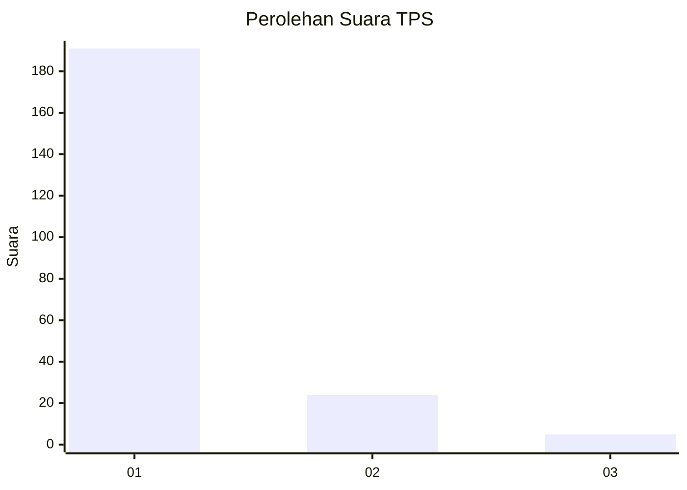
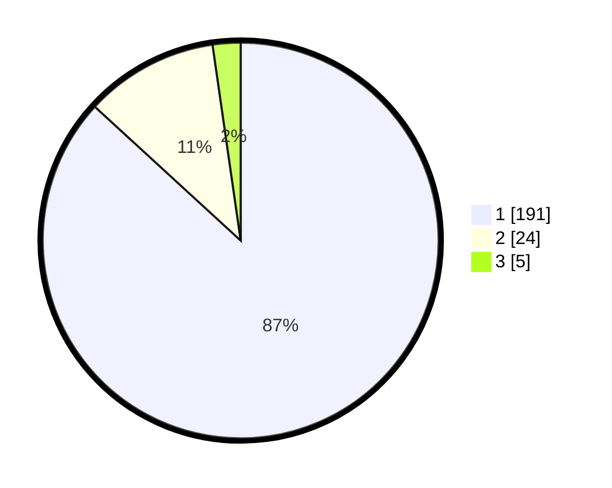

# Hasil

## Grafik

## Tabel

| No. | Nama Paslon    | Suara | Suara (raw) | Persentase |
|:--- |:-------------- | -----:| -----------:| ----------:|
| 1   | ANIES MUHAIMIN | 191   | [191][p-1]  | 86,82      |
| 2   | PRABOWO GIBRAN | 24    | [24][p-2]   | 10,91      |
| 3   | GANJAR MAHFUD  | 5     | [5][p-3]    | 2,27       |

[p-1]: https://github.com/gigit-pemilu/pemilu-2024-11-aceh/blob/main/pilpres/hitung-suara/sub/11-aceh/sub/03-aceh-timur/sub/03-idi-rayeuk/sub/2003-tanoh-anoe/sub/004-tps/sub/paslon-1.txt
[p-2]: https://github.com/gigit-pemilu/pemilu-2024-11-aceh/blob/main/pilpres/hitung-suara/sub/11-aceh/sub/03-aceh-timur/sub/03-idi-rayeuk/sub/2003-tanoh-anoe/sub/004-tps/sub/paslon-2.txt
[p-3]: https://github.com/gigit-pemilu/pemilu-2024-11-aceh/blob/main/pilpres/hitung-suara/sub/11-aceh/sub/03-aceh-timur/sub/03-idi-rayeuk/sub/2003-tanoh-anoe/sub/004-tps/sub/paslon-3.txt

## Foto C Plano

https://sirekap-obj-formc.kpu.go.id/069e/pemilu/ppwp/11/03/03/20/03/1103032003004-20240218-214305--f98b4858-f4fc-4e9a-a1c9-42aac9e0eb24.jpg

https://sirekap-obj-formc.kpu.go.id/069e/pemilu/ppwp/11/03/03/20/03/1103032003004-20240218-214358--8e279bbf-91fc-4e5d-a5e4-954b5aeda9e1.jpg

https://sirekap-obj-formc.kpu.go.id/069e/pemilu/ppwp/11/03/03/20/03/1103032003004-20240218-214459--9cc8a533-490c-4839-b39b-eef9b807d5a6.jpg

## Metadata

| Key        | Value               |
| ---------- | ------------------- |
| Time Stamp | 2024-02-24 22:31:28 |

