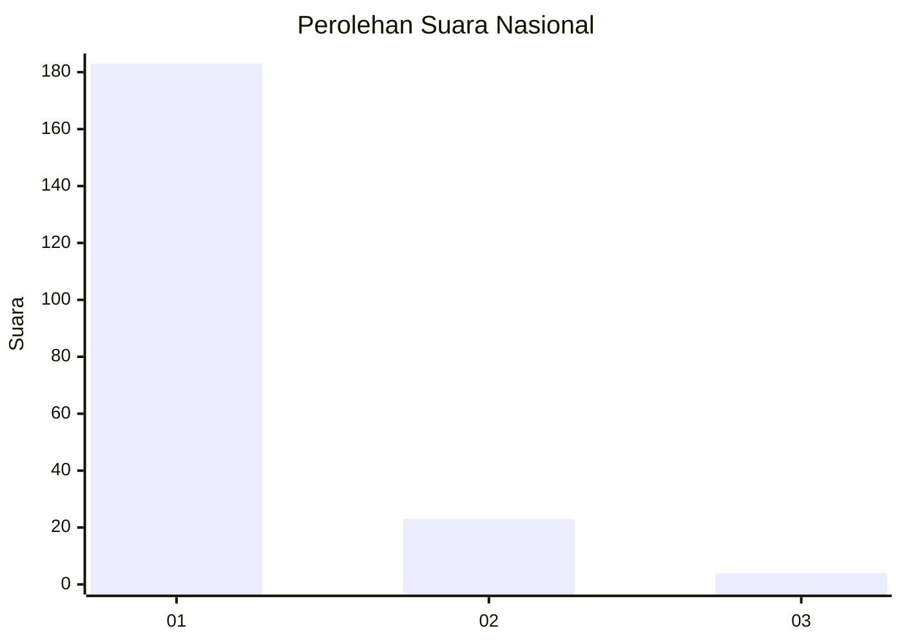
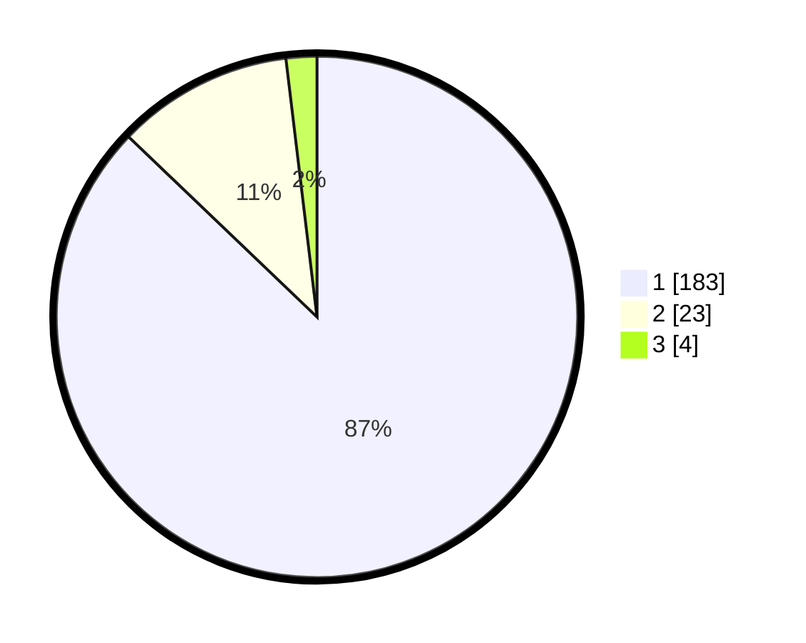

# Hasil

## Grafik

## Tabel

| No. | Nama Paslon    | Suara | Suara (raw) | Persentase |
|:--- |:-------------- | -----:| -----------:| ----------:|
| 1   | ANIES MUHAIMIN | 183   | [183][p-1]  | 87,14      |
| 2   | PRABOWO GIBRAN | 23    | [23][p-2]   | 10,95      |
| 3   | GANJAR MAHFUD  | 4     | [4][p-3]    | 1,90       |

[p-1]: https://github.com/gigit-pemilu/pemilu-2024/blob/main/pilpres/hitung-suara/sub/11-aceh/sub/03-aceh-timur/sub/03-idi-rayeuk/sub/2003-tanoh-anoe/sub/005-tps/sub/paslon-1.txt
[p-2]: https://github.com/gigit-pemilu/pemilu-2024/blob/main/pilpres/hitung-suara/sub/11-aceh/sub/03-aceh-timur/sub/03-idi-rayeuk/sub/2003-tanoh-anoe/sub/005-tps/sub/paslon-2.txt
[p-3]: https://github.com/gigit-pemilu/pemilu-2024/blob/main/pilpres/hitung-suara/sub/11-aceh/sub/03-aceh-timur/sub/03-idi-rayeuk/sub/2003-tanoh-anoe/sub/005-tps/sub/paslon-3.txt

## Foto C Plano

https://sirekap-obj-formc.kpu.go.id/7a5a/pemilu/ppwp/11/03/03/20/03/1103032003005-20240218-225829--97b0f508-fe46-48c5-a7f4-f8dd7ad9bbf7.jpg

https://sirekap-obj-formc.kpu.go.id/7a5a/pemilu/ppwp/11/03/03/20/03/1103032003005-20240218-230656--3146eba2-597e-4351-b23f-5af03cbe15a2.jpg

https://sirekap-obj-formc.kpu.go.id/7a5a/pemilu/ppwp/11/03/03/20/03/1103032003005-20240218-230922--f0b0f9a6-3640-45e9-b35a-64a6b5498992.jpg

## Metadata

| Key        | Value               |
| ---------- | ------------------- |
| Time Stamp | 2024-02-24 22:31:28 |

