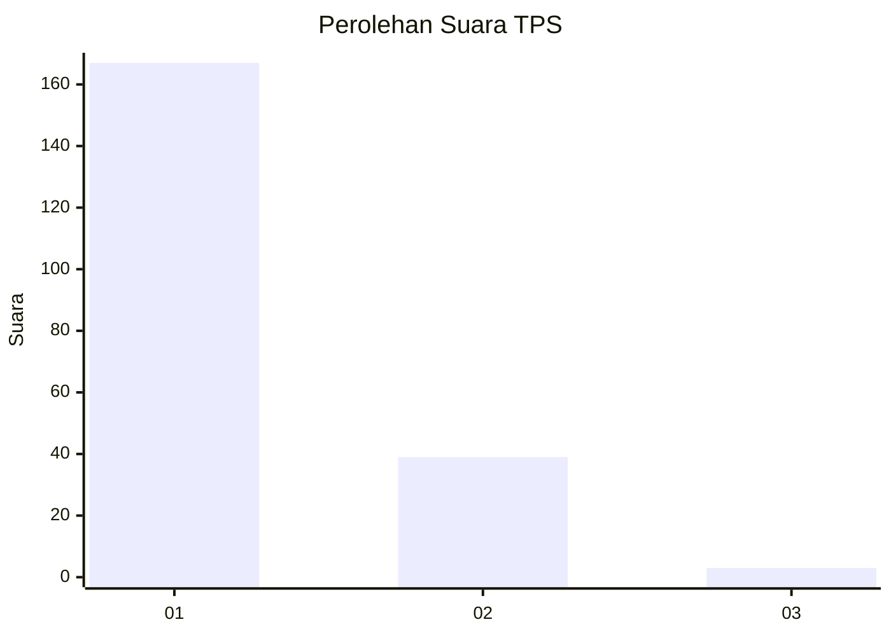
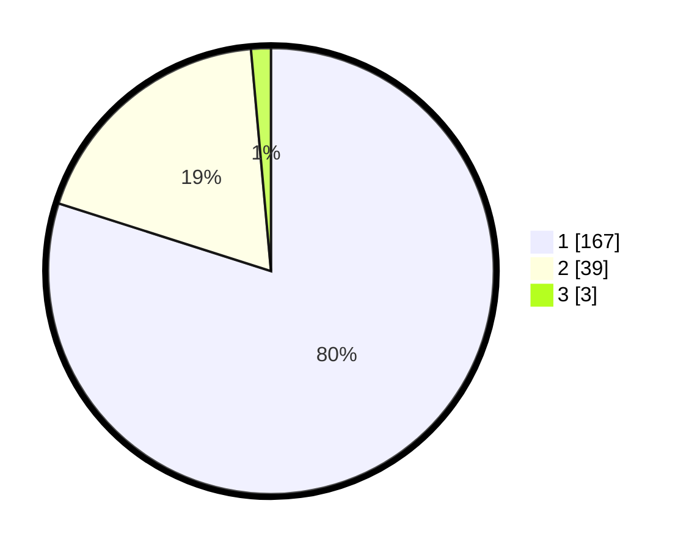

# Hasil

## Grafik

## Tabel

| No. | Nama Paslon    | Suara | Suara (raw) | Persentase |
|:--- |:-------------- | -----:| -----------:| ----------:|
| 1   | ANIES MUHAIMIN | 167   | [167][p-1]  | 79,90      |
| 2   | PRABOWO GIBRAN | 39    | [39][p-2]   | 18,66      |
| 3   | GANJAR MAHFUD  | 3     | [3][p-3]    | 1,44       |

[p-1]: https://github.com/gigit-pemilu/pemilu-2024-11-aceh/blob/main/pilpres/hitung-suara/sub/11-aceh/sub/03-aceh-timur/sub/03-idi-rayeuk/sub/2003-tanoh-anoe/sub/006-tps/sub/paslon-1.txt
[p-2]: https://github.com/gigit-pemilu/pemilu-2024-11-aceh/blob/main/pilpres/hitung-suara/sub/11-aceh/sub/03-aceh-timur/sub/03-idi-rayeuk/sub/2003-tanoh-anoe/sub/006-tps/sub/paslon-2.txt
[p-3]: https://github.com/gigit-pemilu/pemilu-2024-11-aceh/blob/main/pilpres/hitung-suara/sub/11-aceh/sub/03-aceh-timur/sub/03-idi-rayeuk/sub/2003-tanoh-anoe/sub/006-tps/sub/paslon-3.txt

## Foto C Plano

https://sirekap-obj-formc.kpu.go.id/e065/pemilu/ppwp/11/03/03/20/03/1103032003006-20240219-092810--85fa1c46-20e9-4421-95a5-88b55aa9d419.jpg

https://sirekap-obj-formc.kpu.go.id/e065/pemilu/ppwp/11/03/03/20/03/1103032003006-20240219-092947--c6960b3a-98d9-43d5-a9fa-a4ec3a28550f.jpg

https://sirekap-obj-formc.kpu.go.id/e065/pemilu/ppwp/11/03/03/20/03/1103032003006-20240219-093118--c2d52332-ffb7-4697-b5ba-52294cfdedb6.jpg

## Metadata

| Key        | Value               |
| ---------- | ------------------- |
| Time Stamp | 2024-02-25 16:00:00 |

