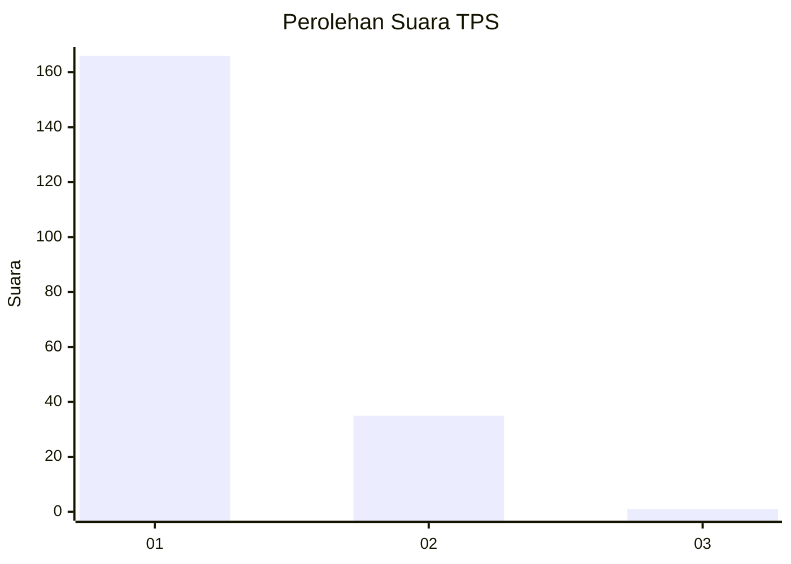
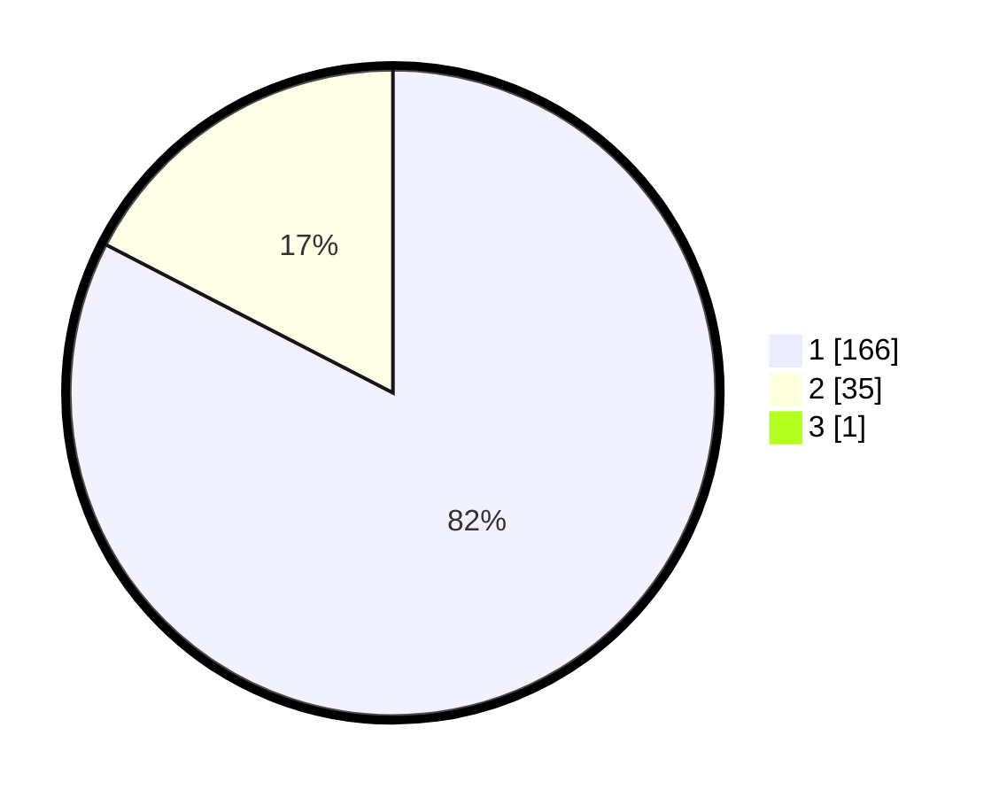

# Hasil

## Grafik

## Tabel

| No. | Nama Paslon    | Suara | Suara (raw) | Persentase |
|:--- |:-------------- | -----:| -----------:| ----------:|
| 1   | ANIES MUHAIMIN | 166   | [166][p-1]  | 82,18      |
| 2   | PRABOWO GIBRAN | 35    | [35][p-2]   | 17,33      |
| 3   | GANJAR MAHFUD  | 1     | [1][p-3]    | 0,50       |

[p-1]: https://github.com/gigit-pemilu/pemilu-2024-11-aceh/blob/main/pilpres/hitung-suara/sub/11-aceh/sub/03-aceh-timur/sub/03-idi-rayeuk/sub/2003-tanoh-anoe/sub/007-tps/sub/paslon-1.txt
[p-2]: https://github.com/gigit-pemilu/pemilu-2024-11-aceh/blob/main/pilpres/hitung-suara/sub/11-aceh/sub/03-aceh-timur/sub/03-idi-rayeuk/sub/2003-tanoh-anoe/sub/007-tps/sub/paslon-2.txt
[p-3]: https://github.com/gigit-pemilu/pemilu-2024-11-aceh/blob/main/pilpres/hitung-suara/sub/11-aceh/sub/03-aceh-timur/sub/03-idi-rayeuk/sub/2003-tanoh-anoe/sub/007-tps/sub/paslon-3.txt

## Foto C Plano

https://sirekap-obj-formc.kpu.go.id/a185/pemilu/ppwp/11/03/03/20/03/1103032003007-20240219-104120--05bfe51e-9987-48ef-a18f-548186f00e51.jpg

https://sirekap-obj-formc.kpu.go.id/a185/pemilu/ppwp/11/03/03/20/03/1103032003007-20240219-104205--4188bb2d-4edd-42a3-acba-c01a083b5f0b.jpg

https://sirekap-obj-formc.kpu.go.id/a185/pemilu/ppwp/11/03/03/20/03/1103032003007-20240219-104254--8fc1fae8-c7ca-444d-beea-e4e86c396ad9.jpg

## Metadata

| Key        | Value               |
| ---------- | ------------------- |
| Time Stamp | 2024-02-24 22:31:28 |

