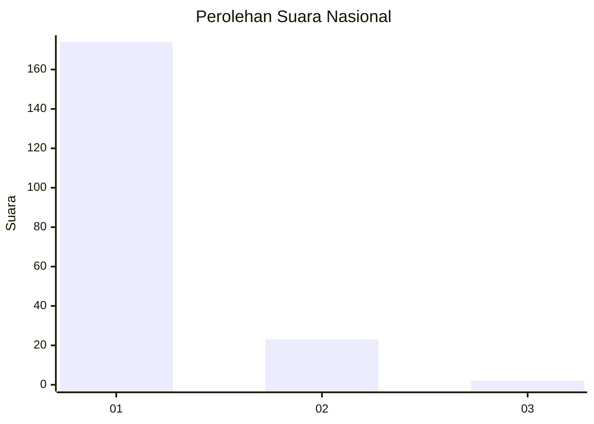
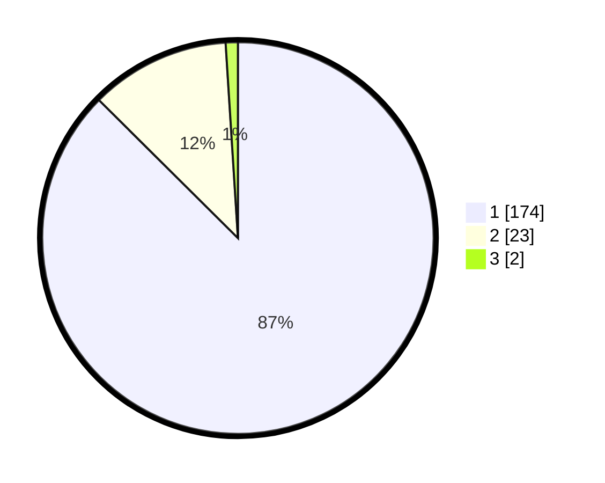

# Hasil

## Grafik

## Tabel

| No. | Nama Paslon    | Suara | Suara (raw) | Persentase |
|:--- |:-------------- | -----:| -----------:| ----------:|
| 1   | ANIES MUHAIMIN | 174   | [174][p-1]  | 87,44      |
| 2   | PRABOWO GIBRAN | 23    | [23][p-2]   | 11,56      |
| 3   | GANJAR MAHFUD  | 2     | [2][p-3]    | 1,01       |

[p-1]: https://github.com/gigit-pemilu/pemilu-2024/blob/main/pilpres/hitung-suara/sub/11-aceh/sub/03-aceh-timur/sub/03-idi-rayeuk/sub/2003-tanoh-anoe/sub/008-tps/sub/paslon-1.txt
[p-2]: https://github.com/gigit-pemilu/pemilu-2024/blob/main/pilpres/hitung-suara/sub/11-aceh/sub/03-aceh-timur/sub/03-idi-rayeuk/sub/2003-tanoh-anoe/sub/008-tps/sub/paslon-2.txt
[p-3]: https://github.com/gigit-pemilu/pemilu-2024/blob/main/pilpres/hitung-suara/sub/11-aceh/sub/03-aceh-timur/sub/03-idi-rayeuk/sub/2003-tanoh-anoe/sub/008-tps/sub/paslon-3.txt

## Foto C Plano

https://sirekap-obj-formc.kpu.go.id/02ae/pemilu/ppwp/11/03/03/20/03/1103032003008-20240215-022508--9b49b91f-653b-4f34-b212-f093a7a0ae39.jpg

https://sirekap-obj-formc.kpu.go.id/02ae/pemilu/ppwp/11/03/03/20/03/1103032003008-20240215-023220--ad672bbc-d315-4d31-b3f0-e0638eda6caf.jpg

https://sirekap-obj-formc.kpu.go.id/02ae/pemilu/ppwp/11/03/03/20/03/1103032003008-20240215-023423--4a106283-1149-417e-a400-475504a09cf6.jpg

## Metadata

| Key        | Value               |
| ---------- | ------------------- |
| Time Stamp | 2024-02-24 22:31:28 |

